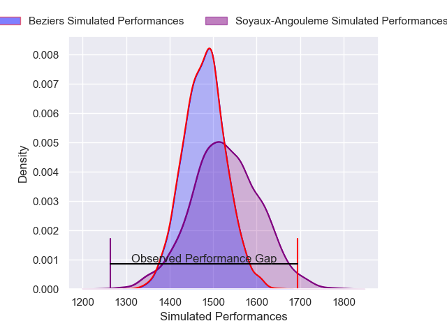
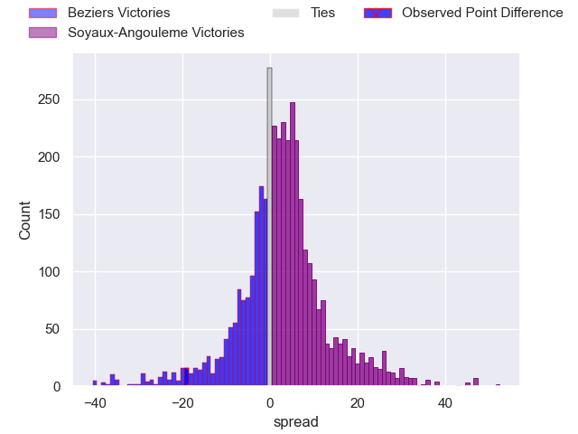
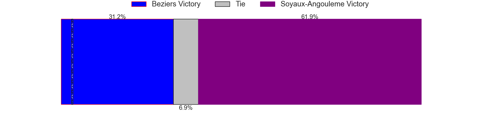
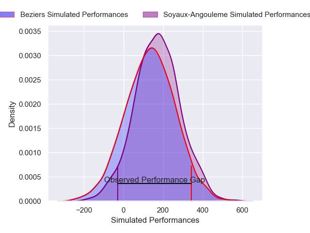
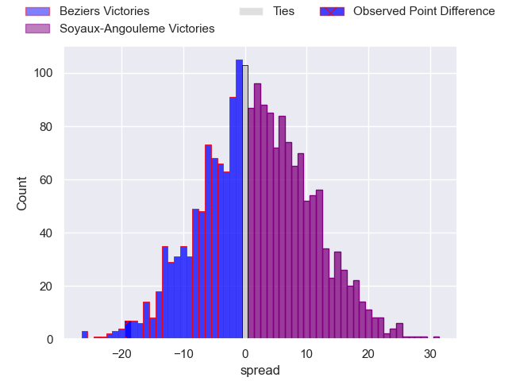
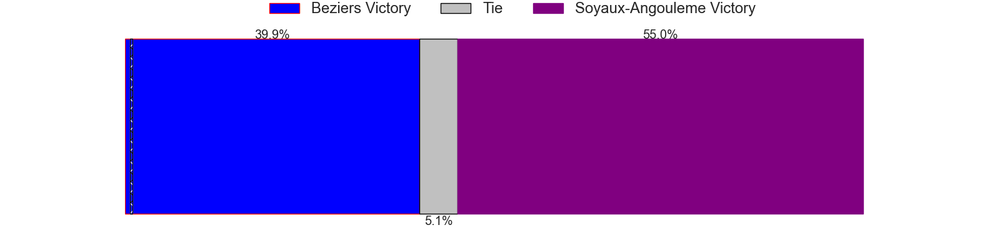

---  
layout: page  
title: Beziers at Soyaux-Angouleme; 32-13  
date: 2025-01-17 18:00:00 -0500  
categories: "Pro D2 2024" match review  
---
# Beziers at Soyaux-Angouleme; 32-13

# Club Level Predictions

The first set of predictions treats a club as the smallest object, as the club develops its members, organizes a gameplan, and deploys its players as needed for each match. This club model has a prediction of 0.565, which translates to predicting Soyaux-Angouleme to win by 2.3.

Our Over/Under is 47.5 - and combined with the spread above, we have a predicted scoreline of 23 to 25

Each club has a rating and a rating deviation (similar to a Glicko rating), and expected performances can be generated. This allows for simulated matches and spreads like the ones below.
## Projected Performances - Club Model

## Projected Spreads - Club Model

## Projected Results - Club Model

# Player Level Predictions

Treating teams instead as an entity made up of the currently active players, I have ratings for each player in an altogether different system. These can be combined to form team ratings once teamsheets are announced, weighting starters a bit higher than the reserves. After the match is played, players can be weighted by their minutes on the field, allowing for an accurate measure of the team's composition. With these compiled team ratings, we can make predictions, measure inaccuracy, and update the individual player ratings.
## Prediction without Player Minutes: Soyaux-Angouleme by 7.6

Soyaux-Angouleme by 2.0 on a neutral pitch

## Projected Performances - Player Model

## Projected Spreads - Player Model

## Projected Results - Player Model

|   Away Minutes | Away Player                 |   Away Percentile |   Number |   Home Percentile | Home Player        |   Home Minutes |
|---------------:|:----------------------------|------------------:|---------:|------------------:|:-------------------|---------------:|
|             80 | Francisco Fernandes Moreira |             12.56 |        1 |             44.53 | Vivien Devisme     |             51 |
|              6 | Yanis Boulassel             |             50.35 |        2 |             89.89 | Patxi Bidart       |             14 |
|             32 | Christian Judge             |             74.87 |        3 |             18.12 | Karl Sorin         |             21 |
|             48 | Cam Dodson                  |             84.01 |        4 |             54.96 | Léo Morand-Bruyat  |             21 |
|             32 | Shahn Eru                   |              0.91 |        5 |             72.57 | Maxence Lemardelet |             29 |
|             25 | William van Bost            |             40.28 |        6 |              5.47 | Gautier Gibouin    |             29 |
|             25 | Clement Ancely              |             89.47 |        7 |             81.28 | Germain Burgaud    |             21 |
|             17 | Sias Koen                   |             62.55 |        8 |             43.29 | Alexander Masibaka |             80 |
|             80 | Samuel Marques              |             89.31 |        9 |             32.79 | Alexis Levron      |             80 |
|             80 | Charly Malie                |             56.79 |       10 |             90.87 | Ben Botica         |             14 |
|             62 | Branden Holder              |             65.45 |       11 |             48.72 | Nathan Farissier   |             80 |
|             80 | Taleta Tupuola              |             78.52 |       12 |             96.73 | George Tilsley     |             19 |
|             63 | Paul Recor                  |             69.57 |       13 |             45.91 | Mathis Lafon       |             80 |
|             59 | Pierre Courtaud             |             35.93 |       14 |              6.3  | Jonny May          |             55 |
|             27 | Gabin Lorre                 |             89.23 |       15 |             89.67 | Pete Lydon         |             32 |
|             17 | Yvann Lalevee               |             83.16 |       16 |             15.43 | Motu Matu'u        |             48 |
|             80 | Damien Añon                 |             55.43 |       17 |             24.9  | Ian Kitwanga       |             55 |
|             12 | Romain Uruty                |            nan    |       18 |             48.58 | Hubert Texier      |             80 |
|             25 | Yannick Arroyo              |             85.04 |       19 |             47.44 | Yassine Boutemane  |             48 |
|             59 | Yahnis El Maslouhi          |             72.05 |       20 |             62.91 | Paul Tailhades     |             68 |
|             55 | Petero Taviraki Mailulu     |            nan    |       21 |              5.8  | Adrien Bau         |             80 |
|             80 | Watisoni Votu               |             75.89 |       22 |             12.32 | Arthur Proult      |             80 |
|             80 | Antoine Payrastre           |            nan    |       23 |             25.11 | Samuel Nollet      |             80 |

