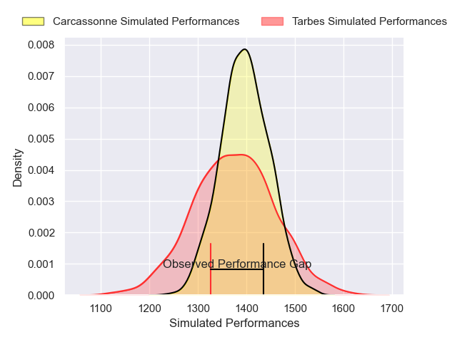
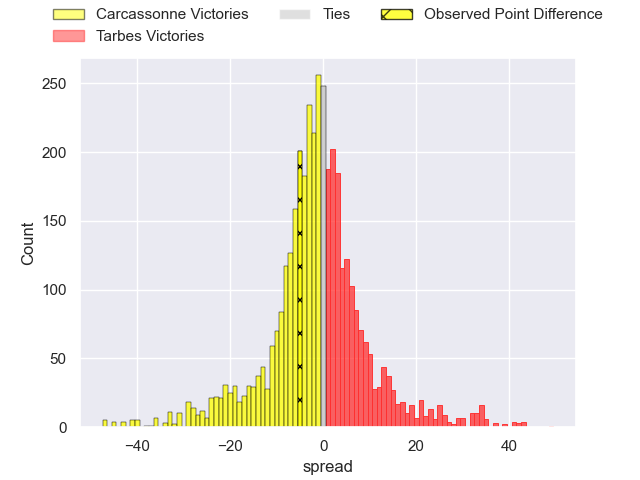
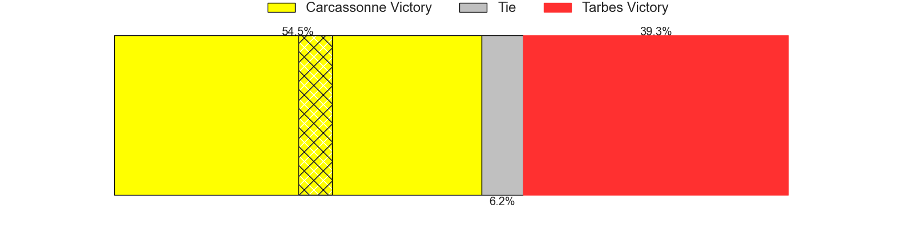
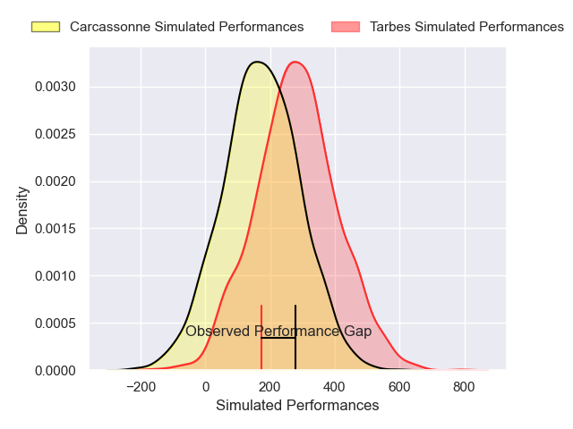
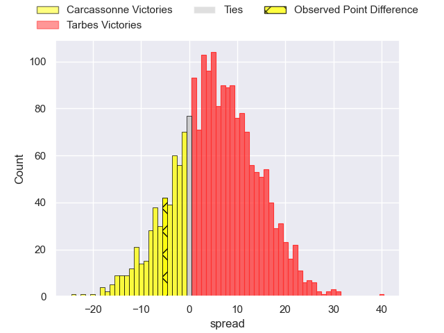
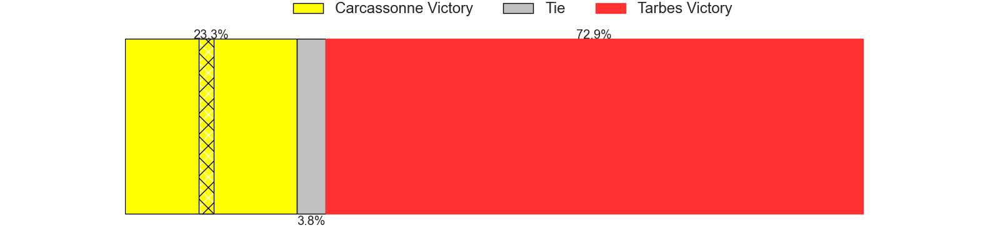

---  
layout: page  
title: Carcassonne at Tarbes; 24-19  
date: 2025-01-17 18:00:00 -0500  
categories: "Nationale 2024" match review  
---
# Carcassonne at Tarbes; 24-19

# Club Level Predictions

The first set of predictions treats a club as the smallest object, as the club develops its members, organizes a gameplan, and deploys its players as needed for each match. This club model has a prediction of 0.468, which translates to predicting Carcassonne to win by 1.1.

Our Over/Under is 44.5 - and combined with the spread above, we have a predicted scoreline of 23 to 22

Each club has a rating and a rating deviation (similar to a Glicko rating), and expected performances can be generated. This allows for simulated matches and spreads like the ones below.
## Projected Performances - Club Model

## Projected Spreads - Club Model

## Projected Results - Club Model

# Player Level Predictions

Treating teams instead as an entity made up of the currently active players, I have ratings for each player in an altogether different system. These can be combined to form team ratings once teamsheets are announced, weighting starters a bit higher than the reserves. After the match is played, players can be weighted by their minutes on the field, allowing for an accurate measure of the team's composition. With these compiled team ratings, we can make predictions, measure inaccuracy, and update the individual player ratings.
## Prediction without Player Minutes: Tarbes by 0.2

Carcassonne by 10.5 on a neutral pitch

## Projected Performances - Player Model

## Projected Spreads - Player Model

## Projected Results - Player Model

|   Away Minutes | Away Player         |   Away Percentile |   Number |   Home Percentile | Home Player         |   Home Minutes |
|---------------:|:--------------------|------------------:|---------:|------------------:|:--------------------|---------------:|
|             60 | Yan Arnold          |             81.97 |        1 |              3.85 | Ximun Bessonart     |             80 |
|             57 | Raphael Carbou      |             81.38 |        2 |             56.03 | Vincent Dolier      |             80 |
|             80 | Siua Halanukonuka   |             78.97 |        3 |             22.14 | Luka Vea            |             80 |
|             61 | Romain Manchia      |             52.73 |        4 |             19.03 | Léo Saint-Guilhem   |             80 |
|             80 | Marius Iftimiciuc   |             23.18 |        5 |             25.2  | Baptiste Peytavi    |             64 |
|             80 | Noe Bedou           |             50.1  |        6 |             88.66 | Alexis Armary       |             54 |
|             80 | Etienne Herjean     |             84.72 |        7 |             17.21 | Spike Salman        |             80 |
|             80 | Ferdinand Dreno     |             72.73 |        8 |              1.52 | Filipe Manu         |             42 |
|             19 | Gaetan Pichon       |             31.16 |        9 |             50    | Matias Brocal       |             55 |
|             22 | Nils Chalies        |             63.03 |       10 |             11.58 | Alexandre Perez     |             59 |
|             17 | Sefa Naivalu        |             99.41 |       11 |              2.56 | Johan Paulet        |             16 |
|             25 | Jordan Puletua      |             21.05 |       12 |              9.27 | Savenaca Rawaca     |             26 |
|             30 | Mathys Barka        |             71.97 |       13 |             25.19 | Osea Waqaninavatu   |             26 |
|             20 | Naim Ben Alla       |             41.14 |       14 |             30.61 | Amona Artaud        |             26 |
|             80 | Maxime Gianet       |             93.19 |       15 |             32.09 | Hugo Cellier        |             26 |
|             16 | Nika Neparidze      |             39.49 |       16 |             57.95 | Enzo Baggiani       |             54 |
|             80 | Gabin Villerouge    |             74.11 |       17 |             29.26 | Florian Lamothe     |             16 |
|             57 | Vakhtangi Akhobadze |              3.5  |       18 |             81.79 | Irakli Mirtskhulava |             80 |
|             62 | Romain Guyot        |             84.82 |       19 |             48.68 | Mathieu Soufflet    |             80 |
|             55 | Valentin Sese       |             33.4  |       20 |             26.62 | Joeli Matalaweru    |             62 |
|             20 | Yvan David          |             29.35 |       21 |             57.97 | Mickael Thébault    |             80 |
|              7 | Johnny McPhillips   |             69.49 |       22 |             35.14 | Clement Latorre     |             54 |
|             29 | Paul Gadea          |             43.41 |       23 |             33.59 | Pierre Descoubet    |             64 |

