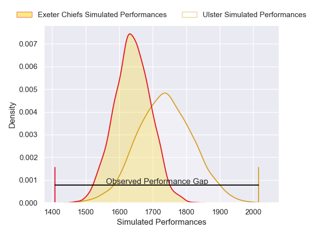
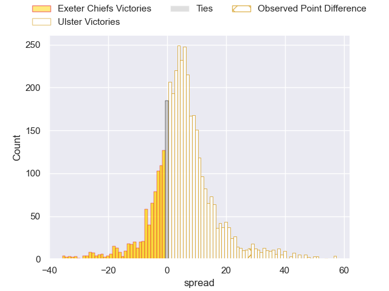
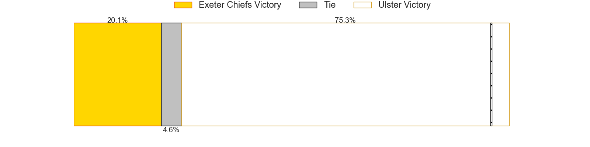
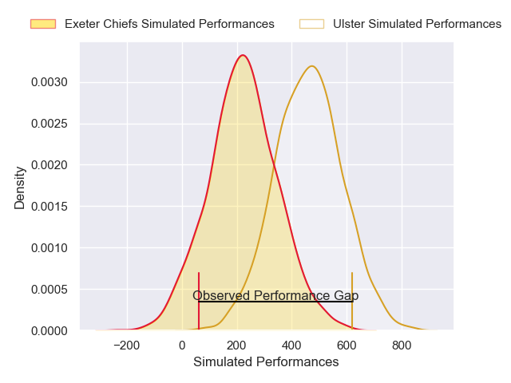
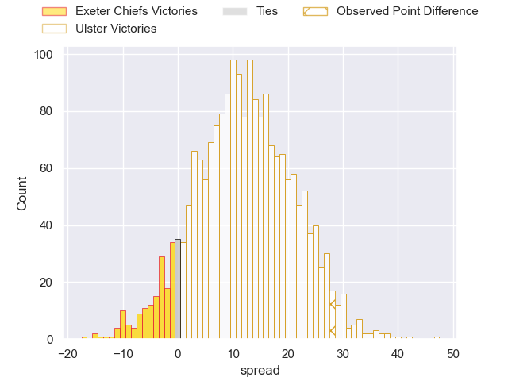
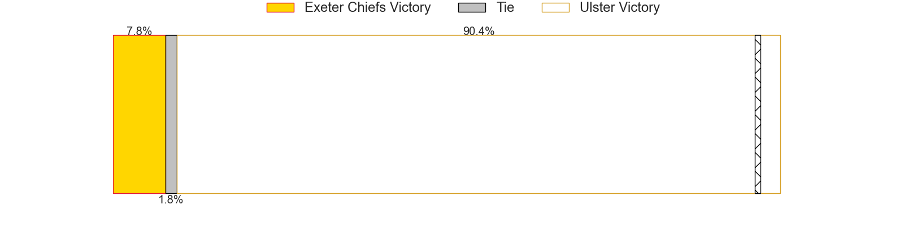

---  
layout: page  
title: Exeter Chiefs at Ulster; 24-52  
date: 2025-01-17 18:00:00 -0500  
categories: "European Rugby Champions Cup 2024" match review  
---
# Exeter Chiefs at Ulster; 24-52

# Club Level Predictions

The first set of predictions treats a club as the smallest object, as the club develops its members, organizes a gameplan, and deploys its players as needed for each match. This club model has a prediction of 0.636, which translates to predicting Ulster to win by 4.9.

Our Over/Under is 53.5 - and combined with the spread above, we have a predicted scoreline of 24 to 29

Each club has a rating and a rating deviation (similar to a Glicko rating), and expected performances can be generated. This allows for simulated matches and spreads like the ones below.
## Projected Performances - Club Model

## Projected Spreads - Club Model

## Projected Results - Club Model

# Player Level Predictions

Treating teams instead as an entity made up of the currently active players, I have ratings for each player in an altogether different system. These can be combined to form team ratings once teamsheets are announced, weighting starters a bit higher than the reserves. After the match is played, players can be weighted by their minutes on the field, allowing for an accurate measure of the team's composition. With these compiled team ratings, we can make predictions, measure inaccuracy, and update the individual player ratings.
## Prediction without Player Minutes: Ulster by 18.5

Ulster by 8.9 on a neutral pitch

## Projected Performances - Player Model

## Projected Spreads - Player Model

## Projected Results - Player Model

|   Away Minutes | Away Player               |   Away Percentile |   Number |   Home Percentile | Home Player        |   Home Minutes |
|---------------:|:--------------------------|------------------:|---------:|------------------:|:-------------------|---------------:|
|             80 | Will Goodrick-Clarke      |             22.65 |        1 |             92.99 | Eric O'Sullivan    |             22 |
|             23 | Jack Innard               |             69.86 |        2 |             98.76 | Rob Herring        |             19 |
|             63 | Josh Iosefa-Scott         |             90.43 |        3 |             57.86 | Scott Wilson       |             80 |
|             80 | Rusiate Tuima             |             17.41 |        4 |             88.87 | Iain Henderson     |             51 |
|             19 | Christ Tshiunza           |             58.4  |        5 |             71.56 | Cormac Izuchukwu   |             23 |
|             71 | Martin Moloney            |             91.3  |        6 |             59.62 | James McNabney     |             80 |
|             49 | Richard Capstick          |              1.62 |        7 |             95.75 | Nick Timoney       |             25 |
|             80 | Ross Vintcent             |             64.72 |        8 |             87.88 | David McCann       |             79 |
|             57 | Niall Armstrong           |             51.81 |        9 |             66.3  | Nathan Doak        |             80 |
|             14 | Will Haydon-Wood          |             19.6  |       10 |             70.82 | Jack Murphy        |             80 |
|             80 | Paul Brown-Bampoe         |             57.38 |       11 |             72.05 | Michael Lowry      |             80 |
|             71 | Will Rigg                 |             90.29 |       12 |             72.08 | Jude Postlethwaite |             66 |
|             16 | Joe Hawkins               |             62.81 |       13 |             59.98 | Ben Carson         |             31 |
|             66 | Ben Hammersley            |             44.98 |       14 |             75.3  | Werner Kok         |             21 |
|             19 | Harvey Skinner            |             34.51 |       15 |             96.92 | Stewart Moore      |             80 |
|             57 | Kwenzokuhle Ndumiso Blose |            nan    |       16 |             36.5  | Corrie Barrett     |             19 |
|             31 | Max Norey                 |             78.37 |       17 |            nan    | Callum Reid        |             80 |
|             11 | Ethan Roots               |              1.52 |       18 |              4.96 | Tom Stewart        |             80 |
|             80 | Jack Dunne                |             61.34 |       19 |             90.08 | Kieran Treadwell   |             55 |
|             80 | Joe Bailey                |             80.97 |       20 |             67.41 | Harry Sheridan     |             80 |
|             20 | Lewis Pearson             |             87.25 |       21 |             93.84 | John Cooney        |              6 |
|             57 | Tom Cairns                |             83.33 |       22 |            nan    | Rob Lyttle         |              9 |
|             31 | Zack Wimbush              |             35.33 |       23 |             44.1  | Jake Flannery      |             64 |

