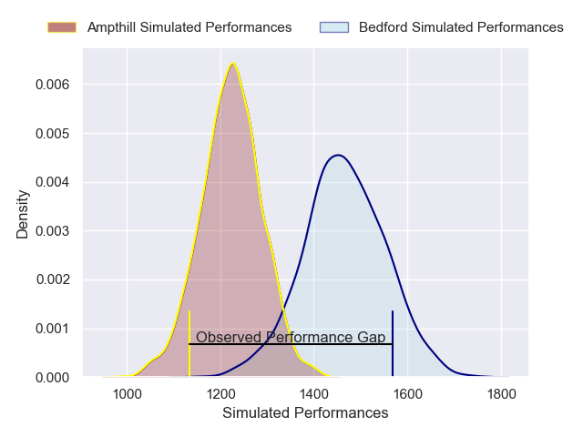
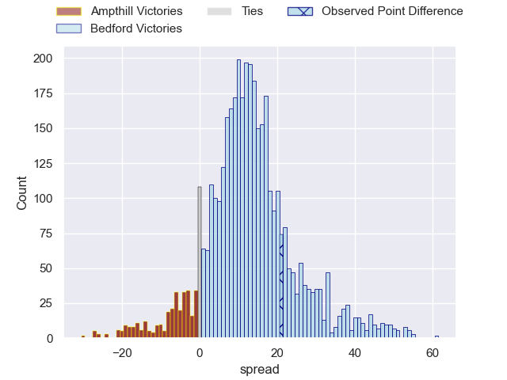
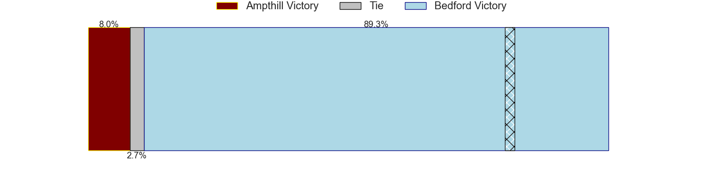
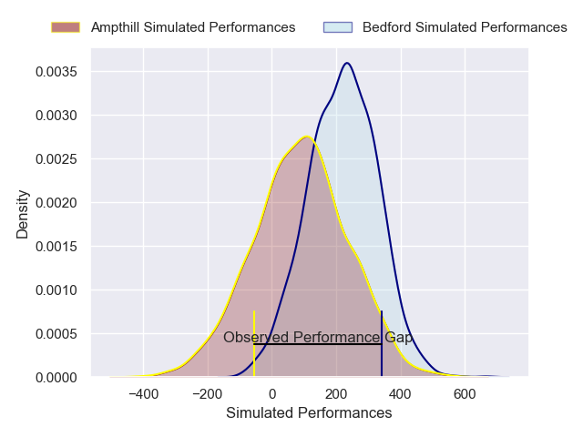
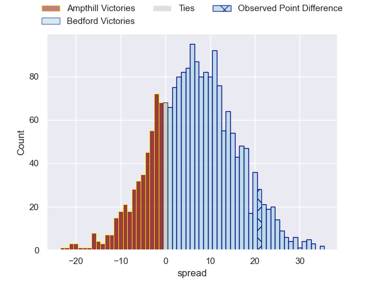
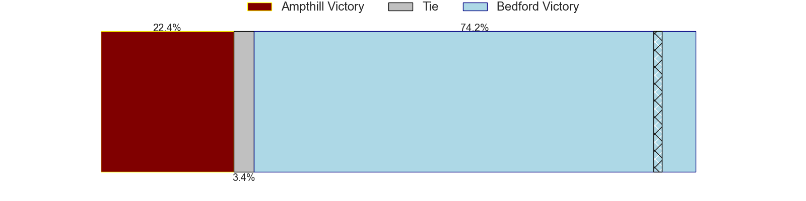

---  
layout: page  
title: Ampthill at Bedford; 24-45  
date: 2025-01-18 18:00:00 -0500  
categories: "RFU Championship 2024" match review  
---
# Ampthill at Bedford; 24-45

# Club Level Predictions

The first set of predictions treats a club as the smallest object, as the club develops its members, organizes a gameplan, and deploys its players as needed for each match. This club model has a prediction of 0.794, which translates to predicting Bedford to win by 11.9.

Our Over/Under is 43.5 - and combined with the spread above, we have a predicted scoreline of 16 to 28

Each club has a rating and a rating deviation (similar to a Glicko rating), and expected performances can be generated. This allows for simulated matches and spreads like the ones below.
## Projected Performances - Club Model

## Projected Spreads - Club Model

## Projected Results - Club Model

# Player Level Predictions

Treating teams instead as an entity made up of the currently active players, I have ratings for each player in an altogether different system. These can be combined to form team ratings once teamsheets are announced, weighting starters a bit higher than the reserves. After the match is played, players can be weighted by their minutes on the field, allowing for an accurate measure of the team's composition. With these compiled team ratings, we can make predictions, measure inaccuracy, and update the individual player ratings.
## Prediction without Player Minutes: Bedford by 5.7

Bedford by 1.1 on a neutral pitch

## Projected Performances - Player Model

## Projected Spreads - Player Model

## Projected Results - Player Model

|   Away Minutes | Away Player                 |   Away Percentile |   Number |   Home Percentile | Home Player          |   Home Minutes |
|---------------:|:----------------------------|------------------:|---------:|------------------:|:---------------------|---------------:|
|             49 | Sam Crean                   |             69.91 |        1 |             26.67 | Jamie Jack           |             55 |
|             59 | Samson Adejimi              |              7.27 |        2 |             74.29 | Tommy Herman         |             55 |
|             80 | Harvey Beaton               |             26.84 |        3 |             82.05 | Oisin Heffernan      |             80 |
|             72 | Kennedy Sylvester           |             23.99 |        4 |             66.4  | Rory Ward            |             42 |
|             60 | Kaden Pearce-Paul           |             31.38 |        5 |             73.48 | Alex Woolford        |             49 |
|             28 | Max Eke                     |             17.51 |        6 |              7.49 | Luke Frost           |             31 |
|             80 | Charles Rylands             |              9.31 |        7 |             22.57 | Fyn Brown            |             50 |
|             80 | Lekima Ravuvu               |             16.23 |        8 |              9.74 | Freddie Tuilagi      |             18 |
|             80 | Charlie Bracken             |             48.01 |        9 |             17.93 | James Lennon         |              9 |
|             80 | Louie Johnson               |             13.14 |       10 |             88.86 | William Maisey       |             64 |
|             80 | Brandon Jackson-Richards    |             45.37 |       11 |             81.69 | Dean Adamson         |             80 |
|             61 | Fraser James Kevin Strachan |             77.97 |       12 |             10.8  | Josh Matavesi        |             50 |
|             52 | Sam Spink                   |             34.13 |       13 |             78.84 | Michael Le Bourgeois |             80 |
|             80 | Wilson Ijeh                 |             32.28 |       14 |             73.52 | Matt Worley          |              5 |
|             74 | Josh Barton                 |             12.97 |       15 |             21.98 | Louis James          |             53 |
|             80 | Luke Thompson               |             67.2  |       16 |             90.6  | Craig Wright         |             30 |
|             80 | Josh Hallett                |             30.32 |       17 |              7.09 | Joe Howard           |             42 |
|             80 | Harrison Courtney           |             55.64 |       18 |             90.04 | Alex Day             |             80 |
|              6 | Sid Blackmore               |            nan    |       19 |             43.68 | Joey Conway          |             24 |
|             19 | James Johnston              |             18.38 |       20 |              4.98 | Cameron King         |              8 |
|             80 | Arthur Thomas               |             30.26 |       21 |             22.47 | George Smith         |              8 |
|            nan | nan                         |            nan    |       22 |             54.96 | Lucas Titherington   |             80 |
|            nan | nan                         |            nan    |       23 |            nan    | Austin Hay           |             44 |

