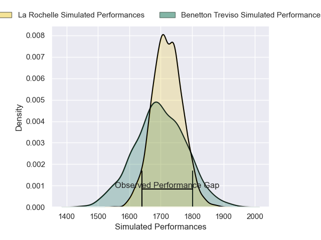
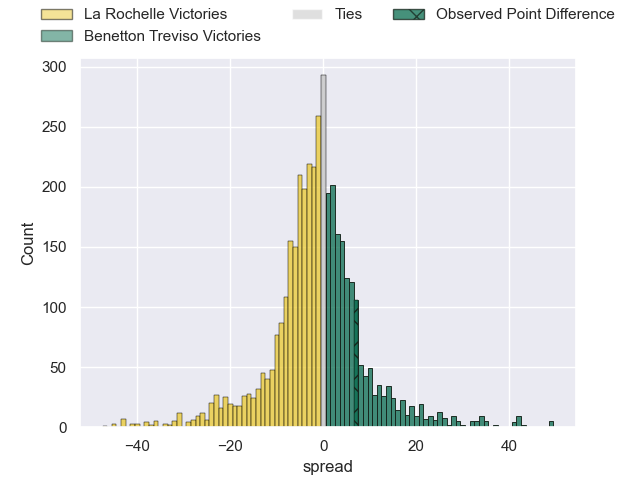
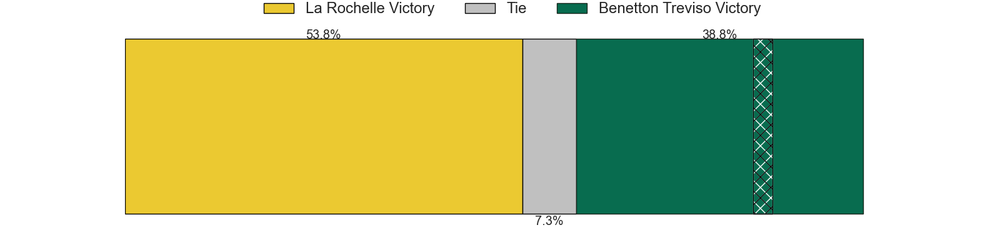
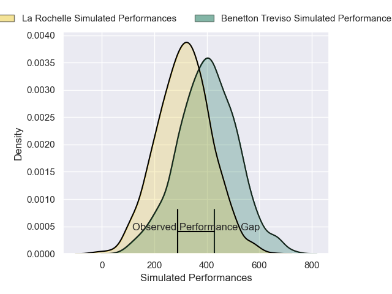
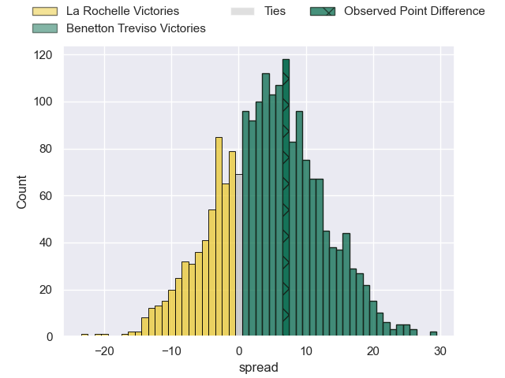
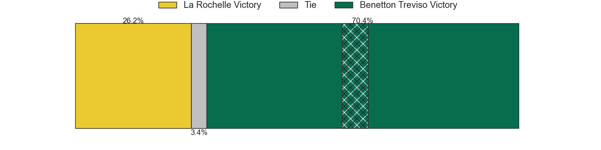

---  
layout: page  
title: La Rochelle at Benetton Treviso; 25-32  
date: 2025-01-18 18:00:00 -0500  
categories: "European Rugby Champions Cup 2024" match review  
---
# La Rochelle at Benetton Treviso; 25-32

# Club Level Predictions

The first set of predictions treats a club as the smallest object, as the club develops its members, organizes a gameplan, and deploys its players as needed for each match. This club model has a prediction of 0.469, which translates to predicting La Rochelle to win by 1.1.

Our Over/Under is 49.5 - and combined with the spread above, we have a predicted scoreline of 26 to 24

Each club has a rating and a rating deviation (similar to a Glicko rating), and expected performances can be generated. This allows for simulated matches and spreads like the ones below.
## Projected Performances - Club Model

## Projected Spreads - Club Model

## Projected Results - Club Model

# Player Level Predictions

Treating teams instead as an entity made up of the currently active players, I have ratings for each player in an altogether different system. These can be combined to form team ratings once teamsheets are announced, weighting starters a bit higher than the reserves. After the match is played, players can be weighted by their minutes on the field, allowing for an accurate measure of the team's composition. With these compiled team ratings, we can make predictions, measure inaccuracy, and update the individual player ratings.
## Prediction without Player Minutes: La Rochelle by 2.2

La Rochelle by 10.0 on a neutral pitch

## Projected Performances - Player Model

## Projected Spreads - Player Model

## Projected Results - Player Model

|   Away Minutes | Away Player           |   Away Percentile |   Number |   Home Percentile | Home Player           |   Home Minutes |
|---------------:|:----------------------|------------------:|---------:|------------------:|:----------------------|---------------:|
|             68 | Alexandre Kaddouri    |             46.41 |        1 |             94.1  | Thomas Gallo          |             80 |
|             71 | Quentin Lespiaucq     |             35.64 |        2 |              1.6  | Siua Maile            |             80 |
|              9 | Uini Atonio           |             98.46 |        3 |             94.44 | Simone Ferrari        |             19 |
|             24 | Thomas Lavault        |             89.47 |        4 |             64.78 | Niccolo Cannone       |             66 |
|             12 | Kane Douglas          |             77.53 |        5 |             73.08 | Eli Snyman            |             24 |
|             80 | Paul Boudehent        |              3.64 |        6 |             26.72 | Alessandro Izekor     |             80 |
|             71 | Oscar Jegou           |             59.51 |        7 |             53.85 | Manuel Zuliani        |             32 |
|             28 | Gregory Alldritt      |             98.48 |        8 |             96.32 | Lorenzo Cannone       |             80 |
|             25 | Tawera Kerr-Barlow    |             98.19 |        9 |             60.51 | Alessandro Garbisi    |             26 |
|             30 | Antoine Hastoy        |             47.22 |       10 |             82.63 | Tomas Albornoz        |             80 |
|             12 | Dillyn Leyds          |             97.74 |       11 |             96.06 | Matt Gallagher        |             19 |
|             21 | Jules Favre           |             89.97 |       12 |             75.46 | Malakai Fekitoa       |             24 |
|             73 | Ulupano Seuteni       |             84.73 |       13 |             95.53 | Juan Ignacio Brex     |             17 |
|             80 | Jack Nowell           |             95.37 |       14 |             93.41 | Tommaso Menoncello    |             71 |
|             40 | Brice Dulin           |             98.02 |       15 |             90.77 | Rhyno Smith           |             61 |
|             51 | Georges-Henri Colombe |              5.9  |       16 |             30.32 | Bautista Bernasconi   |             80 |
|             60 | Matthias Haddad       |             71.46 |       17 |             67.95 | Giosue Zilocchi       |             80 |
|             15 | Ultan Dillane         |             66.8  |       18 |             88.46 | Nahuel Tetaz Chaparro |              7 |
|             80 | Levani Botia          |             96.66 |       19 |             95.55 | Federico Ruzza        |             59 |
|             36 | Hoani Bosmorin        |             61.52 |       20 |             80.26 | Sebastian Negri       |             15 |
|            nan | nan                   |            nan    |       21 |             96.76 | Michele Lamaro        |             10 |
|            nan | nan                   |            nan    |       22 |             10.87 | Andy Uren             |             48 |
|            nan | nan                   |            nan    |       23 |             73.94 | Leonardo Marin        |             22 |

