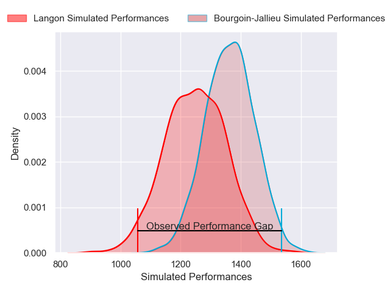
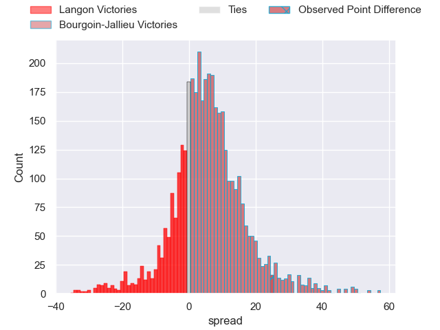
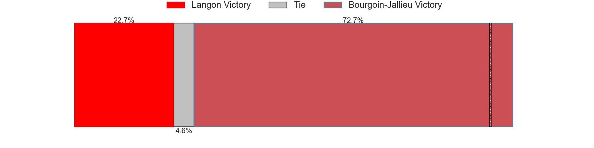
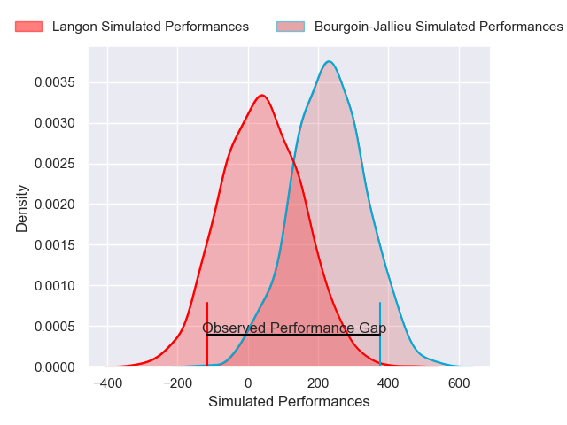
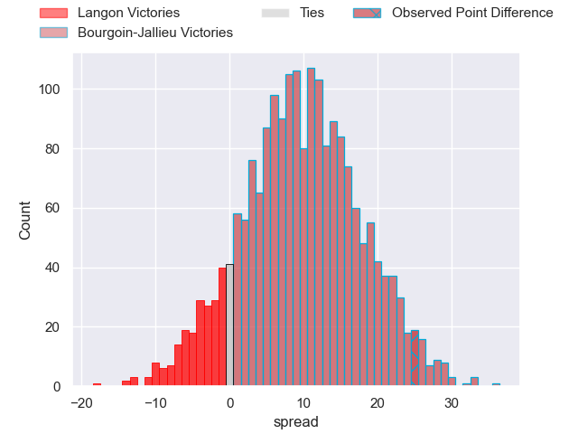
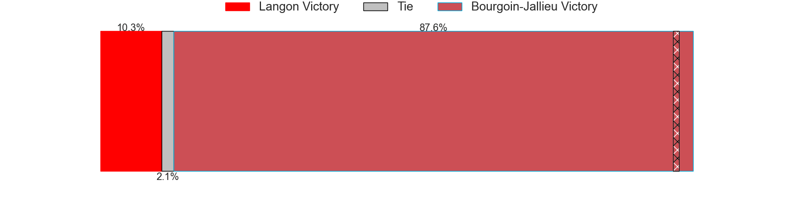

---  
layout: page  
title: Langon at Bourgoin-Jallieu; 8-33  
date: 2025-01-18 18:00:00 -0500  
categories: "Nationale 2024" match review  
---
# Langon at Bourgoin-Jallieu; 8-33

# Club Level Predictions

The first set of predictions treats a club as the smallest object, as the club develops its members, organizes a gameplan, and deploys its players as needed for each match. This club model has a prediction of 0.645, which translates to predicting Bourgoin-Jallieu to win by 5.5.

Our Over/Under is 38.5 - and combined with the spread above, we have a predicted scoreline of 17 to 22

Each club has a rating and a rating deviation (similar to a Glicko rating), and expected performances can be generated. This allows for simulated matches and spreads like the ones below.
## Projected Performances - Club Model

## Projected Spreads - Club Model

## Projected Results - Club Model

# Player Level Predictions

Treating teams instead as an entity made up of the currently active players, I have ratings for each player in an altogether different system. These can be combined to form team ratings once teamsheets are announced, weighting starters a bit higher than the reserves. After the match is played, players can be weighted by their minutes on the field, allowing for an accurate measure of the team's composition. With these compiled team ratings, we can make predictions, measure inaccuracy, and update the individual player ratings.
## Prediction without Player Minutes: Bourgoin-Jallieu by 7.4

Langon by 5.7 on a neutral pitch

## Projected Performances - Player Model

## Projected Spreads - Player Model

## Projected Results - Player Model

|   Away Minutes | Away Player                    |   Away Percentile |   Number |   Home Percentile | Home Player      |   Home Minutes |
|---------------:|:-------------------------------|------------------:|---------:|------------------:|:-----------------|---------------:|
|             80 | Ratu Nailoma Vatubua           |              5.93 |        1 |             22.16 | Romain Favaretto |             80 |
|             53 | Julien Graffouillère           |             20.43 |        2 |             12.43 | Julien Ratajczak |             19 |
|             27 | Loïc Clave                     |             21.65 |        3 |             14.26 | Keynan Knox      |             64 |
|             27 | Simon Lobjoit                  |             28.44 |        4 |             17.37 | Thomas Adélaïde  |             20 |
|             27 | Isikili Seva Davetawalu        |             12.67 |        5 |              1.4  | Morgan Eames     |             80 |
|             68 | Thomas Bishop                  |             47.42 |        6 |             34.78 | Theophile Cotte  |             80 |
|             40 | Thomas Geffré                  |             18.91 |        7 |             15.87 | Kevin Chaudouard |             56 |
|             20 | Thomas De Molder               |              4.51 |        8 |              7.3  | Sam Daly         |              7 |
|             25 | Baptiste Tisne Cardeneau       |             14.77 |        9 |             10.63 | Martin Doan      |             14 |
|             18 | Vincent Debladis               |              9.93 |       10 |             15.01 | Nicolas Cachet   |             12 |
|              9 | Thomas Wallraf                 |             72.62 |       11 |             68.59 | Joe Ravouvou     |             80 |
|             22 | Guillaume Christophe           |             45.91 |       12 |              1.19 | Aviata Silago    |              9 |
|              7 | Quentin Lefort                 |             14.66 |       13 |             22.09 | Pierre Mignot    |             19 |
|             56 | Abdoul Gafour Karembiri        |             22.77 |       14 |              8.55 | Paul-Hugo Champ  |             19 |
|             80 | Nathan Gagnac                  |             23.27 |       15 |              4.92 | Remi Bouet       |             36 |
|             56 | Meryll Ech Chalka Roumazeilles |             56.22 |       16 |              1.98 | Lucas Dycke      |             36 |
|              9 | Bastien Cazale-Debat           |             66.31 |       17 |              3.22 | Poutasi Luafutu  |              9 |
|             80 | Kemueli Lavetanakoroi          |             84.93 |       18 |              0.5  | Léandre Cotte    |             19 |
|             53 | Emiliano Coria Marchetti       |             18.21 |       19 |             73.89 | Maxime Castant   |             44 |
|             80 | Maxime Lancon                  |             42.98 |       20 |             68.99 | Dimitri Tchapnga |             80 |
|             80 | Thomas Mendy                   |             29.61 |       21 |             14.57 | Tom Danovaro     |             18 |
|             55 | Baptiste Castanier             |             30.65 |       22 |            nan    | Louis Giamarchi  |             63 |
|             80 | Lucas Hernandez                |            nan    |       23 |            nan    | Adrian Fugit     |             80 |

