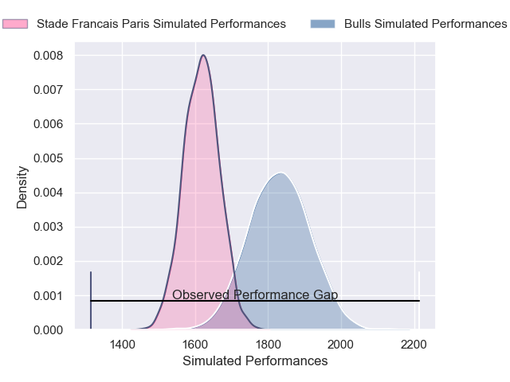
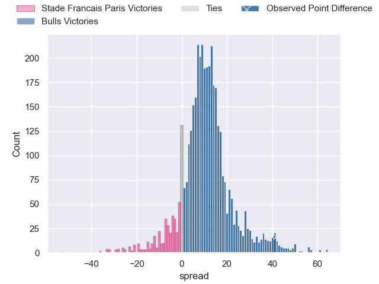
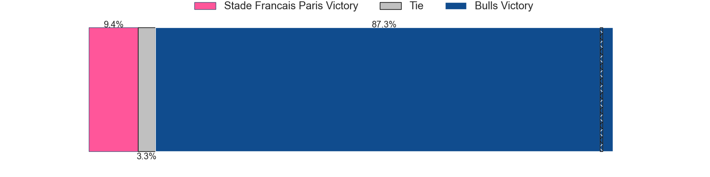
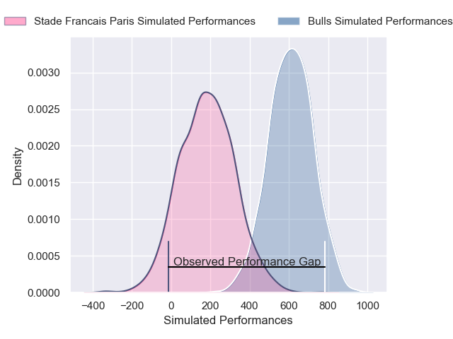
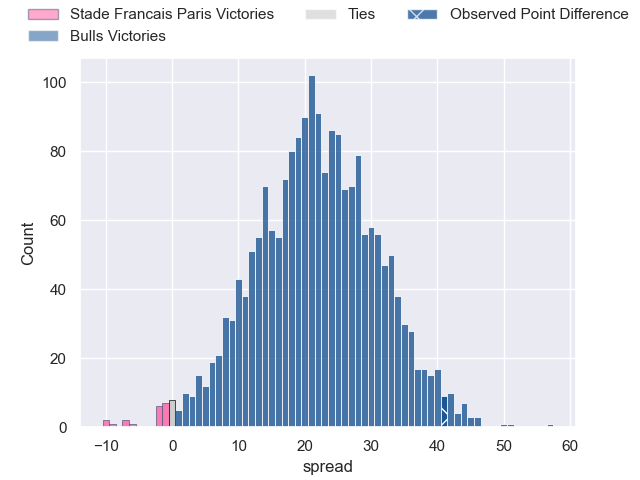
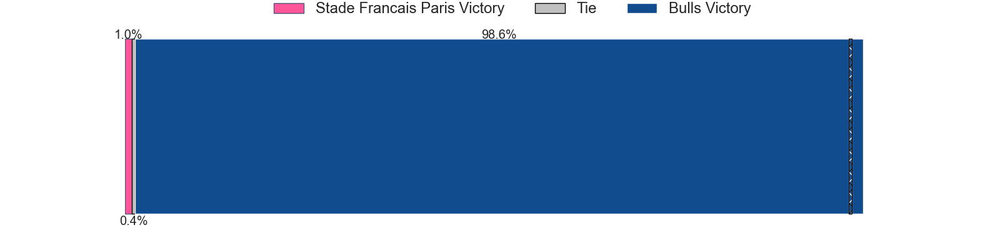

---  
layout: page  
title: Stade Francais Paris at Bulls; 7-48  
date: 2025-01-18 18:00:00 -0500  
categories: "European Rugby Champions Cup 2024" match review  
---
# Stade Francais Paris at Bulls; 7-48

# Club Level Predictions

The first set of predictions treats a club as the smallest object, as the club develops its members, organizes a gameplan, and deploys its players as needed for each match. This club model has a prediction of 0.768, which translates to predicting Bulls to win by 10.5.

Our Over/Under is 61.5 - and combined with the spread above, we have a predicted scoreline of 26 to 36

Each club has a rating and a rating deviation (similar to a Glicko rating), and expected performances can be generated. This allows for simulated matches and spreads like the ones below.
## Projected Performances - Club Model

## Projected Spreads - Club Model

## Projected Results - Club Model

# Player Level Predictions

Treating teams instead as an entity made up of the currently active players, I have ratings for each player in an altogether different system. These can be combined to form team ratings once teamsheets are announced, weighting starters a bit higher than the reserves. After the match is played, players can be weighted by their minutes on the field, allowing for an accurate measure of the team's composition. With these compiled team ratings, we can make predictions, measure inaccuracy, and update the individual player ratings.
## Prediction without Player Minutes: Bulls by 24.2

Bulls by 15.9 on a neutral pitch

## Projected Performances - Player Model

## Projected Spreads - Player Model

## Projected Results - Player Model

|   Away Minutes | Away Player              |   Away Percentile |   Number |   Home Percentile | Home Player         |   Home Minutes |
|---------------:|:-------------------------|------------------:|---------:|------------------:|:--------------------|---------------:|
|             43 | Isaac Koffi              |             15.54 |        1 |             88    | Gerhard Steenekamp  |             80 |
|             17 | Alvaro Garcia Albo       |             44.96 |        2 |             93.35 | Johan Grobbelaar    |             80 |
|             58 | Francisco Gomez Kodela   |             90.24 |        3 |             98.88 | Wilco Louw          |             80 |
|             58 | Juan Martin Scelzo       |             23.39 |        4 |              4.84 | Ruan Vermaak        |             17 |
|             75 | Baptiste Pesenti         |             38.61 |        5 |             84.48 | Ruan Nortje         |             64 |
|             50 | Pierre Huguet            |             14.54 |        6 |             97.22 | Marcell Coetzee     |             14 |
|             80 | Sekou Macalou            |             82.37 |        7 |             94.74 | Elrigh Louw         |             80 |
|             80 | Yoan Tanga               |             54.96 |        8 |             51.51 | Cameron Hanekom     |             24 |
|             54 | Thibaut Motassi          |             41.06 |        9 |             92.34 | Embrose Papier      |             24 |
|             80 | Louis Carbonel           |             68.28 |       10 |             61.23 | Johan Goosen        |              5 |
|             80 | Charles Laloi            |             20.33 |       11 |             95.89 | Sergeal Petersen    |             22 |
|             27 | Julien Delbouis          |             91.26 |       12 |             96.35 | Harold Vorster      |             26 |
|             22 | Leo Monin                |             28.21 |       13 |             88.61 | Stedman Gans        |              9 |
|             71 | Raffaele Storti          |             81.04 |       14 |             95.31 | Sebastian de Klerk  |             53 |
|             58 | Joe Jonas                |             67.11 |       15 |             88.81 | Devon Williams      |             80 |
|             80 | Hugo Ndiaye              |             46.11 |       16 |             70.55 | Alulutho Tshakweni  |             80 |
|             80 | Mamoudou Meite           |            nan    |       17 |             98.02 | Akker van der Merwe |             37 |
|             54 | Luka Petriashvili        |             71.22 |       18 |             56.3  | Francois Klopper    |             80 |
|             56 | Braxton Asi              |            nan    |       19 |             96.98 | Nizaam Carr         |             80 |
|             16 | Andy Timo                |            nan    |       20 |             80.62 | Reinhardt Ludwig    |             22 |
|             80 | Ollie McCrea             |             51.81 |       21 |             93.98 | Zak Burger          |             34 |
|             80 | Louis Foursans-Bourdette |             20.93 |       22 |             68.5  | Boeta Chamberlain   |             49 |
|             80 | Mathis Ibo               |            nan    |       23 |            100    | Canan Moodie        |             56 |

