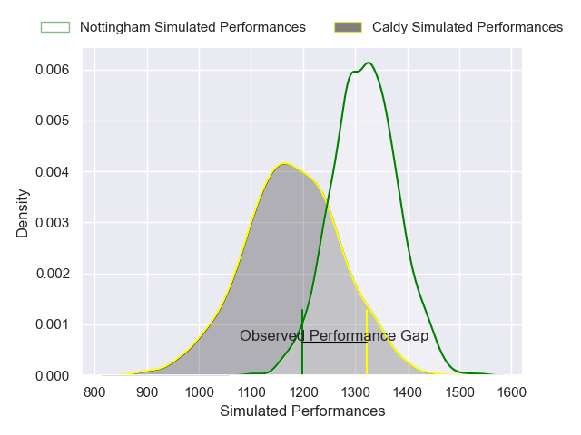
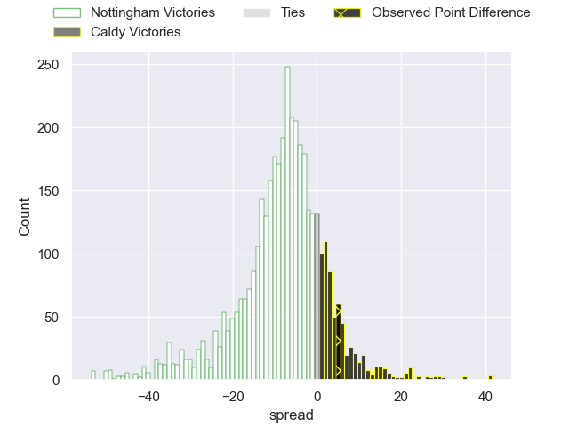
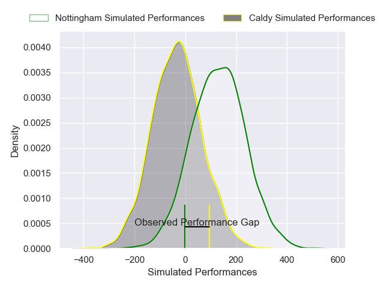
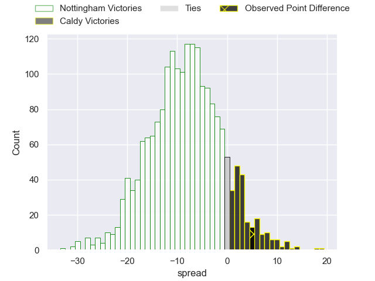

---  
layout: page  
title: Nottingham at Caldy; 22-27  
date: 2025-01-18 18:00:00 -0500  
categories: "RFU Championship 2024" match review  
---
# Nottingham at Caldy; 22-27

# Club Level Predictions

The first set of predictions treats a club as the smallest object, as the club develops its members, organizes a gameplan, and deploys its players as needed for each match. This club model has a prediction of 0.314, which translates to predicting Nottingham to win by 6.9.

Our Over/Under is 56.5 - and combined with the spread above, we have a predicted scoreline of 32 to 25

Each club has a rating and a rating deviation (similar to a Glicko rating), and expected performances can be generated. This allows for simulated matches and spreads like the ones below.
## Projected Performances - Club Model

## Projected Spreads - Club Model

## Projected Results - Club Model

# Player Level Predictions

Treating teams instead as an entity made up of the currently active players, I have ratings for each player in an altogether different system. These can be combined to form team ratings once teamsheets are announced, weighting starters a bit higher than the reserves. After the match is played, players can be weighted by their minutes on the field, allowing for an accurate measure of the team's composition. With these compiled team ratings, we can make predictions, measure inaccuracy, and update the individual player ratings.
## Prediction without Player Minutes: Nottingham by 15.6

Nottingham by 18.3 on a neutral pitch

## Projected Performances - Player Model

## Projected Spreads - Player Model

## Projected Results - Player Model

|   Away Minutes | Away Player        |   Away Percentile |   Number |   Home Percentile | Home Player      |   Home Minutes |
|---------------:|:-------------------|------------------:|---------:|------------------:|:-----------------|---------------:|
|             20 | Kai Owen           |             37.8  |        1 |             22.94 | Monty Weatherby  |             80 |
|             47 | Harry Clayton      |             87.57 |        2 |              4.97 | Oliver Hearn     |             80 |
|             13 | Ale Loman          |             95.1  |        3 |              3.35 | Joe Sproston     |             80 |
|             80 | Sebastien Ferreira |              4.29 |        4 |             72.55 | Alex Groves      |             80 |
|             80 | Jack Shine         |             66.17 |        5 |             15.07 | Thomas Sanders   |             80 |
|             80 | Kody Vereti        |             70.17 |        6 |              3.24 | Callum Ridgway   |             40 |
|             80 | Nathan Tweedy      |             21.64 |        7 |             22.65 | Tristan Woodman  |             23 |
|             80 | James Cherry       |             78.11 |        8 |              5.36 | Josiah Dickinson |             33 |
|             80 | Josh Goodwin       |             16.58 |        9 |              9.55 | Ollie Wynn       |             20 |
|             80 | Matthew Arden      |             86.31 |       10 |              3.31 | Lewis Barker     |             40 |
|             80 | Ryan Olowofela     |             73.68 |       11 |              0.48 | Michael Cartmill |             23 |
|            nan | nan                |            nan    |       12 |             88.47 | Sam Bedlow       |             57 |
|            nan | nan                |            nan    |       13 |              6.36 | Connor Wilkinson |             80 |
|            nan | nan                |            nan    |       14 |              4.8  | William Robinson |             28 |
|            nan | nan                |            nan    |       15 |             16.78 | Matt Kilcourse   |             40 |

