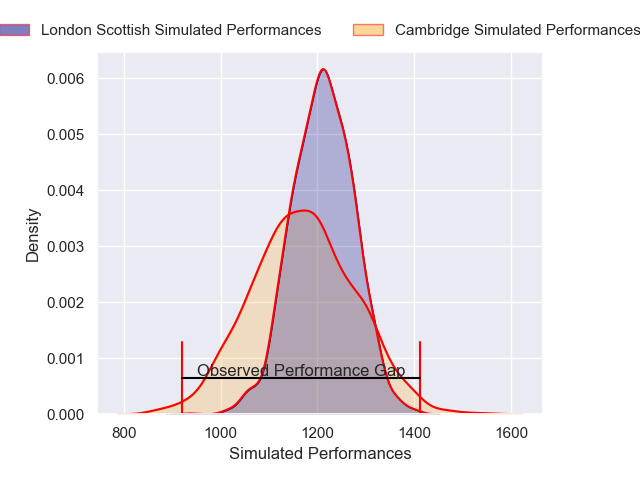
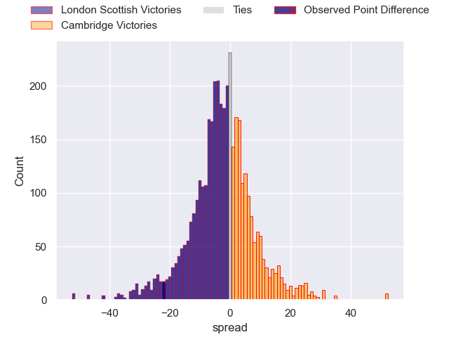
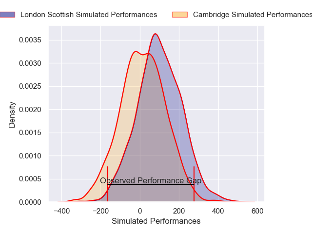
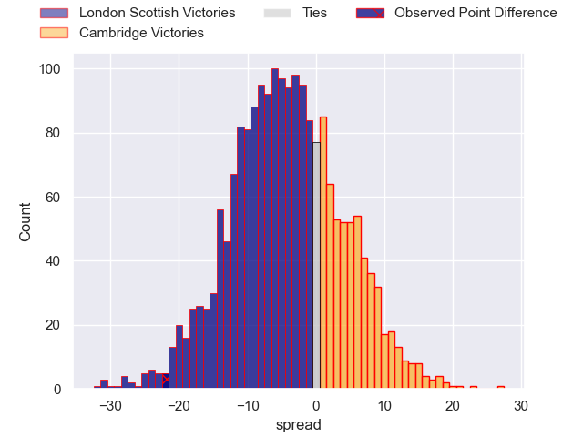

---  
layout: page  
title: London Scottish at Cambridge; 48-26  
date: 2025-01-18 18:00:00 -0500  
categories: "RFU Championship 2024" match review  
---
# London Scottish at Cambridge; 48-26

# Club Level Predictions

The first set of predictions treats a club as the smallest object, as the club develops its members, organizes a gameplan, and deploys its players as needed for each match. This club model has a prediction of 0.44, which translates to predicting London Scottish to win by 2.1.

Our Over/Under is 36.5 - and combined with the spread above, we have a predicted scoreline of 19 to 17

Each club has a rating and a rating deviation (similar to a Glicko rating), and expected performances can be generated. This allows for simulated matches and spreads like the ones below.
## Projected Performances - Club Model

## Projected Spreads - Club Model

## Projected Results - Club Model

# Player Level Predictions

Treating teams instead as an entity made up of the currently active players, I have ratings for each player in an altogether different system. These can be combined to form team ratings once teamsheets are announced, weighting starters a bit higher than the reserves. After the match is played, players can be weighted by their minutes on the field, allowing for an accurate measure of the team's composition. With these compiled team ratings, we can make predictions, measure inaccuracy, and update the individual player ratings.
## Prediction without Player Minutes: London Scottish by 4.7

London Scottish by 7.1 on a neutral pitch

## Projected Performances - Player Model

## Projected Spreads - Player Model

## Projected Results - Player Model

|   Away Minutes | Away Player       |   Away Percentile |   Number |   Home Percentile | Home Player          |   Home Minutes |
|---------------:|:------------------|------------------:|---------:|------------------:|:---------------------|---------------:|
|             40 | George Cave       |              8.98 |        1 |             39.03 | Zac Nearchou         |             31 |
|             52 | George Head       |             71.4  |        2 |              9.89 | Archie Vanes         |             59 |
|             31 | Ashley Challenger |              8.12 |        3 |              1.99 | Billy Walker         |             57 |
|             13 | Matt Wilkinson    |             31.65 |        4 |              7.86 | George Bretag-Norris |             80 |
|             23 | Marijn Huis       |             61.79 |        5 |             12.3  | Gareth Baxter        |             66 |
|             23 | Ioan Rhys Davies  |             10.21 |        6 |             14.12 | Archie Benson        |             24 |
|             21 | Will Trenholm     |             19.9  |        7 |              3.92 | Ben Adams            |             20 |
|             11 | Zach Carr         |             37.93 |        8 |             18.1  | Jack Bartlett        |             80 |
|             22 | Jonny Law         |             11.13 |        9 |             36.31 | Ruaridh Dawson       |             28 |
|              9 | Jamie Benson      |             14.32 |       10 |             18.28 | Louis Grimoldby      |             46 |
|             80 | Will Brown        |             92.28 |       11 |              2.05 | Elias Caven          |             56 |
|             80 | Bryn Bradley      |             86.28 |       12 |             10.95 | Matthew Hema         |             31 |
|             80 | Will Joseph       |             74.56 |       13 |             54.98 | Ollie Betteridge     |             65 |
|             52 | Hayden Hyde       |             35.19 |       14 |             26.98 | William Glister      |             57 |
|             55 | Cameron Anderson  |             53.69 |       15 |              8.28 | Joseph Tarrant       |             52 |
|             80 | Jake Spurway      |             28.53 |       16 |              5.61 | Jake Elwood          |             80 |
|             20 | Jonah Holmes      |             80.54 |       17 |             17.81 | Benjamin Brownlie    |             80 |
|             55 | Ntinga Mpiko      |             12.44 |       18 |             93.07 | Peter White          |             80 |
|             80 | Tom Wilstead      |             33.04 |       19 |              2.99 | Matt Williams        |             80 |
|             60 | Calum Scott       |             28.42 |       20 |              2.06 | Jared Cardew         |             14 |
|             80 | Lewis Barrett     |             20.21 |       21 |             12.07 | Matthew Dawson       |             56 |
|             80 | Jake Murray       |            nan    |       22 |             18.83 | Jake Bridges         |             23 |
|             20 | Will Prior        |             81.52 |       23 |             28.25 | Josef Green          |             49 |

