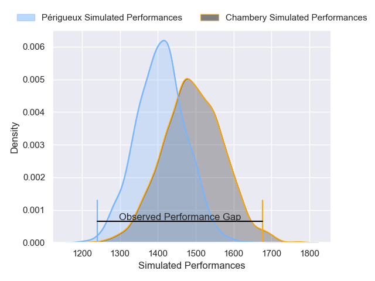
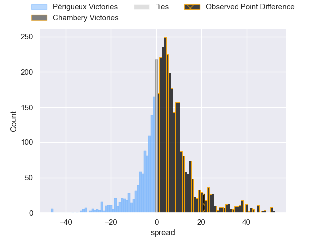
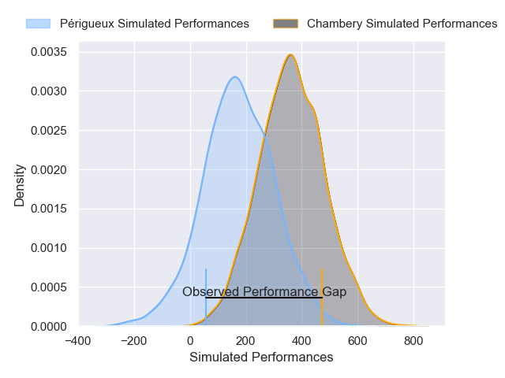
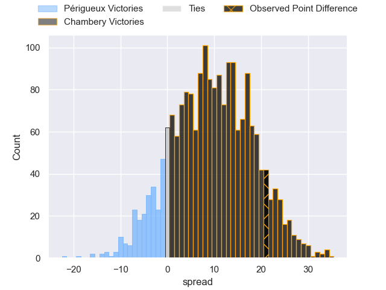
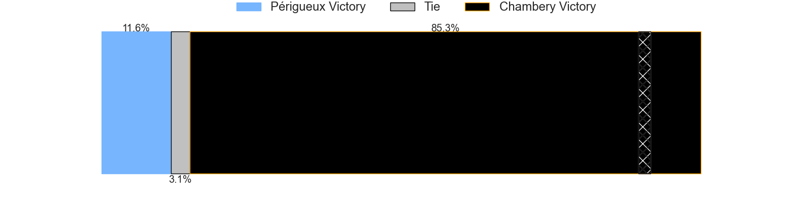

---  
layout: page  
title: Perigueux at Chambery; 7-28  
date: 2025-01-18 18:00:00 -0500  
categories: "Nationale 2024" match review  
---
# Perigueux at Chambery; 7-28

# Club Level Predictions

The first set of predictions treats a club as the smallest object, as the club develops its members, organizes a gameplan, and deploys its players as needed for each match. This club model has a prediction of 0.615, which translates to predicting Chambery to win by 4.1.

Our Over/Under is 38.5 - and combined with the spread above, we have a predicted scoreline of 17 to 22

Each club has a rating and a rating deviation (similar to a Glicko rating), and expected performances can be generated. This allows for simulated matches and spreads like the ones below.
## Projected Performances - Club Model

## Projected Spreads - Club Model

## Projected Results - Club Model

# Player Level Predictions

Treating teams instead as an entity made up of the currently active players, I have ratings for each player in an altogether different system. These can be combined to form team ratings once teamsheets are announced, weighting starters a bit higher than the reserves. After the match is played, players can be weighted by their minutes on the field, allowing for an accurate measure of the team's composition. With these compiled team ratings, we can make predictions, measure inaccuracy, and update the individual player ratings.
## Prediction without Player Minutes: Chambery by 11.3

Chambery by 7.9 on a neutral pitch

## Projected Performances - Player Model

## Projected Spreads - Player Model

## Projected Results - Player Model

|   Away Minutes | Away Player         |   Away Percentile |   Number |   Home Percentile | Home Player          |   Home Minutes |
|---------------:|:--------------------|------------------:|---------:|------------------:|:---------------------|---------------:|
|             80 | Thomas Vidal        |             56.91 |        1 |             89.9  | Nugzar Somkhishvili  |             77 |
|             80 | Louis Martin        |             80.76 |        2 |             83.45 | Yan Tabarot          |             40 |
|             40 | Anthony Pelmard     |             68.48 |        3 |             87.05 | Lasha Tabidze        |             28 |
|             40 | Clement Lanen       |             61.9  |        4 |             93.75 | Jean-Baptiste Grenod |             40 |
|             33 | Damien Lavergne     |             47.98 |        5 |             72.38 | Corentin Astier      |             40 |
|             80 | Karl Lambert        |             52.78 |        6 |             70.41 | Taniela Matakaiongo  |             80 |
|             60 | Afaesetiti Amosa    |             95.46 |        7 |             83.51 | Colin Lebian         |             80 |
|             80 | Nahum Merigan       |             35.99 |        8 |             86.85 | Tui Uru              |             52 |
|             40 | Max Green           |             31.39 |        9 |             62.96 | Mateo Guerret        |             20 |
|             80 | Anderson Neisen     |             39.21 |       10 |             78.19 | Thibault Moreno      |             57 |
|             25 | Benjamin Yarde      |             40.66 |       11 |             90.62 | Arthur Nennig        |             25 |
|              3 | Cyril Couturier     |             83.41 |       12 |             81.64 | Bastien Reymond      |             40 |
|             23 | Dorian Lavernhe     |             73.01 |       13 |             65.38 | Maewen Sao           |             67 |
|             34 | Vincent Fouillade   |             84.85 |       14 |             89.64 | Paul Altier          |             80 |
|             34 | Vincent Fouillade   |             84.85 |       14 |             89.64 | Paul Altier          |             40 |
|             40 | Yon Camou           |             43.62 |       15 |             75.84 | Thomas Hecquet       |             23 |
|             40 | Manu Leiataua       |              1.62 |       16 |             59.59 | Osman Dimen          |             57 |
|             40 | Emilien Borges      |             78.41 |       17 |             78.83 | Fabien Witz          |             47 |
|             80 | Kalaveti Tawake     |             50.43 |       18 |             38.11 | Arwel Robson         |             80 |
|             28 | Madioke Konate      |             21.96 |       19 |             35.77 | Aubin Eymeri         |             80 |
|             80 | Matteo Bordenave    |             55.11 |       20 |             83.92 | Matheo Triki         |             23 |
|             80 | Mathis Lafforgue    |            nan    |       21 |             55.42 | Joseph Exshaw        |             23 |
|             60 | Raphaël Vieilledent |             69.35 |       22 |             61.83 | Gela Murusidze       |             25 |
|             57 | Greg Hutley         |             61.67 |       23 |            nan    | Julien Pierdomenico  |             28 |

