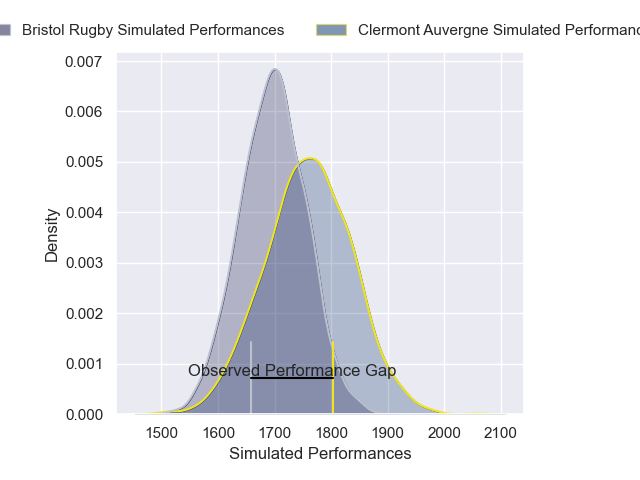
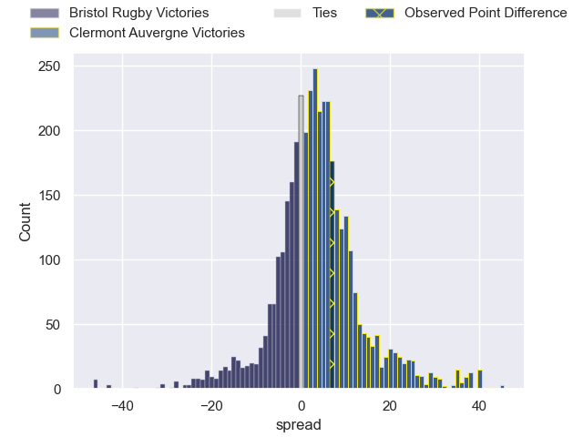
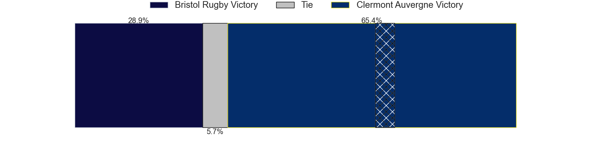
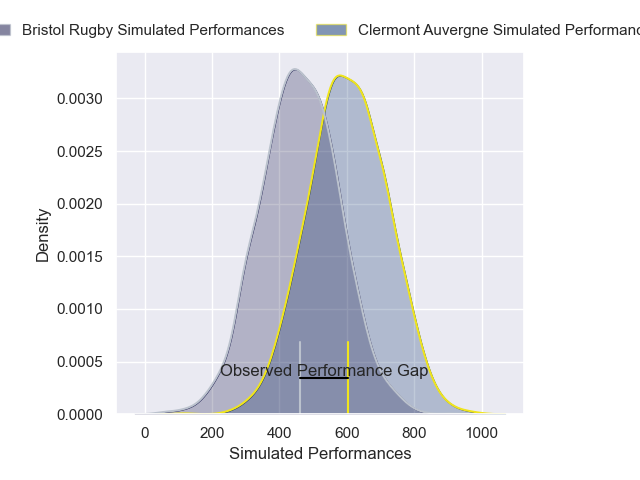
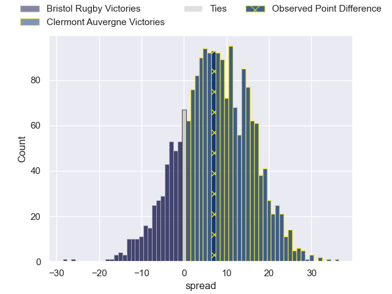
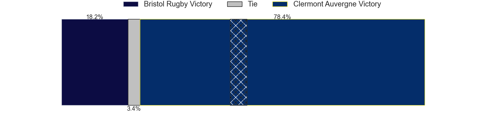

---  
layout: page  
title: Bristol Rugby at Clermont Auvergne; 26-33  
date: 2025-01-18 18:00:00 -0500  
categories: "European Rugby Champions Cup 2024" match review  
---
# Bristol Rugby at Clermont Auvergne; 26-33

# Club Level Predictions

The first set of predictions treats a club as the smallest object, as the club develops its members, organizes a gameplan, and deploys its players as needed for each match. This club model has a prediction of 0.595, which translates to predicting Clermont Auvergne to win by 3.4.

Our Over/Under is 67.5 - and combined with the spread above, we have a predicted scoreline of 32 to 36

Each club has a rating and a rating deviation (similar to a Glicko rating), and expected performances can be generated. This allows for simulated matches and spreads like the ones below.
## Projected Performances - Club Model

## Projected Spreads - Club Model

## Projected Results - Club Model

# Player Level Predictions

Treating teams instead as an entity made up of the currently active players, I have ratings for each player in an altogether different system. These can be combined to form team ratings once teamsheets are announced, weighting starters a bit higher than the reserves. After the match is played, players can be weighted by their minutes on the field, allowing for an accurate measure of the team's composition. With these compiled team ratings, we can make predictions, measure inaccuracy, and update the individual player ratings.
## Prediction without Player Minutes: Clermont Auvergne by 5.7

Bristol Rugby by 7.3 on a neutral pitch

## Projected Performances - Player Model

## Projected Spreads - Player Model

## Projected Results - Player Model

|   Away Minutes | Away Player                |   Away Percentile |   Number |   Home Percentile | Home Player          |   Home Minutes |
|---------------:|:---------------------------|------------------:|---------:|------------------:|:---------------------|---------------:|
|             68 | Ellis Genge                |             74.18 |        1 |             51.04 | Sacha Lotrian        |             71 |
|             58 | Gabriel Oghre              |             93.17 |        2 |             90.83 | Folau Fainga'a       |             40 |
|             20 | George Kloska              |             42.83 |        3 |             91.88 | Michael Ala'alatoa   |             59 |
|             17 | James Dun                  |             95.36 |        4 |             91.94 | Rob Simmons          |             34 |
|             80 | Joe Owen                   |             77.12 |        5 |             90.42 | Peceli Yato Senibitu |             27 |
|             72 | Steven Luatua              |             99.79 |        6 |             82.58 | Killian Tixeront     |             80 |
|             10 | Santiago Grondona          |             95.26 |        7 |             93.51 | Marcos Kremer        |             53 |
|             17 | Fitz Harding               |             95.47 |        8 |             88.79 | Fritz Lee            |             80 |
|             80 | Harry Randall              |             96.35 |        9 |             86.68 | Baptiste Jauneau     |             30 |
|             24 | Harry Byrne                |             89.43 |       10 |             96.92 | Anthony Belleau      |             80 |
|             18 | Deago Bailey               |             29.23 |       11 |              4.59 | Alivereti Raka       |             55 |
|             80 | Benhard Janse van Rensburg |             97.35 |       12 |             51.22 | Irae Simone          |             80 |
|             79 | Joe Jenkins                |             67.15 |       13 |             71.02 | Mathys Belaubre      |             50 |
|             31 | Noah Heward                |             86.51 |       14 |             78.69 | Bautista Delguy      |             42 |
|             31 | Richard Lane               |             77.18 |       15 |             73.15 | Alex Newsome         |             49 |
|             21 | Yann Thomas                |             87.13 |       16 |             79.62 | Etienne Falgoux      |             25 |
|             50 | Max Lahiff                 |             65.46 |       17 |             79.5  | Barnabe Massa        |             31 |
|             80 | Harry Thacker              |             82.19 |       18 |             62.52 | Cristian Ojovan      |              9 |
|             62 | Steele Robert Barker       |             91.43 |       19 |             64.42 | Thomas Ceyte         |             80 |
|             54 | Viliame Mata               |             65.73 |       20 |             84.33 | Alexandre Fischer    |             71 |
|             49 | Kieran Marmion             |             91.61 |       21 |             83.39 | Sebastien Bezy       |             80 |
|             18 | Kalaveti Ravouvou          |             81.08 |       22 |             82.82 | Benjamin Urdapilleta |             80 |
|             61 | Benjamin Elizalde          |             72.93 |       23 |             87.98 | Lucas Tauzin         |             61 |

