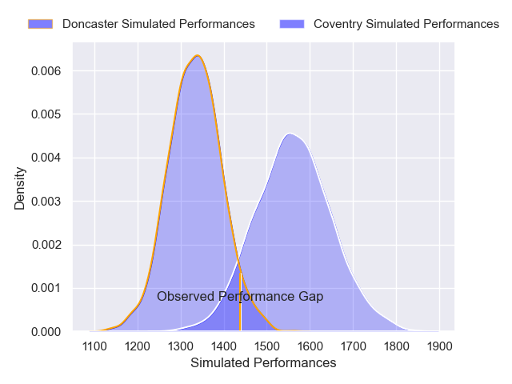
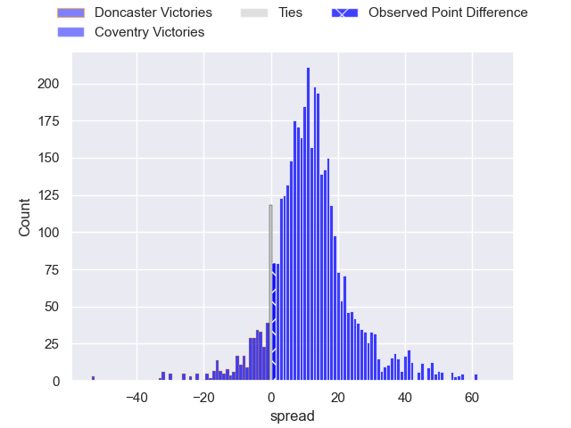
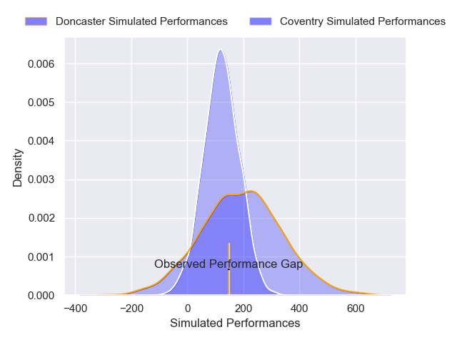
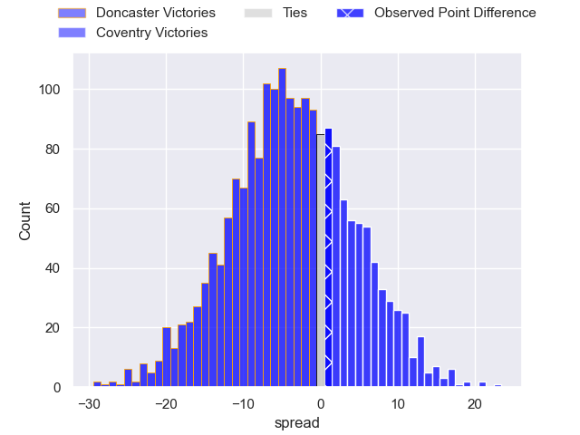

---  
layout: page  
title: Doncaster at Coventry; 23-24  
date: 2025-01-18 18:00:00 -0500  
categories: "RFU Championship 2024" match review  
---
# Doncaster at Coventry; 23-24

# Club Level Predictions

The first set of predictions treats a club as the smallest object, as the club develops its members, organizes a gameplan, and deploys its players as needed for each match. This club model has a prediction of 0.782, which translates to predicting Coventry to win by 11.3.

Our Over/Under is 55.5 - and combined with the spread above, we have a predicted scoreline of 22 to 33

Each club has a rating and a rating deviation (similar to a Glicko rating), and expected performances can be generated. This allows for simulated matches and spreads like the ones below.
## Projected Performances - Club Model

## Projected Spreads - Club Model

## Projected Results - Club Model

# Player Level Predictions

Treating teams instead as an entity made up of the currently active players, I have ratings for each player in an altogether different system. These can be combined to form team ratings once teamsheets are announced, weighting starters a bit higher than the reserves. After the match is played, players can be weighted by their minutes on the field, allowing for an accurate measure of the team's composition. With these compiled team ratings, we can make predictions, measure inaccuracy, and update the individual player ratings.
## Prediction without Player Minutes: Coventry by 3.3

Doncaster by 0.3 on a neutral pitch

## Projected Performances - Player Model

## Projected Spreads - Player Model

## Projected Results - Player Model

|   Away Minutes | Away Player        |   Away Percentile |   Number |   Home Percentile | Home Player        |   Home Minutes |
|---------------:|:-------------------|------------------:|---------:|------------------:|:-------------------|---------------:|
|            nan | nan                |            nan    |        1 |             65.38 | Toby Trinder       |              1 |
|            nan | nan                |            nan    |        2 |             74.78 | Jordon Poole       |             12 |
|            nan | nan                |            nan    |        3 |             69.24 | Eliot Salt         |              0 |
|             10 | Ben Murphy         |             44.51 |        4 |             78.14 | James Tyas         |             14 |
|             80 | Adam Hopkinson     |             47.11 |        5 |             54.39 | Obinna Nkwocha     |              5 |
|             80 | Archie Smeaton     |             48.53 |        6 |             72.7  | Tom Ball           |             14 |
|             80 | Rhys Tait          |             42.06 |        7 |             48.43 | Aaron Hinkley      |             19 |
|             21 | Morgan Strong      |             24.03 |        8 |             52.58 | Senitiki Nayalo    |              8 |
|             21 | Ollie Fox          |             37.3  |        9 |             69.19 | Josh Barton        |             70 |
|             80 | Russell Bennett    |             44.59 |       10 |             51.66 | Tommy Mathews      |             44 |
|             79 | Maliq Holden       |             37.27 |       11 |             60.71 | James Martin       |             49 |
|             72 | Connor Edwards     |             35.67 |       12 |             46.34 | Dafydd-Rhys Tiueti |             59 |
|             80 | Zach Kerr          |             43.86 |       13 |            nan    | nan                |            nan |
|             68 | Jordan Olowofela   |             38.81 |       14 |            nan    | nan                |            nan |
|             66 | Telusa Veainu      |             99.33 |       15 |            nan    | nan                |            nan |
|             75 | George Roberts     |            nan    |       16 |            nan    | nan                |            nan |
|             80 | Conor Davidson     |            nan    |       17 |            nan    | nan                |            nan |
|             80 | Lewis Thiede       |            nan    |       18 |            nan    | nan                |            nan |
|             66 | Josh Williams      |            nan    |       19 |            nan    | nan                |            nan |
|             61 | Taniela Ramasibana |            nan    |       20 |            nan    | nan                |            nan |
|             80 | Alex Dolly         |            nan    |       21 |            nan    | nan                |            nan |
|             80 | Morgan Bunting     |            nan    |       22 |            nan    | nan                |            nan |
|             72 | Harry Davey        |            nan    |       23 |            nan    | nan                |            nan |

