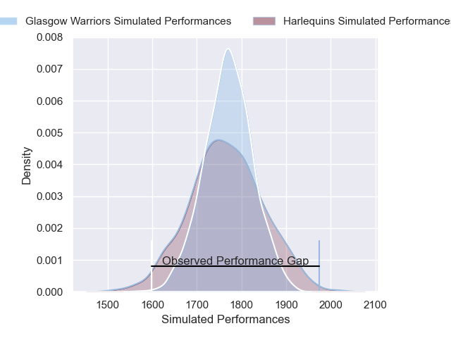
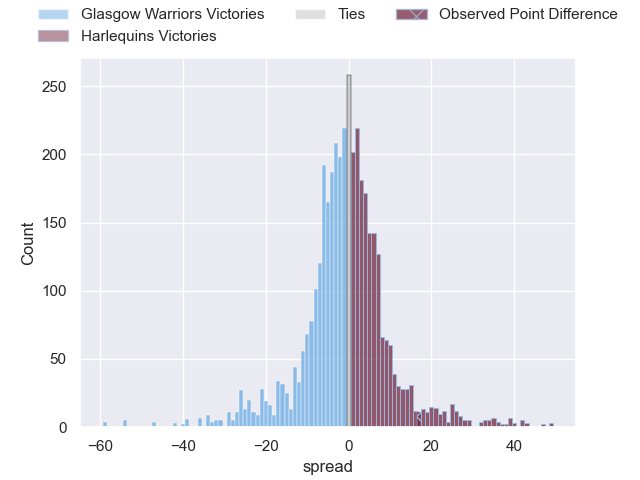
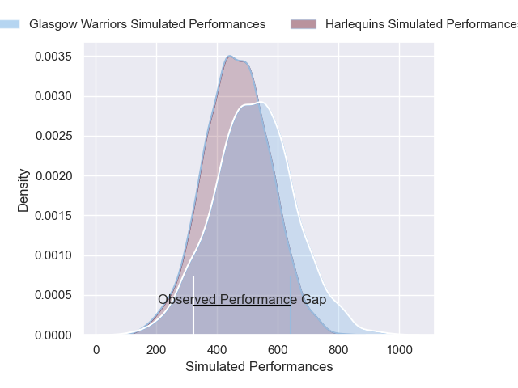
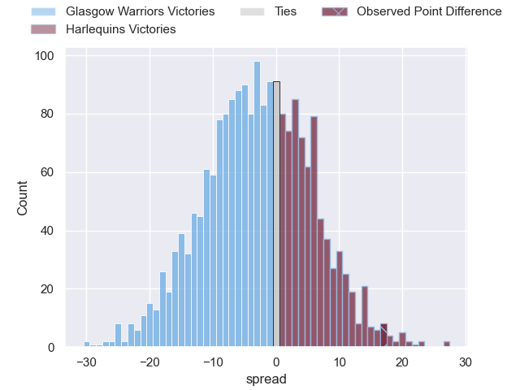

---  
layout: page  
title: Glasgow Warriors at Harlequins; 7-24  
date: 2025-01-18 18:00:00 -0500  
categories: "European Rugby Champions Cup 2024" match review  
---
# Glasgow Warriors at Harlequins; 7-24

# Club Level Predictions

The first set of predictions treats a club as the smallest object, as the club develops its members, organizes a gameplan, and deploys its players as needed for each match. This club model has a prediction of 0.492, which translates to predicting Glasgow Warriors to win by 0.3.

Our Over/Under is 50.5 - and combined with the spread above, we have a predicted scoreline of 26 to 25

Each club has a rating and a rating deviation (similar to a Glicko rating), and expected performances can be generated. This allows for simulated matches and spreads like the ones below.
## Projected Performances - Club Model

## Projected Spreads - Club Model

## Projected Results - Club Model

# Player Level Predictions

Treating teams instead as an entity made up of the currently active players, I have ratings for each player in an altogether different system. These can be combined to form team ratings once teamsheets are announced, weighting starters a bit higher than the reserves. After the match is played, players can be weighted by their minutes on the field, allowing for an accurate measure of the team's composition. With these compiled team ratings, we can make predictions, measure inaccuracy, and update the individual player ratings.
## Prediction without Player Minutes: Glasgow Warriors by 3.8

Glasgow Warriors by 17.5 on a neutral pitch

## Projected Performances - Player Model

## Projected Spreads - Player Model

## Projected Results - Player Model

|   Away Minutes | Away Player           |   Away Percentile |   Number |   Home Percentile | Home Player               |   Home Minutes |
|---------------:|:----------------------|------------------:|---------:|------------------:|:--------------------------|---------------:|
|             17 | Rory Sutherland       |             68.22 |        1 |             12.18 | Fin Baxter                |             36 |
|             13 | Johnny Matthews       |             73.92 |        2 |             50.9  | Jack Walker               |             40 |
|             67 | Zander Fagerson       |             99.83 |        3 |             37.48 | Titi Lamositele           |             56 |
|             27 | Euan Ferrie           |             47.28 |        4 |             96.98 | James Chisholm            |             20 |
|             11 | Scott Cummings        |             98.89 |        5 |             72.58 | Stephan Lewies            |             80 |
|             67 | Matt Fagerson         |             97.11 |        6 |             79.38 | Chandler Cunningham-South |             62 |
|             80 | Rory Darge            |             93.09 |        7 |             94.64 | Jack Kenningham           |             56 |
|             80 | Jack Mann             |             24.14 |        8 |             88.58 | Alex Dombrandt            |             80 |
|             80 | Jamie Dobie           |             85.58 |        9 |             69.53 | Will Porter               |             56 |
|             80 | Tom Jordan            |             55.07 |       10 |             87.44 | Marcus Smith              |             40 |
|             44 | Kyle Rowe             |             82.99 |       11 |             32.75 | Cadan Murley              |             71 |
|             80 | Stafford McDowall     |             92.04 |       12 |             78.65 | Ben Waghorn               |              7 |
|             15 | Huw Jones             |             78.32 |       13 |             57.41 | Oscar Beard               |             40 |
|             80 | Sebastian Cancelliere |             98.63 |       14 |             87    | Nick David                |             80 |
|             80 | Josh McKay            |             79.42 |       15 |             63.98 | Tyrone Green              |             80 |
|             59 | Jamie Bhatti          |             97.93 |       16 |             89.12 | Wyn Jones                 |             56 |
|             11 | Gregor Hiddleston     |             78.78 |       17 |             70.32 | Sam Riley                 |             80 |
|             52 | Sam Talakai           |             42.31 |       18 |             33.94 | Simon Kerrod              |             71 |
|             53 | Alex Samuel           |             68.65 |       19 |             98.69 | Joe Launchbury            |             63 |
|             21 | Henco Venter          |             98.97 |       20 |             74.43 | Will Evans                |              9 |
|             69 | Gregor Brown          |             68.75 |       21 |             98.72 | Danny Care                |             21 |
|             80 | Duncan Weir           |             82.16 |       22 |             73.2  | Tom Lawday                |             17 |
|             80 | Ben Afshar            |             34.31 |       23 |            nan    | nan                       |            nan |

