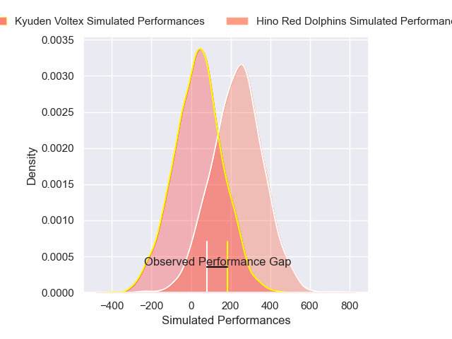
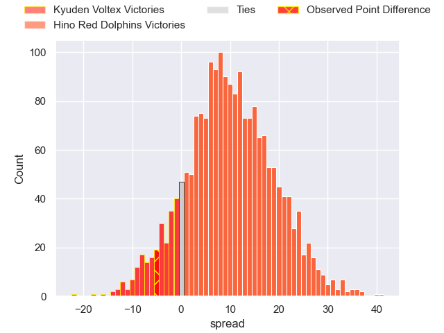
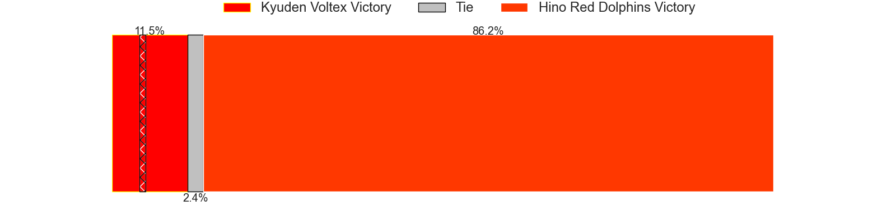

---  
layout: page  
title: Kyuden Voltex at Hino Red Dolphins; 30-25  
date: 2025-01-18 18:00:00 -0500  
categories: "Japan Rugby League One D2 2024" match review  
---
# Kyuden Voltex at Hino Red Dolphins; 30-25

# Club Level Predictions

The first set of predictions treats a club as the smallest object, as the club develops its members, organizes a gameplan, and deploys its players as needed for each match. This club model has a prediction of 0.642, which translates to predicting Hino Red Dolphins to win by 5.4.

Our Over/Under is 62.5 - and combined with the spread above, we have a predicted scoreline of 29 to 34

Each club has a rating and a rating deviation (similar to a Glicko rating), and expected performances can be generated. This allows for simulated matches and spreads like the ones below.
## Projected Performances - Club Model

## Projected Spreads - Club Model

## Projected Results - Club Model

# Player Level Predictions

Treating teams instead as an entity made up of the currently active players, I have ratings for each player in an altogether different system. These can be combined to form team ratings once teamsheets are announced, weighting starters a bit higher than the reserves. After the match is played, players can be weighted by their minutes on the field, allowing for an accurate measure of the team's composition. With these compiled team ratings, we can make predictions, measure inaccuracy, and update the individual player ratings.
## Prediction without Player Minutes: Hino Red Dolphins by 8.8

Hino Red Dolphins by 6.0 on a neutral pitch

## Projected Performances - Player Model

## Projected Spreads - Player Model

## Projected Results - Player Model

|   Away Minutes | Away Player            |   Away Percentile |   Number |   Home Percentile | Home Player     |   Home Minutes |
|---------------:|:-----------------------|------------------:|---------:|------------------:|:----------------|---------------:|
|             13 | Samuel Nozomu Faialaga |             15.3  |        1 |             41.62 | Yuto Tokuda     |             57 |
|             80 | Kyungmun Wang          |              1.06 |        2 |             18.62 | Kousei Tamaki   |             80 |
|             11 | Kosuke Oike            |             27.01 |        3 |              9.83 | Shosuke Funaki  |             80 |
|             80 | Yoshihiro Sononaka     |             17.81 |        4 |             28.64 | Noah Tovio      |             56 |
|             80 | Aaron Carroll          |             89.88 |        5 |             93.42 | Rory Arnold     |             75 |
|             80 | Masahiro Eriguchi      |             53.44 |        6 |             73.79 | Shohei Ijima    |             13 |
|             72 | Keisuke Yamzoe         |             41.09 |        7 |             51.72 | Shun Tomonaga   |             47 |
|             72 | Alex Takuya Walker     |             38.96 |        8 |             54.98 | Kyosuke Horie   |             80 |
|              8 | Spencer Jeans          |             53.62 |        9 |             26.81 | Kotaro Hatada   |             80 |
|              8 | Tom Taylor             |             84.19 |       10 |             81.74 | Simon Hickey    |             67 |
|             13 | Ren Hagiwara           |             16.93 |       11 |             35.53 | Moeki Fukushi   |             70 |
|             66 | Hayato Kojo            |             29.77 |       12 |             29.55 | Murray Koster   |             51 |
|              5 | Sione Likuata Teaupa   |             37.62 |       13 |             53.98 | Taroma Togo     |             33 |
|             61 | Goki Saito             |             76.28 |       14 |              8.46 | Sora Ohchi      |             33 |
|              7 | Charlie Worthington    |             23.52 |       15 |             14.07 | Kyoji Takano    |             24 |
|             58 | Taro Uesugi            |            nan    |       16 |             40.69 | AJ Wolf         |             33 |
|              9 | Makoto Kato            |              1.32 |       17 |             30.29 | Keita Doi       |             42 |
|             66 | Colby Fainga'a         |              4.76 |       18 |             29.66 | Makoto Tsuchiya |             80 |
|             80 | Yasuo Saruwatari       |              8.21 |       19 |            nan    | Sota Moriya     |             80 |
|              9 | Kenji Hayata           |            nan    |       20 |             62.8  | Ko Kojima       |             80 |
|             80 | Hayato Yoshida         |            nan    |       21 |            nan    | Arito Takahashi |             80 |
|             40 | Shunta Takenouchi      |             39.31 |       22 |            nan    | Yutaro Danno    |             14 |
|             58 | Yuuki Yamada           |             24.49 |       23 |             71.74 | Yuki Kagoshima  |             52 |

