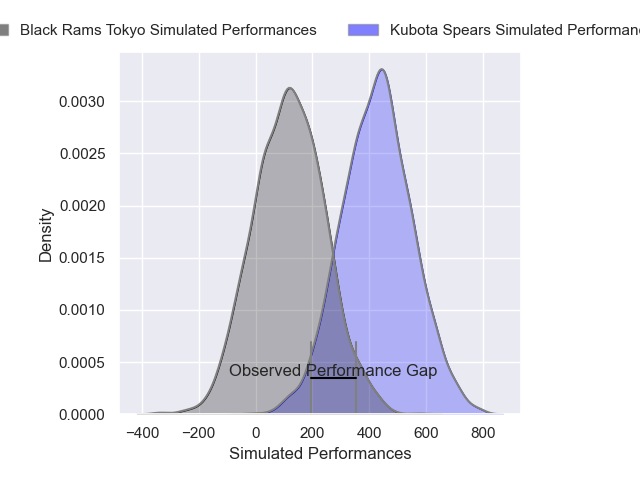
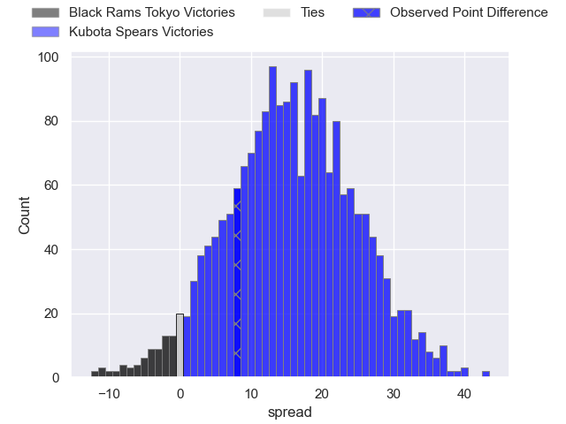
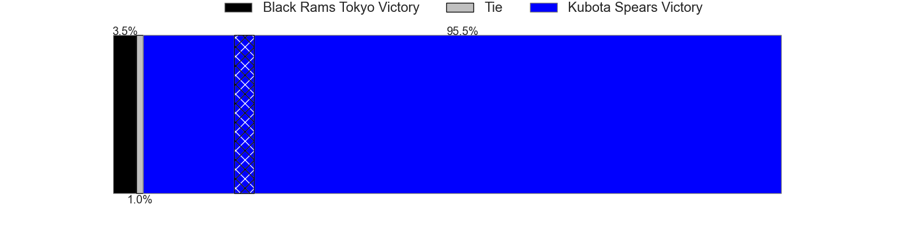

---  
layout: page  
title: Black Rams Tokyo at Kubota Spears; 18-26  
date: 2025-01-18 18:00:00 -0500  
categories: "Japan Rugby League One 2024" match review  
---
# Black Rams Tokyo at Kubota Spears; 18-26

# Club Level Predictions

The first set of predictions treats a club as the smallest object, as the club develops its members, organizes a gameplan, and deploys its players as needed for each match. This club model has a prediction of 0.861, which translates to predicting Kubota Spears to win by 16.5.

Our Over/Under is 58.5 - and combined with the spread above, we have a predicted scoreline of 21 to 38

Each club has a rating and a rating deviation (similar to a Glicko rating), and expected performances can be generated. This allows for simulated matches and spreads like the ones below.
## Projected Performances - Club Model

## Projected Spreads - Club Model

## Projected Results - Club Model

# Player Level Predictions

Treating teams instead as an entity made up of the currently active players, I have ratings for each player in an altogether different system. These can be combined to form team ratings once teamsheets are announced, weighting starters a bit higher than the reserves. After the match is played, players can be weighted by their minutes on the field, allowing for an accurate measure of the team's composition. With these compiled team ratings, we can make predictions, measure inaccuracy, and update the individual player ratings.
## Prediction without Player Minutes: Kubota Spears by 16.7

Kubota Spears by 12.6 on a neutral pitch

## Projected Performances - Player Model

## Projected Spreads - Player Model

## Projected Results - Player Model

|   Away Minutes | Away Player       |   Away Percentile |   Number |   Home Percentile | Home Player            |   Home Minutes |
|---------------:|:------------------|------------------:|---------:|------------------:|:-----------------------|---------------:|
|             13 | Taishi Tsumura    |             28.61 |        1 |             87.8  | Kota Kaishi            |             80 |
|             13 | Ko Sato           |             79.75 |        2 |             46.89 | Hayate Era             |             80 |
|             24 | Shohei Oyama      |             19.5  |        3 |             62.97 | Keijiro Tamefusa       |             47 |
|             33 | Harrison Fox      |             47.01 |        4 |             39.82 | David Van Zeeland      |             80 |
|             33 | Pohiva Lotoahea   |             85.43 |        5 |             79.44 | David Bulbring         |             67 |
|             70 | Mike Stolberg     |              2.33 |        6 |             63.7  | Merwe Olivier          |             47 |
|             80 | Liam Gill         |             84.13 |        7 |             88.57 | Takeo Suenaga          |             13 |
|             67 | Amato Fakatava    |              7.73 |        8 |             83.26 | Faulua Makisi          |             33 |
|             80 | Toshiya Takahashi |             66.67 |        9 |             97.3  | Bryn Hall              |             80 |
|             13 | TJ Perenara       |             96.69 |       10 |             99.12 | Bernard Foley          |             29 |
|             31 | Viliami Lolohea   |             12.87 |       11 |             94.33 | Gerhard van den Heever |             10 |
|             63 | Yuki Ikeda        |             62.61 |       12 |             43.21 | Yuya Hirose            |             29 |
|             29 | Ryohei Isoda      |             74.68 |       13 |             29.85 | Rikus Pretorius        |             63 |
|             29 | Siope Lolo Tavo   |             40.15 |       14 |             74.93 | Halatoa Vailea         |             31 |
|             29 | Kotaro Ito        |             45.41 |       15 |             44.74 | Tomoki Kishioka        |             21 |
|             51 | Paddy Ryan        |             83.08 |       16 |             60.21 | Schalk Erasmus         |             53 |
|             80 | Samuel Waqabaca   |             50.64 |       17 |             37.89 | Yota Kamimori          |             69 |
|             80 | Shuhei Matsuhashi |             65.93 |       18 |             80.84 | Opeti Helu             |             80 |
|             80 | Brodi McCurran    |             66.53 |       19 |             97.78 | Tyler Paul             |             49 |
|             80 | Takanobu Minami   |             13.87 |       20 |             54.77 | Shinobu Fujiwara       |             67 |
|             80 | Shin Ouchi        |            nan    |       21 |             91.95 | Shaun Stevenson        |             80 |
|             80 | Penieli Jr Latu   |            nan    |       22 |             84.11 | Harumichi Tatekawa     |             67 |
|             22 | Semisi Tupou      |             31.77 |       23 |            nan    | Asipeli Moala          |             80 |

