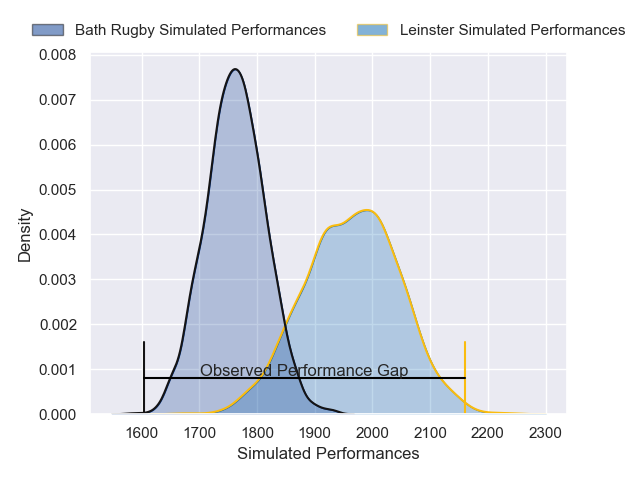
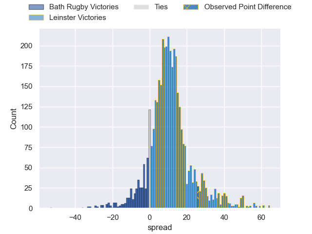
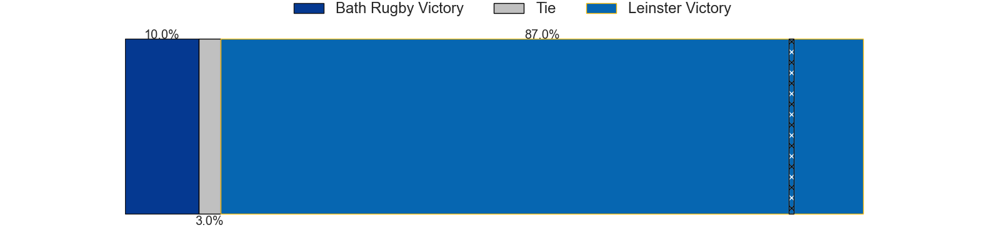
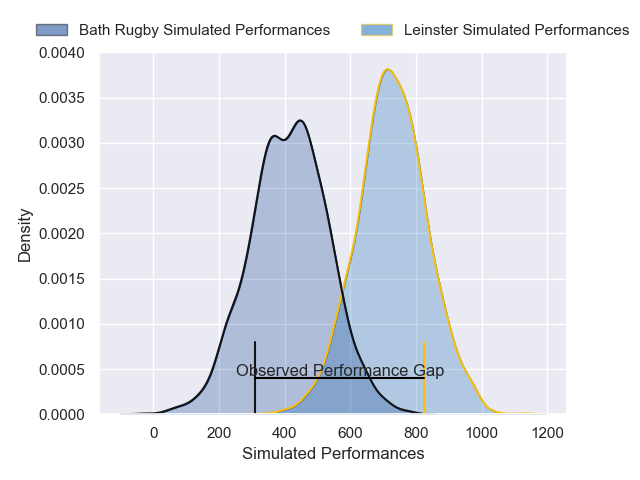
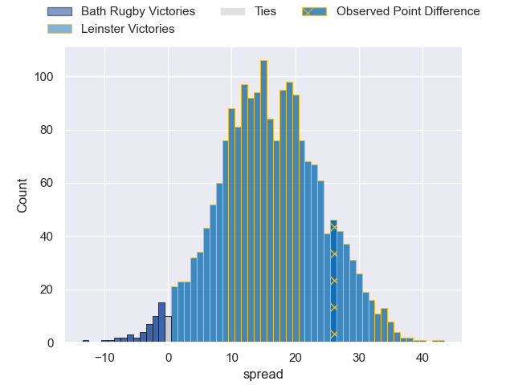
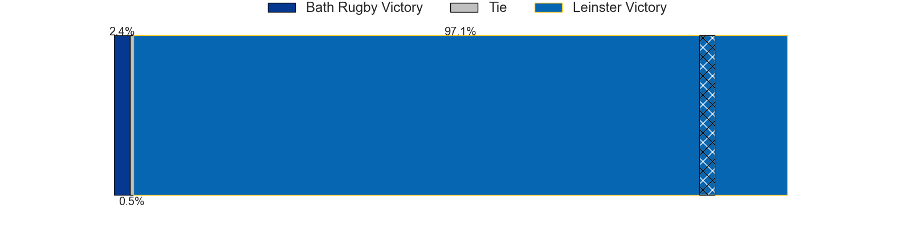

---  
layout: page  
title: Bath Rugby at Leinster; 21-47  
date: 2025-01-18 18:00:00 -0500  
categories: "European Rugby Champions Cup 2024" match review  
---
# Bath Rugby at Leinster; 21-47

# Club Level Predictions

The first set of predictions treats a club as the smallest object, as the club develops its members, organizes a gameplan, and deploys its players as needed for each match. This club model has a prediction of 0.757, which translates to predicting Leinster to win by 10.0.

Our Over/Under is 60.5 - and combined with the spread above, we have a predicted scoreline of 25 to 35

Each club has a rating and a rating deviation (similar to a Glicko rating), and expected performances can be generated. This allows for simulated matches and spreads like the ones below.
## Projected Performances - Club Model

## Projected Spreads - Club Model

## Projected Results - Club Model

# Player Level Predictions

Treating teams instead as an entity made up of the currently active players, I have ratings for each player in an altogether different system. These can be combined to form team ratings once teamsheets are announced, weighting starters a bit higher than the reserves. After the match is played, players can be weighted by their minutes on the field, allowing for an accurate measure of the team's composition. With these compiled team ratings, we can make predictions, measure inaccuracy, and update the individual player ratings.
## Prediction without Player Minutes: Leinster by 18.1

Leinster by 8.0 on a neutral pitch

## Projected Performances - Player Model

## Projected Spreads - Player Model

## Projected Results - Player Model

|   Away Minutes | Away Player         |   Away Percentile |   Number |   Home Percentile | Home Player         |   Home Minutes |
|---------------:|:--------------------|------------------:|---------:|------------------:|:--------------------|---------------:|
|             48 | Beno Obano          |             93.85 |        1 |             91.45 | Andrew Porter       |             54 |
|             14 | Niall Annett        |             70.57 |        2 |             96.45 | Ronan Kelleher      |             80 |
|             12 | Will Stuart         |             57.18 |        3 |             90.77 | Rabah Slimani       |             80 |
|             30 | Quinn Roux          |             94.64 |        4 |             82.09 | Joe McCarthy        |             49 |
|              6 | Ross Molony         |             95.85 |        5 |             97.27 | James Ryan          |             13 |
|             80 | Ted Hill            |             83.91 |        6 |             95.04 | Max Deegan          |             80 |
|             80 | Miles Reid          |             95.45 |        7 |             98.79 | Josh van der Flier  |             16 |
|             18 | Alfie Barbeary      |             78.14 |        8 |             98.7  | Jack Conan          |             58 |
|              2 | Ben Spencer         |             81.7  |        9 |             96.74 | Jamison Gibson-Park |             17 |
|             49 | Finn Russell        |             99.78 |       10 |             32.52 | Sam Prendergast     |             22 |
|             80 | Ruaridh McConnochie |             88.58 |       11 |             91.14 | Jamie Osborne       |             27 |
|             26 | Max Ojomoh          |             95.86 |       12 |             94.55 | Jordie Barrett      |             27 |
|             80 | Ollie Lawrence      |             77.32 |       13 |             92.8  | Robbie Henshaw      |             80 |
|             62 | Joe Cokanasiga      |             96.46 |       14 |             99.21 | Garry Ringrose      |             80 |
|             58 | Tom de Glanville    |             13.19 |       15 |             99.34 | Hugo Keenan         |             58 |
|             54 | Tom Dunn            |             97.16 |       16 |             94.27 | Cian Healy          |             80 |
|             26 | Thomas du Toit      |             98.72 |       17 |             38.56 | Gus McCarthy        |             22 |
|             80 | Charlie Ewels       |             79.76 |       18 |             82.74 | Thomas Clarkson     |             32 |
|             53 | Francois van Wyk    |             86.5  |       19 |             99.8  | RG Snyman           |             44 |
|             80 | Jaco Coetzee        |             56.49 |       20 |             95.45 | Caelan Doris        |             61 |
|             29 | Louis Schreuder     |             81.88 |       21 |             98.55 | Luke McGrath        |             31 |
|             54 | Orlando Bailey      |             73.85 |       22 |             93.76 | Ross Byrne          |             26 |
|             80 | Josh Bayliss        |             15.79 |       23 |            nan    | nan                 |            nan |

