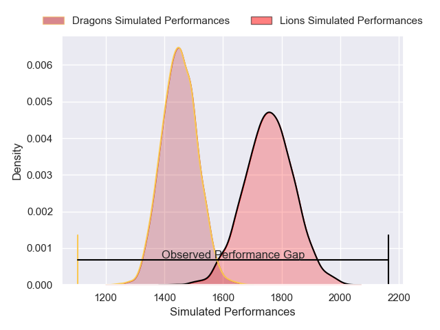
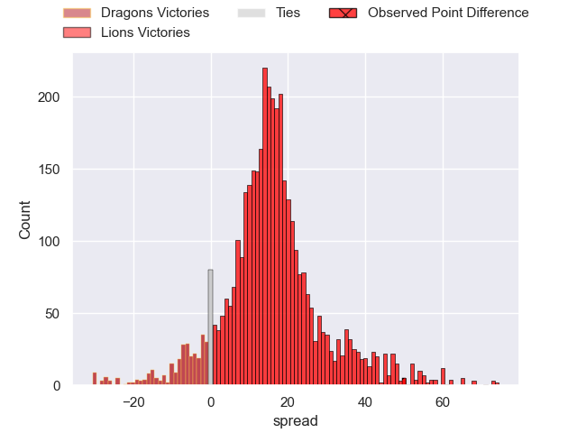
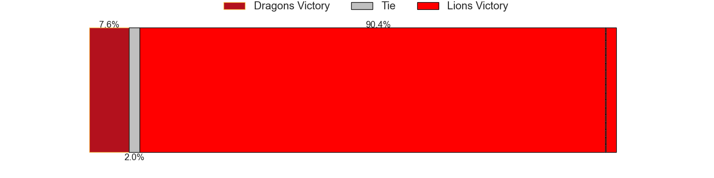
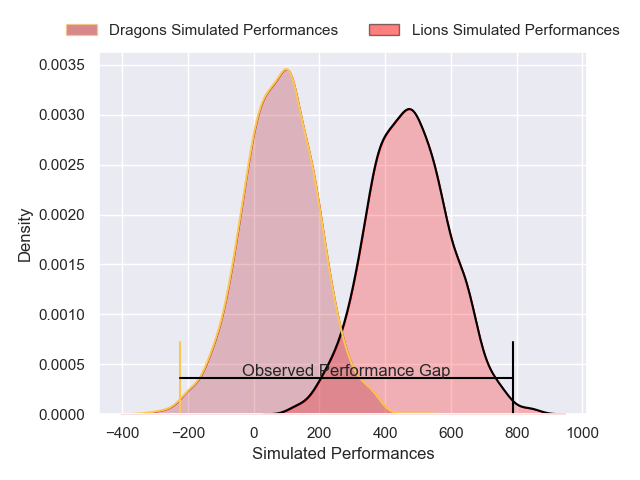
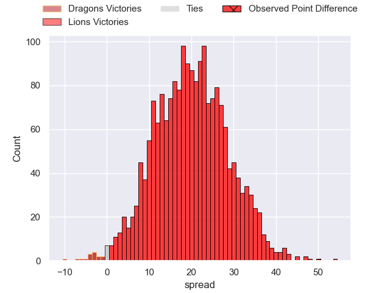
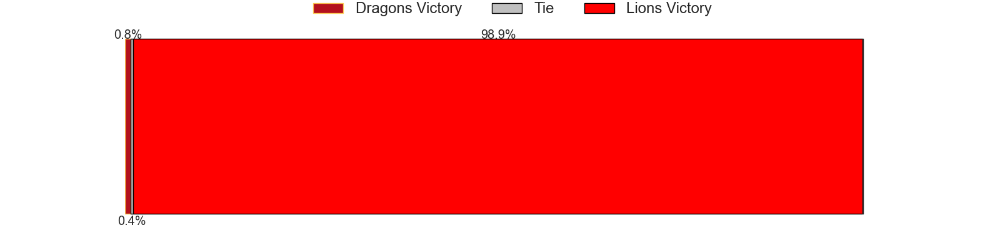

---  
layout: page  
title: Dragons at Lions; 10-60  
date: 2025-01-18 18:00:00 -0500  
categories: "European Rugby Challenge Cup 2024" match review  
---
# Dragons at Lions; 10-60

# Club Level Predictions

The first set of predictions treats a club as the smallest object, as the club develops its members, organizes a gameplan, and deploys its players as needed for each match. This club model has a prediction of 0.848, which translates to predicting Lions to win by 15.2.

Our Over/Under is 67.5 - and combined with the spread above, we have a predicted scoreline of 26 to 41

Each club has a rating and a rating deviation (similar to a Glicko rating), and expected performances can be generated. This allows for simulated matches and spreads like the ones below.
## Projected Performances - Club Model

## Projected Spreads - Club Model

## Projected Results - Club Model

# Player Level Predictions

Treating teams instead as an entity made up of the currently active players, I have ratings for each player in an altogether different system. These can be combined to form team ratings once teamsheets are announced, weighting starters a bit higher than the reserves. After the match is played, players can be weighted by their minutes on the field, allowing for an accurate measure of the team's composition. With these compiled team ratings, we can make predictions, measure inaccuracy, and update the individual player ratings.
## Prediction without Player Minutes: Lions by 23.6

Lions by 17.3 on a neutral pitch

## Projected Performances - Player Model

## Projected Spreads - Player Model

## Projected Results - Player Model

|   Away Minutes | Away Player              |   Away Percentile |   Number |   Home Percentile | Home Player            |   Home Minutes |
|---------------:|:-------------------------|------------------:|---------:|------------------:|:-----------------------|---------------:|
|              9 | Rodrigo Martinez         |             66.75 |        1 |             47.58 | Juan Schoeman          |             31 |
|             80 | Elliot Dee               |             70.5  |        2 |             78.96 | PJ Botha               |             67 |
|              9 | Chris Coleman            |             30.48 |        3 |             67.1  | Asenathi Ntlabakanye   |             80 |
|             27 | Joseph Davies            |              4.33 |        4 |             90.22 | Etienne Oosthuizen     |             20 |
|             80 | George Nott              |             13.51 |        5 |             77.92 | Darrien-Lane Landsberg |             18 |
|              1 | Ryan Woodman             |             65.36 |        6 |             88.25 | JC Pretorius           |             80 |
|             21 | Shane Lewis-Hughes       |              5.26 |        7 |             92.78 | Ruan Venter            |             80 |
|             80 | Taine Basham             |             38.79 |        8 |             98.28 | Francke Horn           |             40 |
|             49 | Che Hope                 |             68.8  |        9 |             90.51 | Morne van den Berg     |             68 |
|             80 | Will Reed                |             18.06 |       10 |             32.16 | Sam Francis            |             80 |
|             80 | Ewan Rosser              |             56.4  |       11 |             92.86 | Edwill van der Merwe   |             40 |
|             18 | Aneurin Owen             |             77.99 |       12 |             89.6  | Rynhardt Jonker        |             80 |
|             31 | Joe Westwood             |             29.76 |       13 |             73.12 | Henco van Wyk          |             13 |
|             18 | Rio Dyer                 |              5.67 |       14 |             90.91 | Tapiwa Mafura          |             80 |
|             27 | Huw Anderson             |             26.62 |       15 |             97.32 | Quan Horn              |             24 |
|             80 | Dylan Kelleher-Griffiths |            nan    |       16 |             72.88 | SJ Kotze               |             60 |
|             62 | Brodie Coghlan           |             31.12 |       17 |             87.41 | Jaco Visagie           |             55 |
|             18 | Paula Latu               |            nan    |       18 |             88.71 | Ruben Schoeman         |             80 |
|              9 | Barny Langton            |             40.32 |       19 |             54.54 | Ruan Delport           |             62 |
|             49 | George Young             |             40.41 |       20 |             17.22 | Jarod Cairns           |             75 |
|             59 | Morgan Lloyd             |            nan    |       21 |             75.55 | Nico Steyn             |             58 |
|             40 | Lloyd Evans              |             68.72 |       22 |             87.25 | Gianni Lombard         |             38 |
|             80 | Harri Ackerman           |             10.29 |       23 |             18.69 | Manuel Rass            |             80 |

