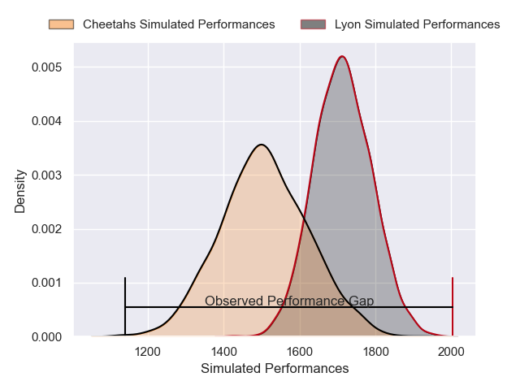
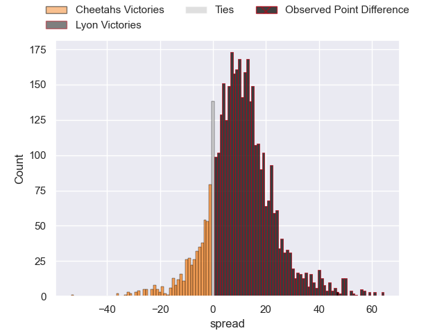
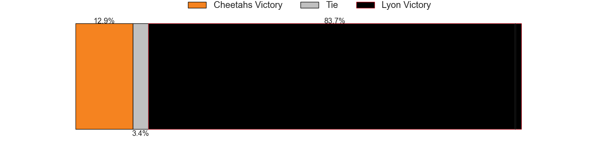
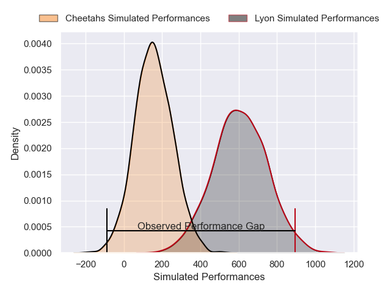
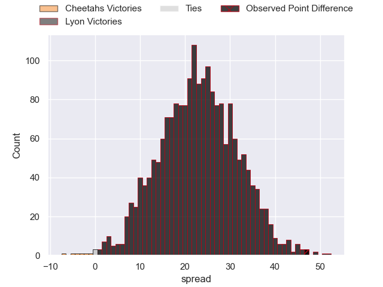
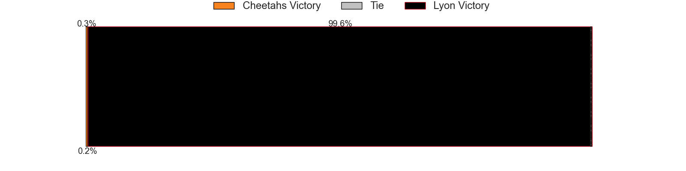

---  
layout: page  
title: Cheetahs at Lyon; 21-68  
date: 2025-01-18 18:00:00 -0500  
categories: "European Rugby Challenge Cup 2024" match review  
---
# Cheetahs at Lyon; 21-68

# Club Level Predictions

The first set of predictions treats a club as the smallest object, as the club develops its members, organizes a gameplan, and deploys its players as needed for each match. This club model has a prediction of 0.756, which translates to predicting Lyon to win by 10.4.

Our Over/Under is 51.5 - and combined with the spread above, we have a predicted scoreline of 21 to 31

Each club has a rating and a rating deviation (similar to a Glicko rating), and expected performances can be generated. This allows for simulated matches and spreads like the ones below.
## Projected Performances - Club Model

## Projected Spreads - Club Model

## Projected Results - Club Model

# Player Level Predictions

Treating teams instead as an entity made up of the currently active players, I have ratings for each player in an altogether different system. These can be combined to form team ratings once teamsheets are announced, weighting starters a bit higher than the reserves. After the match is played, players can be weighted by their minutes on the field, allowing for an accurate measure of the team's composition. With these compiled team ratings, we can make predictions, measure inaccuracy, and update the individual player ratings.
## Prediction without Player Minutes: Lyon by 16.1

Lyon by 3.6 on a neutral pitch

## Projected Performances - Player Model

## Projected Spreads - Player Model

## Projected Results - Player Model

|   Away Minutes | Away Player              |   Away Percentile |   Number |   Home Percentile | Home Player        |   Home Minutes |
|---------------:|:-------------------------|------------------:|---------:|------------------:|:-------------------|---------------:|
|             52 | Hencus van Wyk           |             39.38 |        1 |             49.74 | Lyan Pakihivatau   |             61 |
|             22 | Louis van der Westhuizen |             86.33 |        2 |             83.09 | Sam Matavesi       |             49 |
|             12 | Aranos Coetzee           |             13.04 |        3 |             55.61 | Cedate Gomes Sa    |             65 |
|             30 | Pieter Jansen van Vuuren |             44.66 |        4 |             13.71 | Theo William       |             32 |
|             80 | Victor Sekekete          |             82.16 |        5 |             77.22 | Alban Roussel      |             25 |
|             40 | Daniel Johannes Maartens |             84.95 |        6 |             72.89 | Dylan Cretin       |             80 |
|             14 | Friedle Olivier          |             96.7  |        7 |             50.1  | Luka Saginadze     |             57 |
|             68 | Jeandre Rudolph          |             28.88 |        8 |             76.29 | Liam Allen         |             80 |
|             31 | Ruben de Haas            |             51.46 |        9 |             72.08 | Martin Page-Relo   |             80 |
|             80 | Franco Smith             |             21.37 |       10 |             79.74 | Leo Berdeu         |              6 |
|             18 | Prince Nkabinde          |             43.79 |       11 |             95.21 | Monty Ioane        |             80 |
|             80 | Ali Mgijima              |             58.41 |       12 |             70.58 | Theo Millet        |             80 |
|             30 | Carel-Jan Coetzee        |              0.11 |       13 |              3.98 | Josiah Maraku      |             62 |
|             60 | Munier Hartzenberg       |             81.43 |       14 |             86.41 | Vincent Rattez     |             80 |
|             40 | Cohen Jasper             |             69.13 |       15 |             75.17 | Davit Niniashvili  |             80 |
|             40 | Cohen Jasper             |             69.13 |       15 |             75.17 | Davit Niniashvili  |             61 |
|             48 | Corne Fourie             |             97.84 |       16 |              9.41 | Hamza Kaabeche     |             74 |
|             48 | Vernon Paulo             |            nan    |       17 |              7.69 | Jermaine Ainsley   |             65 |
|             19 | Laurence Herbert Victor  |            nan    |       18 |             92.27 | Camille Chat       |             63 |
|             19 | Pierre-Raymond Uys       |            nan    |       19 |             58.87 | Felix Lambey       |             80 |
|             19 | Neels Volschenk          |             41.59 |       20 |             94.85 | Arno Botha         |             44 |
|             29 | Sisonke Vumazonke        |            nan    |       21 |             95.02 | Thibault Regard    |             26 |
|             68 | Jandre Nel               |            nan    |       22 |             99.32 | Semi Radradra      |             80 |
|             31 | Litha Nkula              |             61.52 |       23 |             92.52 | Baptiste Couilloud |             80 |

