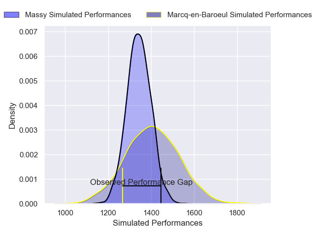
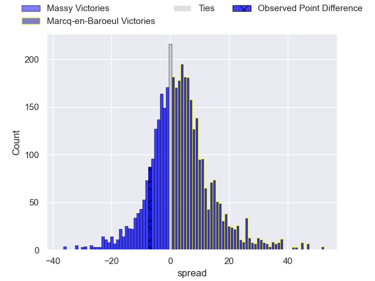
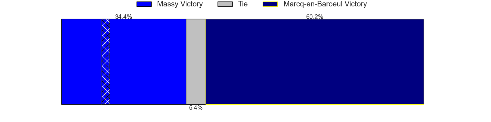
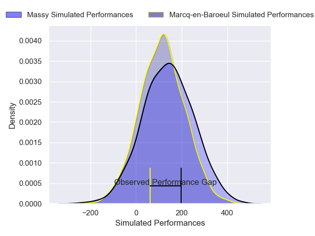
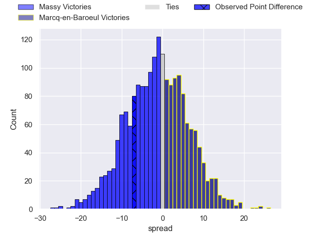
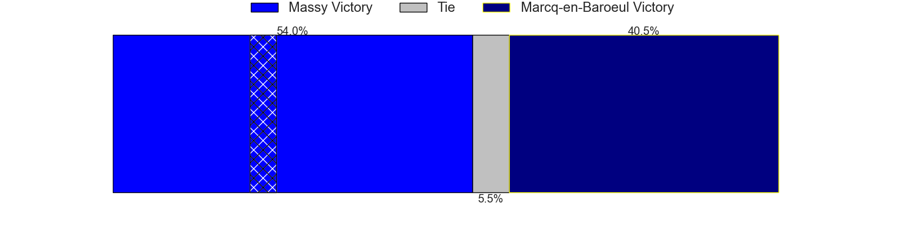

---  
layout: page  
title: Massy at Marcq-en-Baroeul; 31-24  
date: 2025-01-18 18:00:00 -0500  
categories: "Nationale 2024" match review  
---
# Massy at Marcq-en-Baroeul; 31-24

# Club Level Predictions

The first set of predictions treats a club as the smallest object, as the club develops its members, organizes a gameplan, and deploys its players as needed for each match. This club model has a prediction of 0.583, which translates to predicting Marcq-en-Baroeul to win by 2.9.

Our Over/Under is 41.5 - and combined with the spread above, we have a predicted scoreline of 20 to 22

Each club has a rating and a rating deviation (similar to a Glicko rating), and expected performances can be generated. This allows for simulated matches and spreads like the ones below.
## Projected Performances - Club Model

## Projected Spreads - Club Model

## Projected Results - Club Model

# Player Level Predictions

Treating teams instead as an entity made up of the currently active players, I have ratings for each player in an altogether different system. These can be combined to form team ratings once teamsheets are announced, weighting starters a bit higher than the reserves. After the match is played, players can be weighted by their minutes on the field, allowing for an accurate measure of the team's composition. With these compiled team ratings, we can make predictions, measure inaccuracy, and update the individual player ratings.
## Prediction without Player Minutes: Massy by 1.2

Massy by 3.5 on a neutral pitch

## Projected Performances - Player Model

## Projected Spreads - Player Model

## Projected Results - Player Model

|   Away Minutes | Away Player            |   Away Percentile |   Number |   Home Percentile | Home Player              |   Home Minutes |
|---------------:|:-----------------------|------------------:|---------:|------------------:|:-------------------------|---------------:|
|             28 | Siegfried Fisi'ihoi    |             44.07 |        1 |             51.8  | Eli Serra-Miglietti      |             32 |
|             28 | Adrien Sonzogni        |             61.63 |        2 |             35.35 | Santiago Iglesias Valdez |             19 |
|             15 | Tijde Visser           |             62.89 |        3 |             34.11 | Victor-Fy Balas Burel    |             54 |
|             80 | Hilan Delbois Fontaine |             64.77 |        4 |             55.09 | Antoine Delaporte        |             26 |
|             23 | Andrei Mahu            |             33.03 |        5 |             31.44 | Lucio Anconetani         |             58 |
|             25 | Yohann Gbizie          |             88.78 |        6 |             48.63 | Joachim Beaumont         |             80 |
|             15 | Clément Vidoni         |             58.04 |        7 |             52.78 | Arthur Bruges            |             29 |
|             25 | Simon Cowley           |             56.87 |        8 |             66.52 | Maxime Danton            |             18 |
|             19 | Julien Blanc           |             59.82 |        9 |             61.08 | Geoffrey Cazanave        |             44 |
|             15 | Gonzalo Lopez Bontempo |              6.18 |       10 |             59.82 | Paul Decavel             |             40 |
|             25 | Martin Carre           |             82.9  |       11 |             45.44 | Hugues Crespo            |             20 |
|             80 | Luca Mignot            |             79.74 |       12 |             63.15 | Louis Decavel            |             57 |
|             61 | Tom Cusson             |             60.45 |       13 |              9.16 | Hugo Detre               |             11 |
|             15 | Ilian El Yahyaoui      |             59.37 |       14 |             12.3  | Dany Antunes             |             15 |
|             80 | Alexandre Borie        |             43.18 |       15 |             55.03 | Patrick Fleming Dewhirst |             65 |
|             28 | Fernandez Correa       |              0.26 |       16 |             25.77 | Bruno Vliegen            |             52 |
|             65 | Pierre Trassoudaine    |             95.2  |       17 |             43.52 | Joseph Reynaud           |             52 |
|             69 | Nicolas Ferrer         |             81.79 |       18 |             57.13 | Lewys Jones              |             40 |
|             80 | Koen Bloemen           |            nan    |       19 |             54.89 | Jean-Baptiste Rende      |             31 |
|             11 | Giani Gamba            |             50.86 |       20 |             38.42 | Cedric Yonkeu            |             52 |
|             80 | Arthur Seigneuret      |             78.88 |       21 |              9.66 | Otilo Kafotamaki         |             80 |
|             80 | Lucas Rubio            |             42.7  |       22 |             58.74 | Dylan Nocete             |             65 |
|             80 | Giorgi Gogoladze       |             14.02 |       23 |             56.96 | Mathias Ortiz            |             10 |

