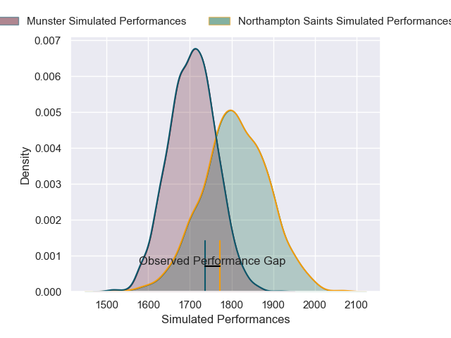
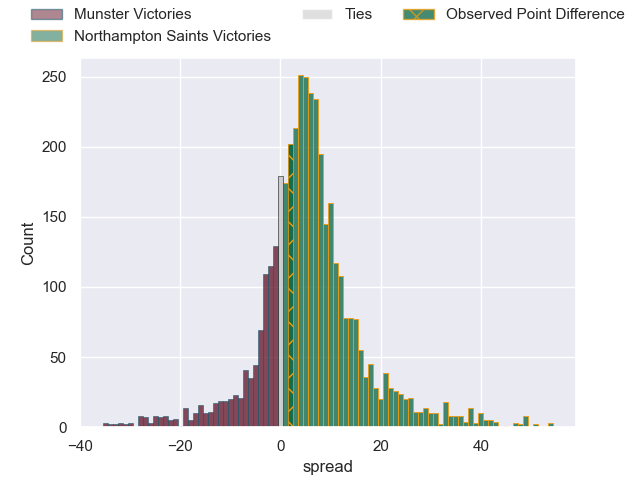
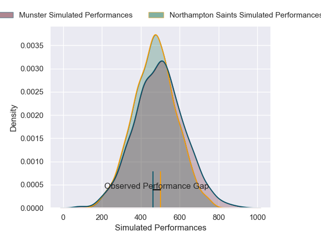
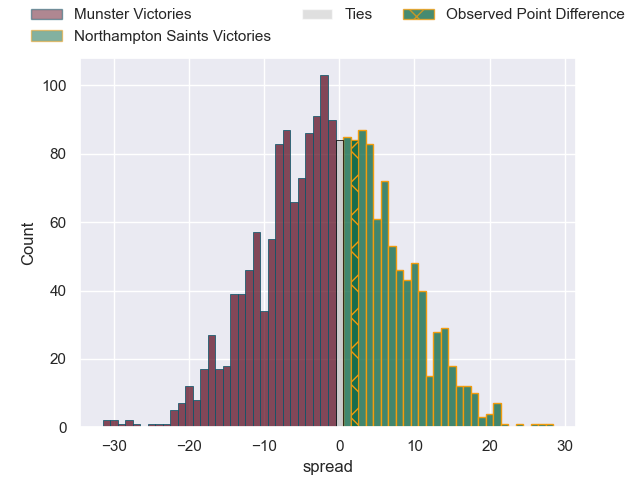

---  
layout: page  
title: Munster at Northampton Saints; 32-34  
date: 2025-01-18 18:00:00 -0500  
categories: "European Rugby Champions Cup 2024" match review  
---
# Munster at Northampton Saints; 32-34

# Club Level Predictions

The first set of predictions treats a club as the smallest object, as the club develops its members, organizes a gameplan, and deploys its players as needed for each match. This club model has a prediction of 0.64, which translates to predicting Northampton Saints to win by 5.1.

Our Over/Under is 52.5 - and combined with the spread above, we have a predicted scoreline of 24 to 29

Each club has a rating and a rating deviation (similar to a Glicko rating), and expected performances can be generated. This allows for simulated matches and spreads like the ones below.
## Projected Performances - Club Model

## Projected Spreads - Club Model

## Projected Results - Club Model

# Player Level Predictions

Treating teams instead as an entity made up of the currently active players, I have ratings for each player in an altogether different system. These can be combined to form team ratings once teamsheets are announced, weighting starters a bit higher than the reserves. After the match is played, players can be weighted by their minutes on the field, allowing for an accurate measure of the team's composition. With these compiled team ratings, we can make predictions, measure inaccuracy, and update the individual player ratings.
## Prediction without Player Minutes: Northampton Saints by 4.0

Munster by 11.1 on a neutral pitch

## Projected Performances - Player Model

## Projected Spreads - Player Model

## Projected Results - Player Model

|   Away Minutes | Away Player        |   Away Percentile |   Number |   Home Percentile | Home Player        |   Home Minutes |
|---------------:|:-------------------|------------------:|---------:|------------------:|:-------------------|---------------:|
|             80 | Dian Bleurer       |             51.54 |        1 |             86.15 | Tarek Haffar       |             70 |
|             80 | Diarmuid Barron    |             88.65 |        2 |             96.99 | Curtis Langdon     |             51 |
|             49 | Oli Jager          |             90.94 |        3 |              0.6  | Trevor Davison     |             40 |
|             18 | Fineen Wycherley   |             36.84 |        4 |              8.2  | Alex Coles         |             10 |
|             80 | Tadhg Beirne       |             99.19 |        5 |             15.18 | Tom Lockett        |             20 |
|             27 | Peter O'Mahony     |             97.47 |        6 |              4.55 | Josh Kemeny        |             59 |
|              1 | Alex Kendellen     |             88.56 |        7 |             97.06 | Tom Pearson        |              9 |
|             80 | Gavin Coombes      |             73.38 |        8 |             66.02 | Juarno Augustus    |             55 |
|             80 | Conor Murray       |             99.28 |        9 |             97.46 | Alex Mitchell      |              9 |
|             80 | Jack Crowley       |             35.86 |       10 |             63.7  | Fin Smith          |             80 |
|             80 | Diarmuid Kilgallen |             45.87 |       11 |              2.17 | Tom Seabrook       |             40 |
|             79 | Rory Scannell      |             96.4  |       12 |             86.37 | Rory Hutchinson    |             62 |
|             68 | Tom Farrell        |             79.72 |       13 |             81.9  | Fraser Dingwall    |             80 |
|             75 | Calvin Nash        |             96.75 |       14 |             97.44 | Tommy Freeman      |             46 |
|             58 | Mike Haley         |             77.36 |       15 |             62.42 | James Ramm         |             80 |
|             40 | John Ryan          |             81.88 |       16 |             13.59 | Tom West           |             67 |
|              9 | Niall Scannell     |             93.09 |       17 |             72.52 | Henry Walker       |             49 |
|             80 | Stephen Archer     |             99.23 |       18 |             78.29 | Luke Green         |             40 |
|             20 | Thomas Ahern       |             53.44 |       19 |            nan    | Callum Hunter-Hill |             62 |
|             22 | Jack O'Donoghue    |             78.44 |       20 |             40.69 | Angus Scott-Young  |             45 |
|             25 | Paddy Patterson    |             56.52 |       21 |             95.02 | Henry Pollock      |             21 |
|             31 | Tony Butler        |             12.69 |       22 |              9.06 | Tom James          |             80 |

