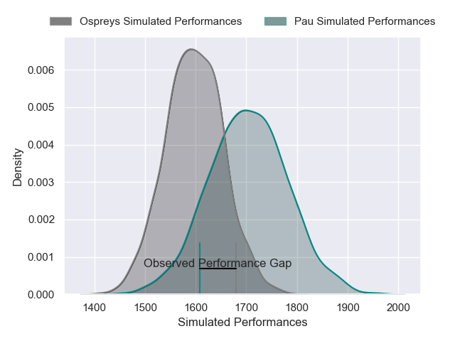
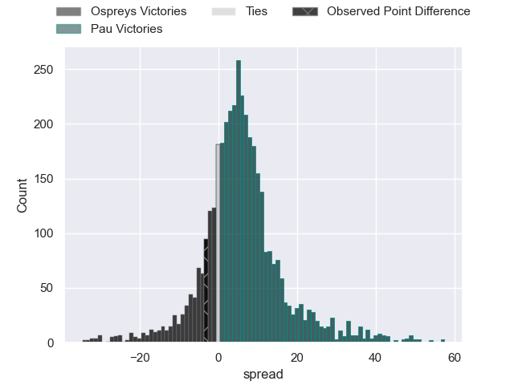
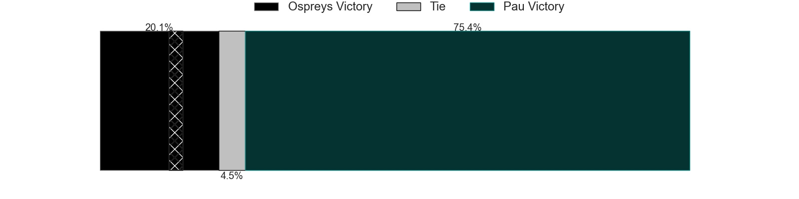
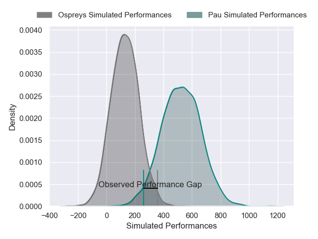
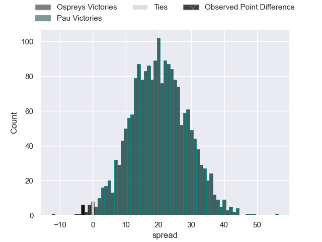
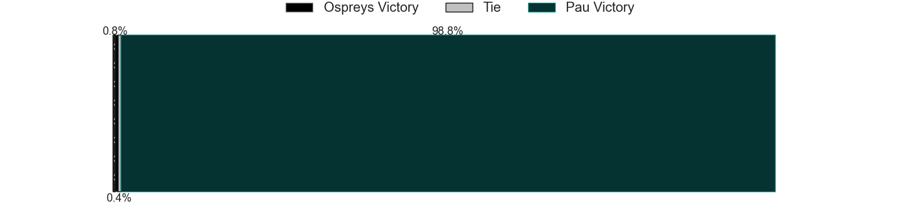

---  
layout: page  
title: Ospreys at Pau; 31-28  
date: 2025-01-18 18:00:00 -0500  
categories: "European Rugby Challenge Cup 2024" match review  
---
# Ospreys at Pau; 31-28

# Club Level Predictions

The first set of predictions treats a club as the smallest object, as the club develops its members, organizes a gameplan, and deploys its players as needed for each match. This club model has a prediction of 0.647, which translates to predicting Pau to win by 5.3.

Our Over/Under is 39.5 - and combined with the spread above, we have a predicted scoreline of 17 to 23

Each club has a rating and a rating deviation (similar to a Glicko rating), and expected performances can be generated. This allows for simulated matches and spreads like the ones below.
## Projected Performances - Club Model

## Projected Spreads - Club Model

## Projected Results - Club Model

# Player Level Predictions

Treating teams instead as an entity made up of the currently active players, I have ratings for each player in an altogether different system. These can be combined to form team ratings once teamsheets are announced, weighting starters a bit higher than the reserves. After the match is played, players can be weighted by their minutes on the field, allowing for an accurate measure of the team's composition. With these compiled team ratings, we can make predictions, measure inaccuracy, and update the individual player ratings.
## Prediction without Player Minutes: Pau by 11.3

Ospreys by 1.9 on a neutral pitch

## Projected Performances - Player Model

## Projected Spreads - Player Model

## Projected Results - Player Model

|   Away Minutes | Away Player    |   Away Percentile |   Number |   Home Percentile | Home Player         |   Home Minutes |
|---------------:|:---------------|------------------:|---------:|------------------:|:--------------------|---------------:|
|             22 | Steffan Thomas |             15.37 |        1 |             25.3  | Ignacio Calles      |             22 |
|             50 | Lewis Lloyd    |             77.16 |        2 |             30.58 | Romain Ruffenach    |             80 |
|             30 | Tom Botha      |             71.68 |        3 |              9.24 | Guram Papidze       |             63 |
|             55 | Will Spencer   |             77.32 |        4 |             42.24 | Lekima Tagitagivalu |             66 |
|              6 | James Fender   |             79.84 |        5 |             19.35 | Remi Picquette      |             80 |
|             30 | James Ratti    |             77.01 |        6 |             31.65 | Joel Kpoku          |             56 |
|             30 | Jac Morgan     |             94.23 |        7 |              7.42 | Thibaut Hamonou     |             58 |
|             16 | Morgan Morse   |             41.16 |        8 |             96.55 | Luke Whitelock      |             63 |
|             16 | Kieran Hardy   |             64.42 |        9 |             76.64 | Thomas Souverbie    |             80 |
|             37 | Dan Edwards    |             77.31 |       10 |             86.34 | Axel Desperes       |             80 |
|             80 | Ryan Conbeer   |             17.79 |       11 |             24.05 | Gregoire Arfeuil    |             80 |
|             30 | Owen Williams  |             95.35 |       12 |             78.87 | Fabien Brau-Boirie  |             80 |
|             64 | Evardi Boshoff |             13.38 |       13 |             19.47 | Elliot Roudil       |             80 |
|             48 | Daniel Kasende |             96.38 |       14 |             12.22 | Theo Attissogbe     |             43 |
|             61 | Iestyn Hopkins |             76.06 |       15 |             16.11 | Clement Mondinat    |             74 |
|             25 | Garyn Phillips |             68.91 |       16 |              4.15 | Daniel Bibi Biziwu  |             50 |
|             80 | Ben Warren     |             76.25 |       17 |             67.63 | Youri Delhommel     |             64 |
|             16 | Ethan Lewis    |            nan    |       18 |             94.3  | Harry Williams      |             80 |
|             43 | Tristan Davies |            nan    |       19 |             45.5  | Dan Jooste          |             80 |
|             80 | Luke Davies    |             64.05 |       20 |             43.75 | Brent Liufau        |             80 |
|             50 | Jack Walsh     |             53.24 |       21 |             98.54 | Dan Robson          |             64 |
|            nan | nan            |            nan    |       22 |             58.36 | Aaron Grandidier    |             26 |
|            nan | nan            |            nan    |       23 |             62.61 | Emilien Gailleton   |             80 |

