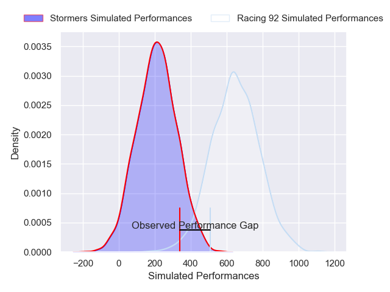
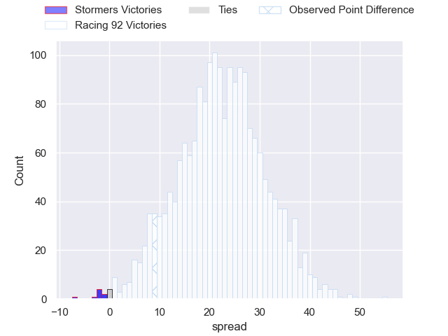
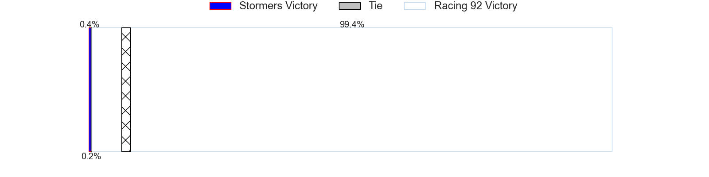

---  
layout: page  
title: Stormers at Racing 92; 22-31  
date: 2025-01-18 18:00:00 -0500  
categories: "European Rugby Champions Cup 2024" match review  
---
# Stormers at Racing 92; 22-31

# Club Level Predictions

The first set of predictions treats a club as the smallest object, as the club develops its members, organizes a gameplan, and deploys its players as needed for each match. This club model has a prediction of 0.597, which translates to predicting Racing 92 to win by 3.5.

Our Over/Under is 56.5 - and combined with the spread above, we have a predicted scoreline of 27 to 30

Each club has a rating and a rating deviation (similar to a Glicko rating), and expected performances can be generated. This allows for simulated matches and spreads like the ones below.
## Projected Performances - Club Model

## Projected Spreads - Club Model

## Projected Results - Club Model

# Player Level Predictions

Treating teams instead as an entity made up of the currently active players, I have ratings for each player in an altogether different system. These can be combined to form team ratings once teamsheets are announced, weighting starters a bit higher than the reserves. After the match is played, players can be weighted by their minutes on the field, allowing for an accurate measure of the team's composition. With these compiled team ratings, we can make predictions, measure inaccuracy, and update the individual player ratings.
## Prediction without Player Minutes: Racing 92 by 9.8

Stormers by 1.2 on a neutral pitch

## Projected Performances - Player Model

## Projected Spreads - Player Model

## Projected Results - Player Model

|   Away Minutes | Away Player          |   Away Percentile |   Number |   Home Percentile | Home Player                       |   Home Minutes |
|---------------:|:---------------------|------------------:|---------:|------------------:|:----------------------------------|---------------:|
|             53 | Sti Sithole          |             71.11 |        1 |             14.1  | Hassane Kolingar                  |             73 |
|             80 | Joseph Dweba         |             75    |        2 |              6.56 | Feleti Kaitu'u                    |             73 |
|             11 | Neethling Fouche     |             87.95 |        3 |             77.86 | Thomas Laclayat                   |             20 |
|             24 | Salmaan Moerat       |             88.66 |        4 |             29.45 | Will Rowlands                     |             53 |
|             15 | Ruben van Heerden    |             91.8  |        5 |             28.85 | Romain Taofifenua                 |             80 |
|             36 | Willie Engelbrecht   |             79.66 |        6 |             26.32 | Ibrahim Diallo                    |             80 |
|             36 | Marcel Theunissen    |             47.47 |        7 |             80.36 | Maxime Baudonne                   |             27 |
|             24 | Evan Roos            |             90.91 |        8 |             89.83 | Hacjivah Dayimani                 |             80 |
|             15 | Dewaldt Duvenage     |             84.96 |        9 |             77.36 | Nolann Le Garrec                  |             53 |
|             27 | Jurie Matthee        |             25.84 |       10 |             98.89 | Owen Farrell                      |             80 |
|             44 | Ben Loader           |             92.32 |       11 |             11.81 | Max Spring                        |              4 |
|             69 | Jonathan Roche       |             63.03 |       12 |              4.91 | Dan Lancaster                     |             53 |
|             24 | Wandisile Simelane   |             80.92 |       13 |             95.97 | Josua Tuisova                     |             53 |
|             80 | Suleiman Hartzenberg |             78.15 |       14 |             43.5  | Vinaya Habosi                     |             80 |
|             21 | Clayton Blommetjies  |             94.95 |       15 |             27.25 | Tristan Tedder                    |             53 |
|             80 | Alistair Vermaak     |             88.63 |       16 |             74.96 | Guram Gogichashvili               |             80 |
|             24 | Andre-Hugo Venter    |             59.57 |       17 |             73.23 | Diego Escobar Alvarez             |             80 |
|             40 | Frans Malherbe       |             89.74 |       18 |             73.33 | Lee-Marvin Lofty Siyanda Mazibuko |             44 |
|             80 | JD Schickerling      |              6.38 |       19 |             91.3  | Boris Palu                        |             80 |
|             56 | Paul De Villiers     |             10.22 |       20 |             96.36 | Cameron Woki                      |             56 |
|             52 | Dave Ewers           |             98.38 |       21 |             85.71 | Jordan Joseph                     |             65 |
|             63 | Herschel Jantjies    |             91.67 |       22 |             94.88 | Antoine Gibert                    |             80 |
|             80 | Jean-Luc du Plessis  |             64.01 |       23 |             99.89 | Henry Chavancy                    |             80 |

