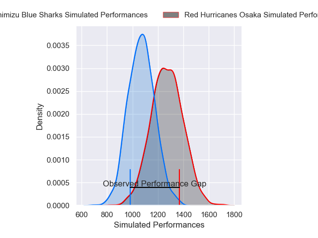
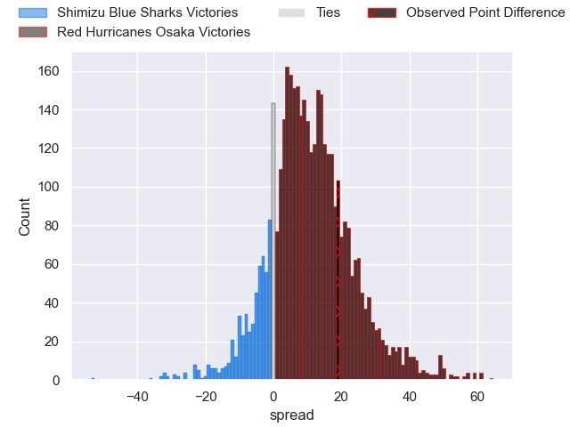
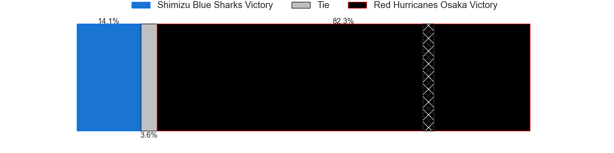
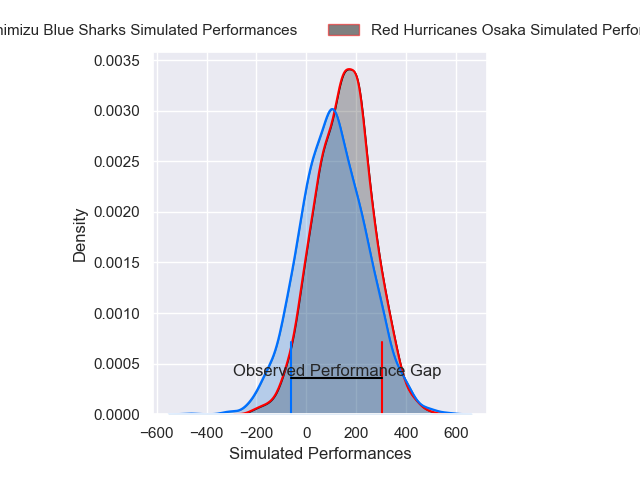
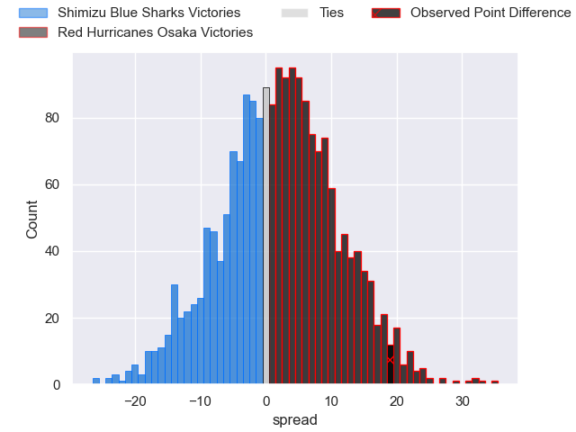

---  
layout: page  
title: Shimizu Blue Sharks at Red Hurricanes Osaka; 19-38  
date: 2025-01-18 18:00:00 -0500  
categories: "Japan Rugby League One D2 2024" match review  
---
# Shimizu Blue Sharks at Red Hurricanes Osaka; 19-38

# Club Level Predictions

The first set of predictions treats a club as the smallest object, as the club develops its members, organizes a gameplan, and deploys its players as needed for each match. This club model has a prediction of 0.758, which translates to predicting Red Hurricanes Osaka to win by 10.4.

Our Over/Under is 46.5 - and combined with the spread above, we have a predicted scoreline of 18 to 28

Each club has a rating and a rating deviation (similar to a Glicko rating), and expected performances can be generated. This allows for simulated matches and spreads like the ones below.
## Projected Performances - Club Model

## Projected Spreads - Club Model

## Projected Results - Club Model

# Player Level Predictions

Treating teams instead as an entity made up of the currently active players, I have ratings for each player in an altogether different system. These can be combined to form team ratings once teamsheets are announced, weighting starters a bit higher than the reserves. After the match is played, players can be weighted by their minutes on the field, allowing for an accurate measure of the team's composition. With these compiled team ratings, we can make predictions, measure inaccuracy, and update the individual player ratings.
## Prediction without Player Minutes: Red Hurricanes Osaka by 3.6

Shimizu Blue Sharks by 0.1 on a neutral pitch

## Projected Performances - Player Model

## Projected Spreads - Player Model

## Projected Results - Player Model

|   Away Minutes | Away Player         |   Away Percentile |   Number |   Home Percentile | Home Player          |   Home Minutes |
|---------------:|:--------------------|------------------:|---------:|------------------:|:---------------------|---------------:|
|             67 | Sanshiro Nomura     |             64.87 |        1 |             43.5  | Hiromichi Sakamoto   |             73 |
|             66 | Naomichi Tatekawa   |             59.93 |        2 |             67.55 | Hisamitsu Shimada    |             80 |
|             59 | Uha Lee             |             75.64 |        3 |             78.8  | Munekata Sashida     |             67 |
|             14 | Ed Holmes           |             65.79 |        4 |             31.07 | Michael Allardice    |             80 |
|             66 | Tom Rowe            |             43.42 |        5 |             89.07 | Elliott Stooke       |             66 |
|             72 | Koyo Adachi         |             52.43 |        6 |             57.89 | Taro Sato            |              7 |
|             10 | Josh Basham         |             46.46 |        7 |             81.38 | Blake Gibson         |             21 |
|             71 | Michael Va'a Toloke |              9.52 |        8 |             88.31 | Jack O'Sullivan      |             13 |
|             67 | Tatsuya Kanetsuki   |             29.71 |        9 |             38.77 | Akira Inoue          |             13 |
|             70 | Lima Sopoaga        |             94.43 |       10 |             76.61 | Fumiya Dobashi       |             58 |
|             80 | Tatsuhiro Ozaki     |              2.26 |       11 |             22.05 | Kouki Shigeno        |             21 |
|             67 | Soichiro Kuwata     |              9.38 |       12 |             20.83 | Mifiposeti Paea      |             67 |
|             80 | Noah Foster         |             19.96 |       13 |             14.5  | Kaoru Tsuruta        |             22 |
|             58 | Eika Miyazaki       |             12.7  |       14 |              4.92 | Taichi Yoshizawa     |             80 |
|             80 | Coenie van Wyk      |             66.81 |       15 |             74.51 | Taiki Yamaguchi      |             10 |
|              4 | Naoki Moriya        |              5.51 |       16 |             25.54 | Toshihiro Yamamouchi |             14 |
|             80 | Essendon Tuitupou   |            nan    |       17 |             45.26 | Henry Taefu          |             18 |
|             28 | Ryota Saito         |            nan    |       18 |            nan    | Shota Takai          |             29 |
|             14 | Kaito Tamori        |             13.3  |       19 |            nan    | Shinnosuke Toyonaga  |             46 |
|             22 | Fumiyake Mato       |             54.79 |       20 |             28.57 | Hiroki Hanada        |             80 |
|             13 | Murphy Taramai      |             12.12 |       21 |             13.58 | Kanta Yamamoto       |             71 |
|             80 | Yutaro Shirako      |              3.24 |       22 |              6.88 | Tatsunari Fujita     |             80 |
|             80 | Reijiro Usui        |            nan    |       23 |             76.77 | Kentaro Otsuka       |             80 |

