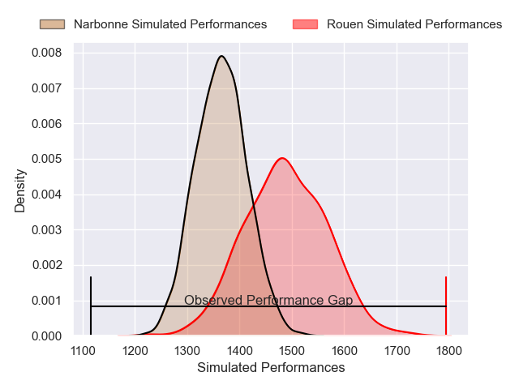
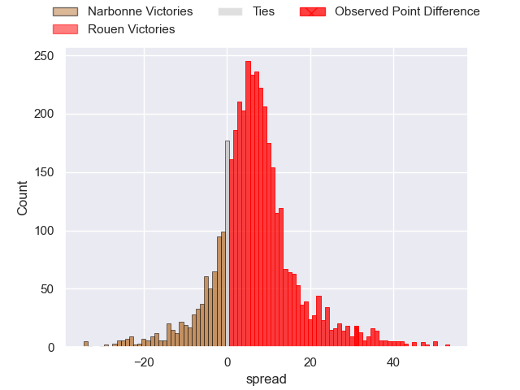
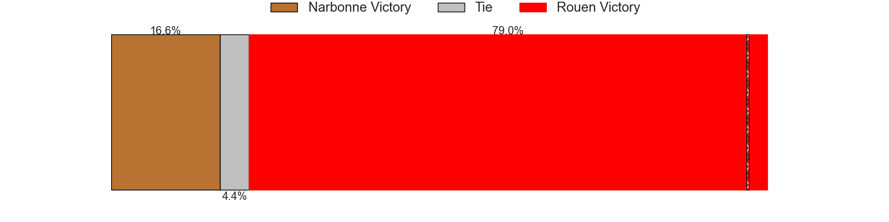
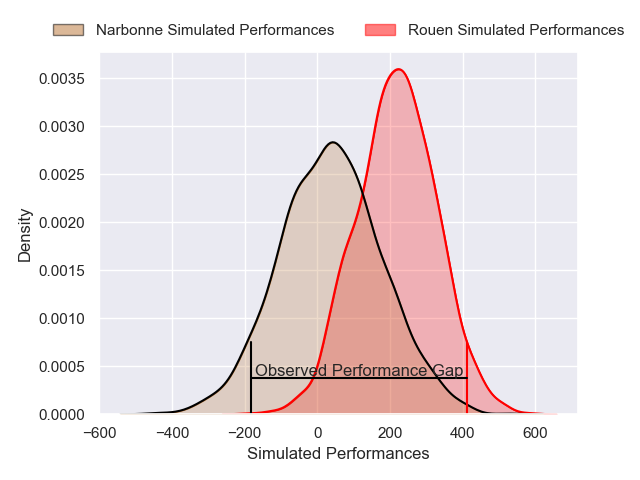
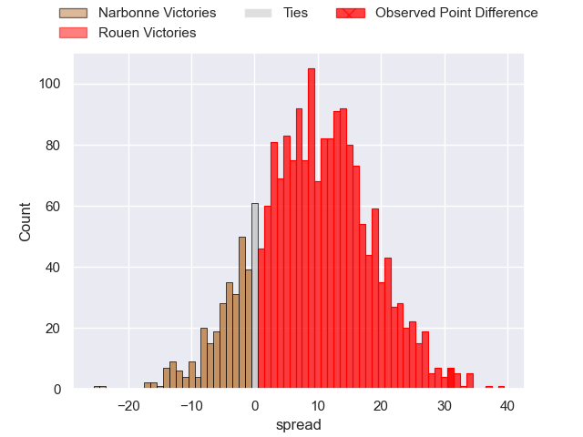
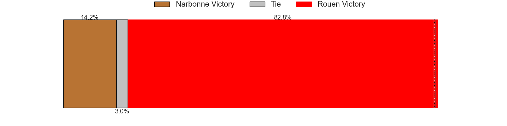

---  
layout: page  
title: Narbonne at Rouen; 10-41  
date: 2025-01-18 18:00:00 -0500  
categories: "Nationale 2024" match review  
---
# Narbonne at Rouen; 10-41

# Club Level Predictions

The first set of predictions treats a club as the smallest object, as the club develops its members, organizes a gameplan, and deploys its players as needed for each match. This club model has a prediction of 0.665, which translates to predicting Rouen to win by 6.0.

Our Over/Under is 41.5 - and combined with the spread above, we have a predicted scoreline of 18 to 24

Each club has a rating and a rating deviation (similar to a Glicko rating), and expected performances can be generated. This allows for simulated matches and spreads like the ones below.
## Projected Performances - Club Model

## Projected Spreads - Club Model

## Projected Results - Club Model

# Player Level Predictions

Treating teams instead as an entity made up of the currently active players, I have ratings for each player in an altogether different system. These can be combined to form team ratings once teamsheets are announced, weighting starters a bit higher than the reserves. After the match is played, players can be weighted by their minutes on the field, allowing for an accurate measure of the team's composition. With these compiled team ratings, we can make predictions, measure inaccuracy, and update the individual player ratings.
## Prediction without Player Minutes: Rouen by 12.4

Rouen by 8.4 on a neutral pitch

## Projected Performances - Player Model

## Projected Spreads - Player Model

## Projected Results - Player Model

|   Away Minutes | Away Player               |   Away Percentile |   Number |   Home Percentile | Home Player          |   Home Minutes |
|---------------:|:--------------------------|------------------:|---------:|------------------:|:---------------------|---------------:|
|             40 | Gregory Fichten           |              3.01 |        1 |             45.19 | Ewan Clément         |             69 |
|             40 | Clément Esteriola         |              7.99 |        2 |             74.96 | Mathieu Bonnot       |             80 |
|             14 | Jamie Hagan               |             39.35 |        3 |             83.51 | Soso Bekoshvili      |             80 |
|             80 | Darrell Dyer              |             84.63 |        4 |             64.67 | Jean Leleu           |             80 |
|             80 | Dennis Visser             |             13.57 |        5 |             69.96 | John-Charles Astle   |             55 |
|             80 | Lopeti Timani             |             78.36 |        6 |             18.1  | Willy N'Diaye        |             51 |
|             80 | Paul Belzons              |              3.03 |        7 |             91    | Tienie Burger        |             18 |
|             19 | Charles Malet             |              5.79 |        8 |             80.9  | Abdelkarim Fofana    |             55 |
|             55 | James Hart                |              0.36 |        9 |             12.79 | Ilan El Khattabi     |             10 |
|             65 | Gilles Bosch              |              2.43 |       10 |             68.65 | Maxime Javaux        |             23 |
|             80 | Clément Clavières         |             54.76 |       11 |             67.44 | Nicolas Nieto        |             40 |
|             80 | Peter Betham              |             99.03 |       12 |              4.63 | Theo Dachary         |             23 |
|             65 | Pierre-Hugo Ducom         |              5.28 |       13 |             43.53 | Opetera Peleseuma    |             25 |
|             80 | Taqele Naiyaravoro        |             12.39 |       14 |             77.71 | Benjamin Descamps    |             66 |
|             62 | Boris Goutard             |              0.45 |       15 |             51.45 | Aloïs Chayla         |             47 |
|             40 | Théo Castinel             |             56.19 |       16 |             42.7  | Soulemane Camara     |             10 |
|             57 | Gabriel Atlan             |            nan    |       17 |            nan    | Sidi-Mohammed Diallo |             40 |
|             57 | Avto Gogiashvili          |            nan    |       18 |            nan    | Tao Delacoudre       |             55 |
|             55 | Leva Fifita               |              2.99 |       19 |             56.89 | Corentin Vernet      |             23 |
|             80 | Bill Caffo                |             49.04 |       20 |            nan    | Ernest Eudier        |             61 |
|             29 | Tom Chauvet               |             18.98 |       21 |            nan    | Gauthier Lelong      |             80 |
|             80 | Thibault Santoro          |             38.7  |       22 |             84.33 | Benjamin Pehau       |              5 |
|             57 | Parataiso Silafai-Lea'ana |             52.59 |       23 |            nan    | Marin Boulier        |             80 |

