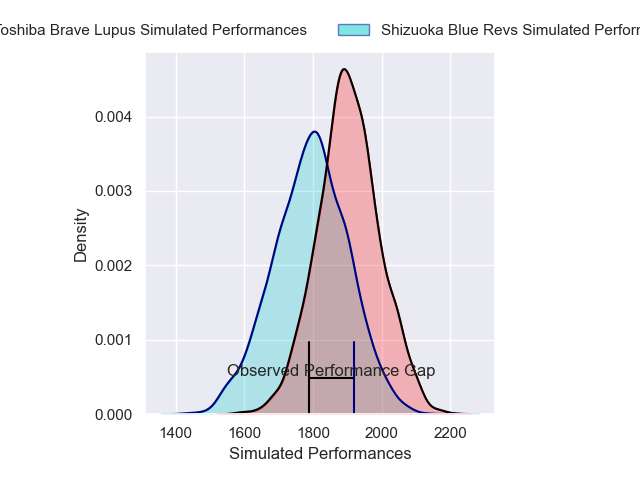
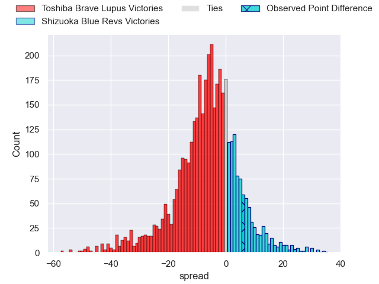
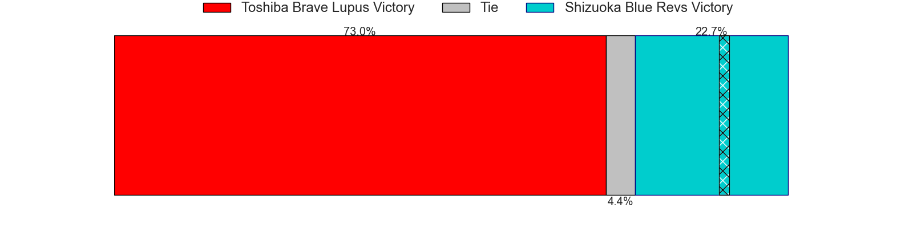
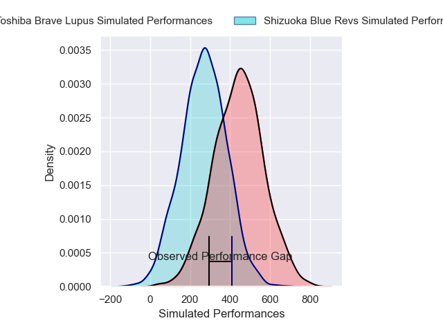
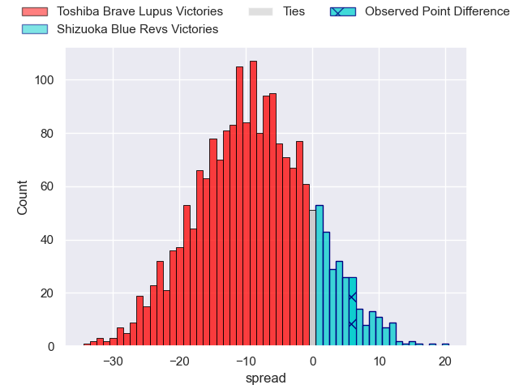
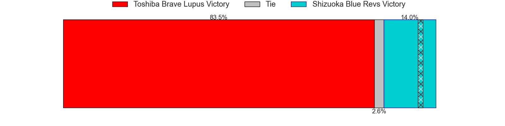

---  
layout: page  
title: Toshiba Brave Lupus at Shizuoka Blue Revs; 28-34  
date: 2025-01-18 18:00:00 -0500  
categories: "Japan Rugby League One 2024" match review  
---
# Toshiba Brave Lupus at Shizuoka Blue Revs; 28-34

# Club Level Predictions

The first set of predictions treats a club as the smallest object, as the club develops its members, organizes a gameplan, and deploys its players as needed for each match. This club model has a prediction of 0.349, which translates to predicting Toshiba Brave Lupus to win by 5.6.

Our Over/Under is 66.5 - and combined with the spread above, we have a predicted scoreline of 36 to 30

Each club has a rating and a rating deviation (similar to a Glicko rating), and expected performances can be generated. This allows for simulated matches and spreads like the ones below.
## Projected Performances - Club Model

## Projected Spreads - Club Model

## Projected Results - Club Model

# Player Level Predictions

Treating teams instead as an entity made up of the currently active players, I have ratings for each player in an altogether different system. These can be combined to form team ratings once teamsheets are announced, weighting starters a bit higher than the reserves. After the match is played, players can be weighted by their minutes on the field, allowing for an accurate measure of the team's composition. With these compiled team ratings, we can make predictions, measure inaccuracy, and update the individual player ratings.
## Prediction without Player Minutes: Toshiba Brave Lupus by 9.1

Toshiba Brave Lupus by 13.3 on a neutral pitch

## Projected Performances - Player Model

## Projected Spreads - Player Model

## Projected Results - Player Model

|   Away Minutes | Away Player        |   Away Percentile |   Number |   Home Percentile | Home Player             |   Home Minutes |
|---------------:|:-------------------|------------------:|---------:|------------------:|:------------------------|---------------:|
|             80 | Sena Kimura        |             79.83 |        1 |             41.2  | Kenta Yamashita         |             61 |
|             80 | Mamoru Harada      |             71.1  |        2 |             94.33 | Takeshi Hino            |             22 |
|             63 | Yuta Kokaji        |             87.61 |        3 |             55.73 | Bunkei Kaku             |             58 |
|             49 | Jacob Pierce       |             98.28 |        4 |             93.83 | Yuya Odo                |             31 |
|             17 | Warner Dearns      |             88.97 |        5 |             90.38 | Murray Douglas          |             27 |
|             11 | Shannon Frizell    |             93.12 |        6 |             26.62 | Vueti Tupou             |             31 |
|             80 | Takeshi Sasaki     |             79.25 |        7 |             90.69 | Kwagga Smith            |             66 |
|             31 | Michael Leitch     |             93.51 |        8 |             49.13 | Malgene Ilaua           |             80 |
|             80 | Yuhei Sugiyama     |             79.35 |        9 |             55.07 | Shuntaro Kitamura       |             69 |
|             47 | Richie Mo'unga     |             99.11 |       10 |             50.11 | Kenta Iemura            |             17 |
|             63 | Atsuki Kuwayama    |             79.92 |       11 |             84.35 | Malo Tuitama            |             80 |
|             55 | Taichi Mano        |             75.57 |       12 |             70.45 | Viliami Tahitu'a        |             49 |
|             80 | Seta Tamanivalu    |             94.33 |       13 |             95.2  | Charles Piutau          |             49 |
|             14 | Jone Naikabula     |             66.73 |       14 |             54.72 | Valynce Te Whare-Crosby |             80 |
|             80 | Takuro Matsunaga   |             90.99 |       15 |             61.98 | Futo Yamaguchi          |             22 |
|             17 | Yuto Mori          |             64.47 |       16 |             57.61 | Sean Vete               |             80 |
|             80 | Rob Thompson       |             35.11 |       17 |             55.63 | Sione Vuna              |             11 |
|             53 | Masataka Mikami    |             81.28 |       18 |            nan    | Soma Okazaki            |             11 |
|             80 | Daigo Hashimoto    |             60.99 |       19 |             41.63 | Damian Markus           |             52 |
|             17 | Teruo Makabe       |             85.56 |       20 |            nan    | Kazuhiro Kawata         |             80 |
|             80 | Yoshitaka Tokunaga |             25.61 |       21 |             82.39 | Eishin Kuwano           |             39 |
|             21 | Shin Ito           |             80.97 |       22 |            nan    | Richmond Tongatama      |             80 |
|            nan | nan                |            nan    |       23 |             52.36 | Kodai Okazaki           |             14 |

