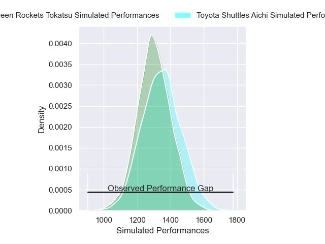
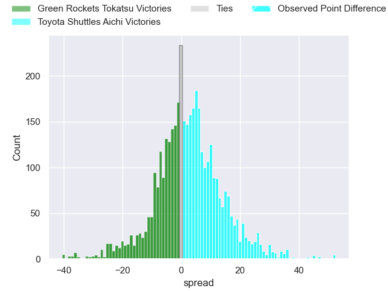
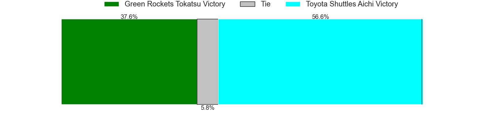
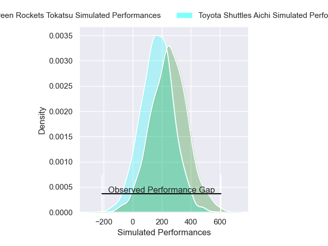
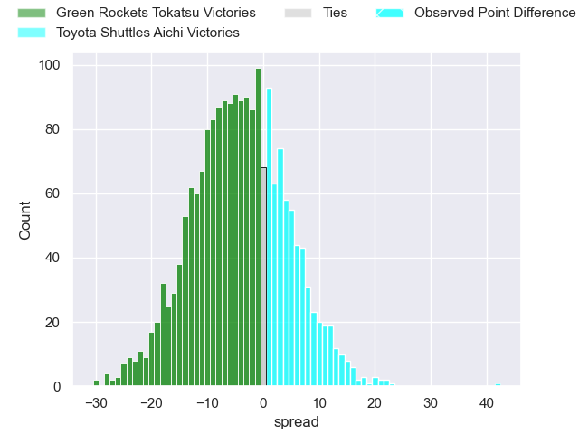
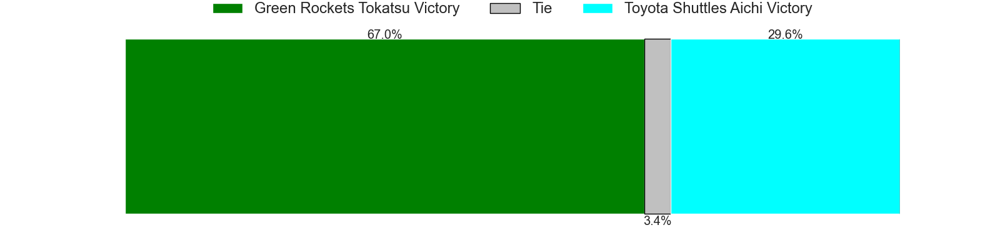

---  
layout: page  
title: Green Rockets Tokatsu at Toyota Shuttles Aichi; 0-42  
date: 2025-01-18 18:00:00 -0500  
categories: "Japan Rugby League One D2 2024" match review  
---
# Green Rockets Tokatsu at Toyota Shuttles Aichi; 0-42

# Club Level Predictions

The first set of predictions treats a club as the smallest object, as the club develops its members, organizes a gameplan, and deploys its players as needed for each match. This club model has a prediction of 0.566, which translates to predicting Toyota Shuttles Aichi to win by 2.4.

Our Over/Under is 45.5 - and combined with the spread above, we have a predicted scoreline of 22 to 24

Each club has a rating and a rating deviation (similar to a Glicko rating), and expected performances can be generated. This allows for simulated matches and spreads like the ones below.
## Projected Performances - Club Model

## Projected Spreads - Club Model

## Projected Results - Club Model

# Player Level Predictions

Treating teams instead as an entity made up of the currently active players, I have ratings for each player in an altogether different system. These can be combined to form team ratings once teamsheets are announced, weighting starters a bit higher than the reserves. After the match is played, players can be weighted by their minutes on the field, allowing for an accurate measure of the team's composition. With these compiled team ratings, we can make predictions, measure inaccuracy, and update the individual player ratings.
## Prediction without Player Minutes: Green Rockets Tokatsu by 6.3

Green Rockets Tokatsu by 10.0 on a neutral pitch

## Projected Performances - Player Model

## Projected Spreads - Player Model

## Projected Results - Player Model

|   Away Minutes | Away Player           |   Away Percentile |   Number |   Home Percentile | Home Player          |   Home Minutes |
|---------------:|:----------------------|------------------:|---------:|------------------:|:---------------------|---------------:|
|             19 | Kosei Yamamoto        |             90.33 |        1 |             65.2  | Tomoki Yamaguchi     |             18 |
|              9 | Ren Osawa             |             44.6  |        2 |             63.67 | Akito Fujinami       |             42 |
|              6 | Keisuke Kikuta        |             92.75 |        3 |             89.38 | Nobuyuki Takahashi   |             73 |
|             62 | Daiki Yamagiwa        |             69.96 |        4 |             82.66 | Taishi Nakamura      |             69 |
|             80 | Pari Pari Parkinson   |             95.77 |        5 |             35.48 | James Gaskell        |             13 |
|             80 | Viliami Lutua Ahofono |             75.15 |        6 |             66.29 | Tama Kapene          |             13 |
|             67 | Mitieli Tuinakauvadra |             79.07 |        7 |             50.31 | Chang Chao Yi        |              8 |
|              8 | Aseri Masivou         |             86.21 |        8 |             91.81 | Taleni Seu           |             72 |
|             80 | Nick Phipps           |             93.25 |        9 |             63.32 | Atsushi Yumoto       |             80 |
|             66 | Ko Yoshimura          |             26.65 |       10 |             93.83 | Freddie Burns        |             80 |
|             56 | Hiroyuki Miyajima     |              2.64 |       11 |             61.49 | Go Nakano            |             80 |
|             67 | Orbyn Leger           |              5.09 |       12 |              1.44 | Tiaan Thomas-Wheeler |             80 |
|             80 | Maritino Nemani       |              4.2  |       13 |             37.06 | Keita Ichikawa       |             66 |
|             58 | Kenta Omata           |             83.68 |       14 |             26.88 | Hiroaki Saito        |             66 |
|              4 | Keagan Faria          |             66.67 |       15 |             79.19 | Josua Kerevi         |             34 |
|             40 | Yusuke Maruo          |             67.88 |       16 |             90.33 | Keita Fujiwara       |             80 |
|             10 | Keita Kobayashi       |            nan    |       17 |             53.43 | Shoma Makinouchi     |             22 |
|             22 | Suguru Kubo           |            nan    |       18 |              7.49 | James Mollentze      |             21 |
|             80 | Edward Annandale      |            nan    |       19 |            nan    | Ieremia Mataena      |             18 |
|             14 | Taisetsu Kanai        |             92.73 |       20 |             68.25 | Yamato Matsuoka      |             14 |
|             72 | Koichi Matsura        |            nan    |       21 |            nan    | Daigo Doi            |             40 |
|             80 | Kanta Higashionna     |             83.25 |       22 |            nan    | Suguru Igarashi      |             40 |
|             80 | Ryoi Kamei            |             78.25 |       23 |             55.4  | Takuma Oyama         |             28 |

