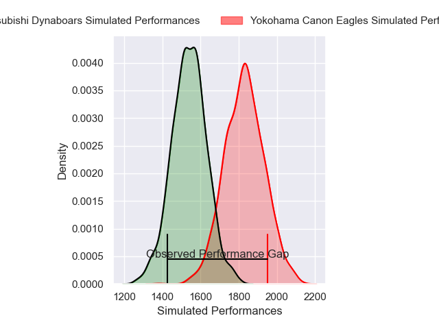
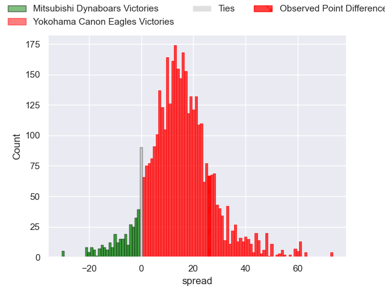
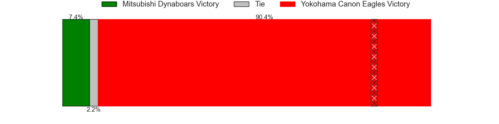
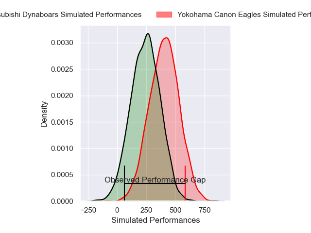
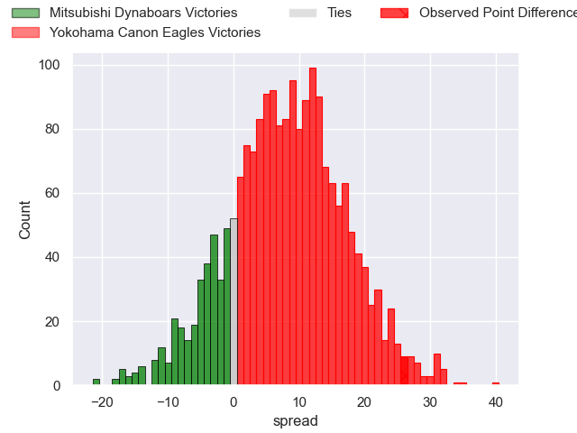
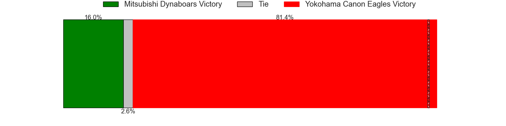

---  
layout: page  
title: Mitsubishi Dynaboars at Yokohama Canon Eagles; 21-47  
date: 2025-01-18 18:00:00 -0500  
categories: "Japan Rugby League One 2024" match review  
---
# Mitsubishi Dynaboars at Yokohama Canon Eagles; 21-47

# Club Level Predictions

The first set of predictions treats a club as the smallest object, as the club develops its members, organizes a gameplan, and deploys its players as needed for each match. This club model has a prediction of 0.835, which translates to predicting Yokohama Canon Eagles to win by 14.7.

Our Over/Under is 61.5 - and combined with the spread above, we have a predicted scoreline of 24 to 38

Each club has a rating and a rating deviation (similar to a Glicko rating), and expected performances can be generated. This allows for simulated matches and spreads like the ones below.
## Projected Performances - Club Model

## Projected Spreads - Club Model

## Projected Results - Club Model

# Player Level Predictions

Treating teams instead as an entity made up of the currently active players, I have ratings for each player in an altogether different system. These can be combined to form team ratings once teamsheets are announced, weighting starters a bit higher than the reserves. After the match is played, players can be weighted by their minutes on the field, allowing for an accurate measure of the team's composition. With these compiled team ratings, we can make predictions, measure inaccuracy, and update the individual player ratings.
## Prediction without Player Minutes: Yokohama Canon Eagles by 10.6

Yokohama Canon Eagles by 6.5 on a neutral pitch

## Projected Performances - Player Model

## Projected Spreads - Player Model

## Projected Results - Player Model

|   Away Minutes | Away Player         |   Away Percentile |   Number |   Home Percentile | Home Player        |   Home Minutes |
|---------------:|:--------------------|------------------:|---------:|------------------:|:-------------------|---------------:|
|             80 | Chang Ho Ahn        |             41.45 |        1 |             91.88 | Sioeli Vakalahi    |             80 |
|             25 | Lee Seung Hyok      |              3.9  |        2 |             93.79 | Shunta Nakamura    |             80 |
|             28 | Tomoaki Ishii       |             96.41 |        3 |             81.03 | Ryosuke Iwaihara   |             66 |
|             80 | Walt Steenkamp      |             64.17 |        4 |             10.12 | Liaki Moli         |             63 |
|             25 | Daniel Linde        |             18.22 |        5 |             56.07 | Matt Philip        |             25 |
|             36 | Kyo Yoshida         |             60.12 |        6 |             69.53 | Billy Harmon       |             30 |
|             40 | Timote Tavalea      |             19.74 |        7 |             76.92 | Naoto Shimada      |             80 |
|             74 | Jackson Hemopo      |             44.16 |        8 |             98.27 | Amanaki Mafi       |             80 |
|             30 | Kota Iwamura        |             71.38 |        9 |             95.83 | Faf de Klerk       |             14 |
|             80 | Jack Stratton       |             89.98 |       10 |             86.86 | Yu Tamura          |             80 |
|             16 | Satoshi Koizumi     |             73.82 |       11 |             52.56 | Masayoshi Takezawa |             43 |
|             55 | Charlie Lawrence    |             91.71 |       12 |             97.6  | Yusuke Kajimura    |             25 |
|             66 | Curtis Rona         |             75.25 |       13 |             99.02 | Jesse Kriel        |              6 |
|             66 | Kurt-Lee Arendse    |             98.13 |       14 |             65.55 | Kippei Ishida      |             61 |
|             80 | Kazuki Ishida       |              5.93 |       15 |             98.68 | Jumpei Ogura       |             35 |
|             41 | Matt Vaega          |             37.73 |       16 |             96.95 | Viliame Takayawa   |             80 |
|             80 | Rento Tsukayama     |             91.71 |       17 |             97.35 | Takato Okabe       |             80 |
|              5 | Hayato Hosoda       |              7.18 |       18 |              7.26 | Tatsuro Sugimoto   |             44 |
|             30 | Yuki Miyazato       |             29.96 |       19 |             87.06 | Yusuke Niwai       |             58 |
|             69 | Shunsuke Sakamoto   |            nan    |       20 |             55.87 | Cormac Daly        |             33 |
|             80 | Marino Mikaele-Tu'u |             14.72 |       21 |             87.45 | Sione Halasili     |             55 |
|             80 | James Grayson       |             45.21 |       22 |             64.86 | Kafazumi Yamasuga  |             66 |
|             48 | Riku Mishima        |            nan    |       23 |             30.43 | Ryo Tabata         |             80 |

