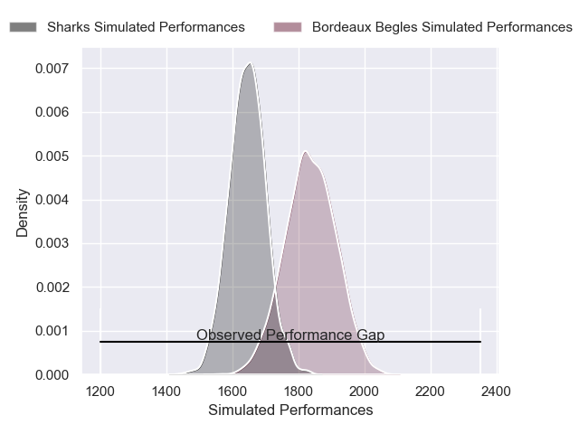
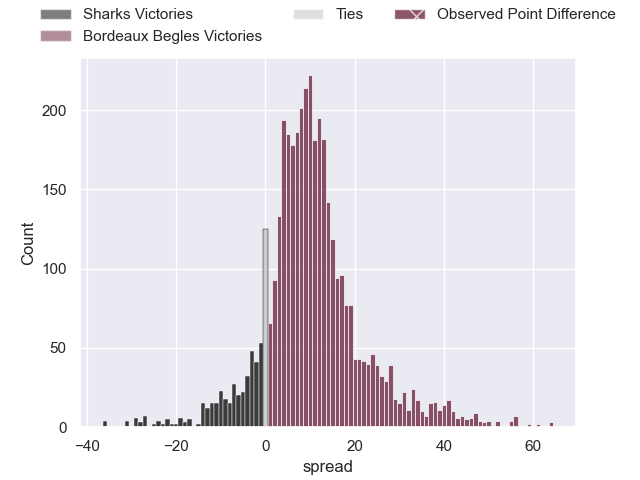
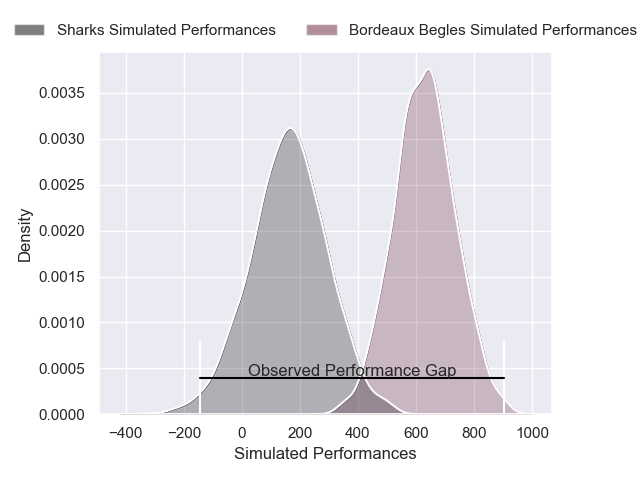
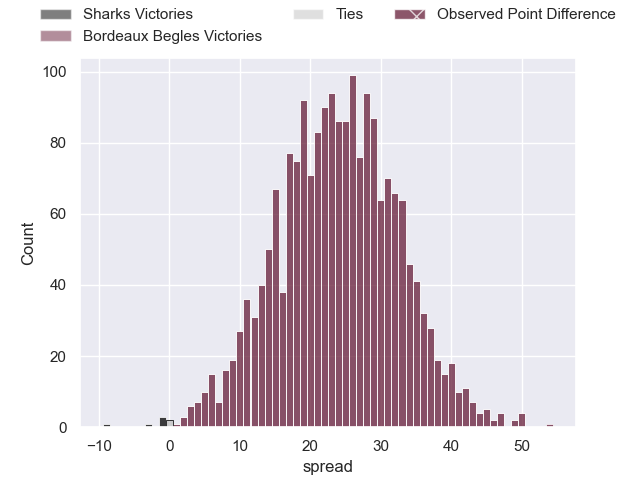

---  
layout: page  
title: Sharks at Bordeaux Begles; 12-66  
date: 2025-01-19 18:00:00 -0500  
categories: "European Rugby Champions Cup 2024" match review  
---
# Sharks at Bordeaux Begles; 12-66

# Club Level Predictions

The first set of predictions treats a club as the smallest object, as the club develops its members, organizes a gameplan, and deploys its players as needed for each match. This club model has a prediction of 0.749, which translates to predicting Bordeaux Begles to win by 9.7.

Our Over/Under is 57.5 - and combined with the spread above, we have a predicted scoreline of 24 to 33

Each club has a rating and a rating deviation (similar to a Glicko rating), and expected performances can be generated. This allows for simulated matches and spreads like the ones below.
## Projected Performances - Club Model

## Projected Spreads - Club Model

## Projected Results - Club Model

# Player Level Predictions

Treating teams instead as an entity made up of the currently active players, I have ratings for each player in an altogether different system. These can be combined to form team ratings once teamsheets are announced, weighting starters a bit higher than the reserves. After the match is played, players can be weighted by their minutes on the field, allowing for an accurate measure of the team's composition. With these compiled team ratings, we can make predictions, measure inaccuracy, and update the individual player ratings.
## Prediction without Player Minutes: Bordeaux Begles by 30.6

Bordeaux Begles by 18.7 on a neutral pitch

## Projected Performances - Player Model

## Projected Spreads - Player Model

## Projected Results - Player Model

|   Away Minutes | Away Player         |   Away Percentile |   Number |   Home Percentile | Home Player                     |   Home Minutes |
|---------------:|:--------------------|------------------:|---------:|------------------:|:--------------------------------|---------------:|
|             26 | Ntuthuko Mchunu     |             20.81 |        1 |             85.15 | Jefferson Poirot                |             13 |
|             35 | Bongi Mbonambi      |             96.58 |        2 |             70.68 | Connor Sa                       |             49 |
|             30 | Trevor Nyakane      |             85.23 |        3 |             90.41 | Carlu Sadie                     |             45 |
|             56 | Corne Rahl          |             12.5  |        4 |             92.94 | Guido Petti                     |             80 |
|             80 | Jason Jenkins       |             36.79 |        5 |             97.68 | Alexandre Ricard                |             54 |
|             59 | Phepsi Buthelezi    |             51.34 |        6 |             84.64 | Marko Gazzotti                  |             54 |
|             19 | Emmanuel Tshituka   |             49.18 |        7 |             98.66 | Bastien Vergnes Taillefer       |             18 |
|             54 | Emmanuel Tshituka   |             49.18 |        7 |             98.66 | Bastien Vergnes Taillefer       |             18 |
|             54 | Siya Kolisi         |             89.87 |        8 |             92.67 | Tevita Tatafu                   |             25 |
|             26 | Grant Williams      |             79.74 |        9 |             99.45 | Maxime Lucu                     |             57 |
|             80 | Siya Masuku         |             53.3  |       10 |             97.58 | Matthieu Jalibert               |             49 |
|             80 | Ethan Hooker        |             57.48 |       11 |             95.8  | Arthur Retiere                  |             53 |
|             30 | Francois Venter     |             44.14 |       12 |             93.03 | Yoram Moefana                   |             50 |
|             59 | Jurenzo Julius      |             67.81 |       13 |             94.8  | Nicolas Depoortere              |             61 |
|             21 | Eduan Keyter        |              9.29 |       14 |             97.75 | Damian Penaud                   |             22 |
|             80 | Yaw Penxe           |              2.68 |       15 |             88.37 | Joey Carbery                    |              8 |
|             27 | Ox Nche             |             99.91 |       16 |             94.04 | Ugo Boniface                    |             59 |
|             80 | Ethan Bester        |             57.19 |       17 |             90.65 | Maxime Lamothe                  |             80 |
|             62 | Hanru Jacobs        |             44.39 |       18 |             98.1  | Ben Tameifuna                   |             54 |
|             80 | Jeandre Labuschagne |             12.78 |       19 |            nan    | Jacques Malende Simon Nguimbous |             54 |
|             80 | Dylan Richardson    |             34.89 |       20 |             80.52 | Mahamadou Diaby                 |             80 |
|             80 | Jaden Hendrikse     |             87.59 |       21 |              8.76 | Lachlan Swinton                 |             26 |
|             40 | Bradley Davids      |             64.6  |       22 |              9.38 | Pablo Uberti                    |             36 |
|             29 | Lukhanyo Am         |             80.2  |       23 |             94.03 | Rohan Janse van Rensburg        |             65 |

