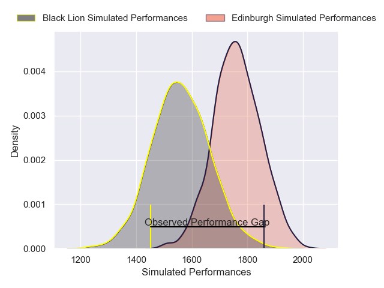
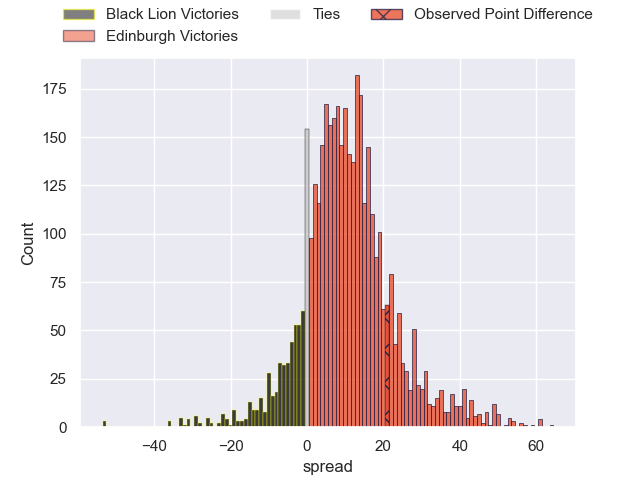
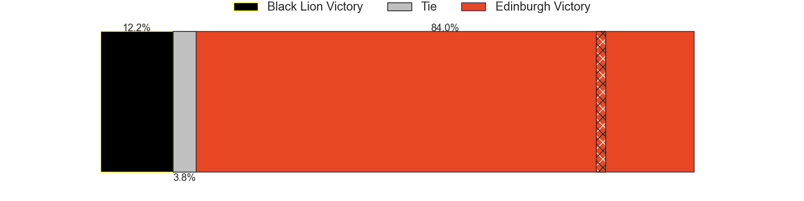
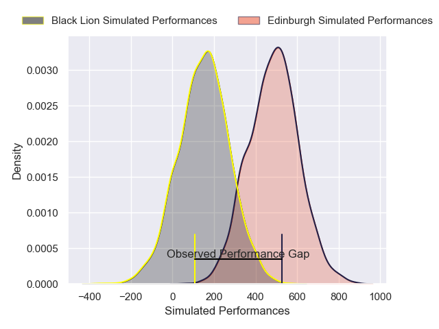
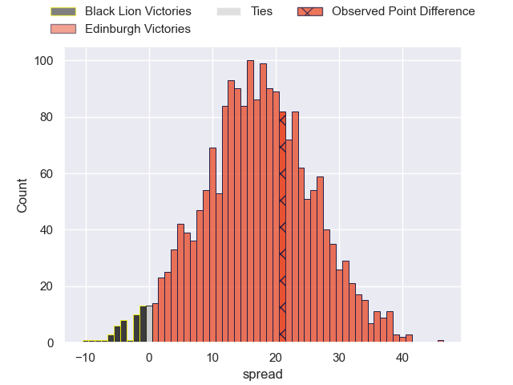
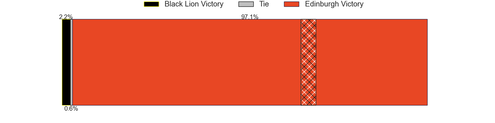

---  
layout: page  
title: Black Lion at Edinburgh; 15-36  
date: 2025-01-19 18:00:00 -0500  
categories: "European Rugby Challenge Cup 2024" match review  
---
# Black Lion at Edinburgh; 15-36

# Club Level Predictions

The first set of predictions treats a club as the smallest object, as the club develops its members, organizes a gameplan, and deploys its players as needed for each match. This club model has a prediction of 0.751, which translates to predicting Edinburgh to win by 10.1.

Our Over/Under is 35.5 - and combined with the spread above, we have a predicted scoreline of 13 to 23

Each club has a rating and a rating deviation (similar to a Glicko rating), and expected performances can be generated. This allows for simulated matches and spreads like the ones below.
## Projected Performances - Club Model

## Projected Spreads - Club Model

## Projected Results - Club Model

# Player Level Predictions

Treating teams instead as an entity made up of the currently active players, I have ratings for each player in an altogether different system. These can be combined to form team ratings once teamsheets are announced, weighting starters a bit higher than the reserves. After the match is played, players can be weighted by their minutes on the field, allowing for an accurate measure of the team's composition. With these compiled team ratings, we can make predictions, measure inaccuracy, and update the individual player ratings.
## Prediction without Player Minutes: Edinburgh by 16.4

Edinburgh by 5.8 on a neutral pitch

## Projected Performances - Player Model

## Projected Spreads - Player Model

## Projected Results - Player Model

|   Away Minutes | Away Player             |   Away Percentile |   Number |   Home Percentile | Home Player      |   Home Minutes |
|---------------:|:------------------------|------------------:|---------:|------------------:|:-----------------|---------------:|
|             21 | Vasil Kakovin           |             60.82 |        1 |             74.4  | Pierre Schoeman  |             30 |
|             20 | Shalva Mamukashvili     |             45.47 |        2 |             16.7  | Patrick Harrison |             55 |
|             80 | Bachuki Tchumbadze      |             31.62 |        3 |             99.57 | Paul Hill        |             59 |
|             54 | Mikheil Babunashvili    |             68.16 |        4 |             38.42 | Marshall Sykes   |             23 |
|             26 | Guga Ganiashvili        |             18.56 |        5 |             92.32 | Sam Skinner      |             80 |
|             35 | Sandro Mamamtavrishvili |             68.45 |        6 |             93.23 | Thomas Dodd      |             80 |
|             40 | Mikheil Gachechiladze   |              0.2  |        7 |             92.21 | Luke Crosbie     |             80 |
|             80 | Luka Ivanishvili        |             65.88 |        8 |             74.25 | Magnus Bradbury  |             31 |
|             80 | Tengiz Peranidze        |             74.95 |        9 |             57.66 | Charlie Shiel    |             31 |
|             44 | Luka Matkava            |             62.03 |       10 |             65.78 | Ben Healy        |             80 |
|             80 | Shalva Aptsiauri        |             49.76 |       11 |             47.93 | Lewis Wells      |             80 |
|             72 | Ioane Metreveli         |             15.52 |       12 |             72.2  | James Lang       |             80 |
|             80 | Tornike Kakhoidze       |             18.75 |       13 |             78.02 | Matt Currie      |             80 |
|             19 | Aka Tabutsadze          |             88.66 |       14 |             46.49 | Darcy Graham     |             31 |
|             26 | Luka Tsirekidze         |             61.07 |       15 |             85.91 | Wes Goosen       |             54 |
|             80 | Nikoloz Khatiashvili    |            nan    |       16 |             74.66 | Boan Venter      |             36 |
|             61 | Irakli Kvatadze         |            nan    |       17 |             65.98 | Javan Sebastian  |             40 |
|              8 | Giorgi Chkhartishvili   |              5.24 |       18 |             66.61 | Ewan Ashman      |             40 |
|             19 | Demuri Epremidze        |            nan    |       19 |              2.89 | Glen Young       |             56 |
|             21 | Lado Chachanidze        |             22.06 |       20 |             79.88 | Hamish Watson    |             59 |
|             80 | Davit Khuroshvili       |            nan    |       21 |             90.99 | Ali Price        |             19 |
|             26 | Sandro Todua            |             92.8  |       22 |             79.25 | Ross Thompson    |             50 |
|             80 | Amiran Shvangiradze     |             17.2  |       23 |             31.47 | Mosese Tuipulotu |             56 |

