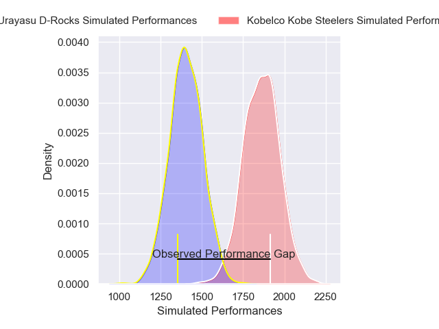
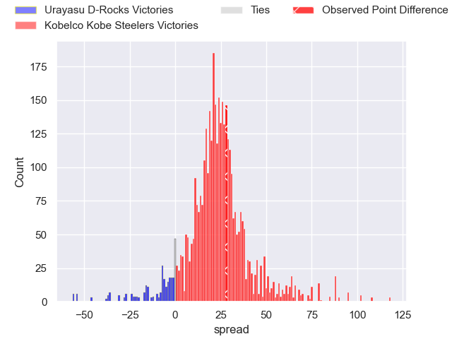
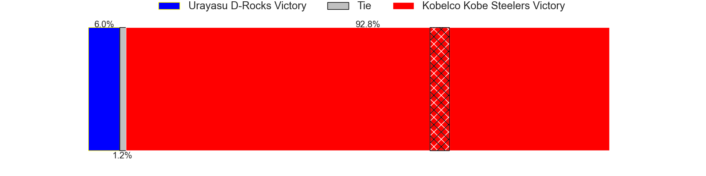
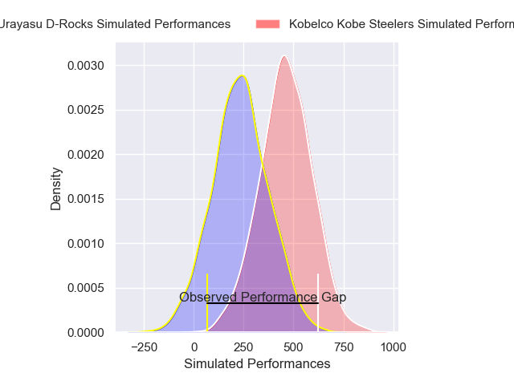
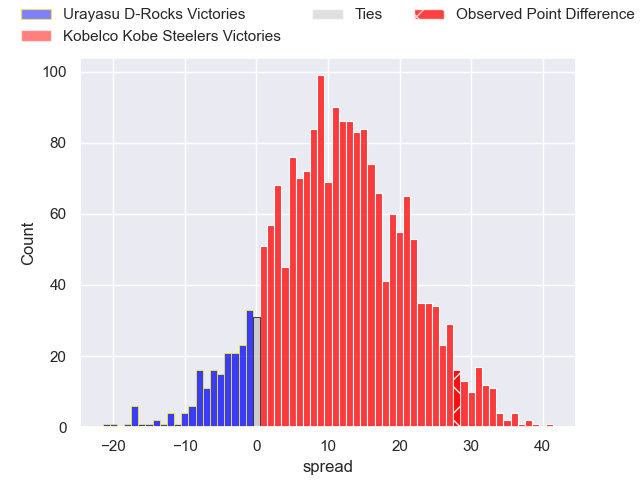
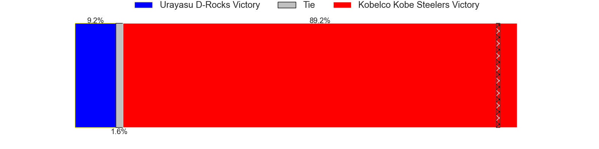

---  
layout: page  
title: Urayasu D-Rocks at Kobelco Kobe Steelers; 22-50  
date: 2025-01-19 18:00:00 -0500  
categories: "Japan Rugby League One 2024" match review  
---
# Urayasu D-Rocks at Kobelco Kobe Steelers; 22-50

# Club Level Predictions

The first set of predictions treats a club as the smallest object, as the club develops its members, organizes a gameplan, and deploys its players as needed for each match. This club model has a prediction of 0.928, which translates to predicting Kobelco Kobe Steelers to win by 23.2.

Our Over/Under is 71.5 - and combined with the spread above, we have a predicted scoreline of 24 to 48

Each club has a rating and a rating deviation (similar to a Glicko rating), and expected performances can be generated. This allows for simulated matches and spreads like the ones below.
## Projected Performances - Club Model

## Projected Spreads - Club Model

## Projected Results - Club Model

# Player Level Predictions

Treating teams instead as an entity made up of the currently active players, I have ratings for each player in an altogether different system. These can be combined to form team ratings once teamsheets are announced, weighting starters a bit higher than the reserves. After the match is played, players can be weighted by their minutes on the field, allowing for an accurate measure of the team's composition. With these compiled team ratings, we can make predictions, measure inaccuracy, and update the individual player ratings.
## Prediction without Player Minutes: Kobelco Kobe Steelers by 13.3

Kobelco Kobe Steelers by 8.6 on a neutral pitch

## Projected Performances - Player Model

## Projected Spreads - Player Model

## Projected Results - Player Model

|   Away Minutes | Away Player        |   Away Percentile |   Number |   Home Percentile | Home Player          |   Home Minutes |
|---------------:|:-------------------|------------------:|---------:|------------------:|:---------------------|---------------:|
|             80 | Hidetomo Nabeshima |              5.15 |        1 |             57.65 | Shigure Takao        |             80 |
|             80 | Ryuji Fujimura     |             36.23 |        2 |             68.56 | Kenta Matsuoka       |             80 |
|             80 | Ryom Kim           |             17.01 |        3 |             95.53 | Hiroshi Yamashita    |             80 |
|             80 | Shingo Nakashima   |             88.22 |        4 |             82.04 | Gerard Cowley-Tuioti |             80 |
|             80 | Tom Parsons        |             53.29 |        5 |            100    | Brodie Retallick     |             80 |
|             80 | Hendrik Tui        |             24.97 |        6 |             58.95 | Takara Imamura       |             80 |
|             80 | Daishi Kojima      |             34.98 |        7 |             69.26 | Tiennan Costley      |             80 |
|             80 | Jasper Wiese       |             67.81 |        8 |             49.57 | Amanaki Saumaki      |             80 |
|             80 | Ren Iinuma         |             56.76 |        9 |             91.17 | Atsushi Hiwasa       |             80 |
|             80 | Yu Tamura          |             90.73 |       10 |             91.83 | Bryn Gatland         |             80 |
|             80 | Kai Ishii          |             16.62 |       11 |             73.49 | Kanta Matsunaga      |             80 |
|             80 | Otere Black        |             57.33 |       12 |             47.95 | Timothy Lafaele      |             80 |
|             80 | Tana Tuhakaraina   |             58.73 |       13 |             87.07 | Ngani Laumape        |             80 |
|             80 | Junya Matsumoto    |             30.64 |       14 |             54.47 | Ryota Funabiki       |             80 |
|             80 | Takuhei Yasuda     |             87.7  |       15 |             93.29 | Rakuhei Yamashita    |             80 |

