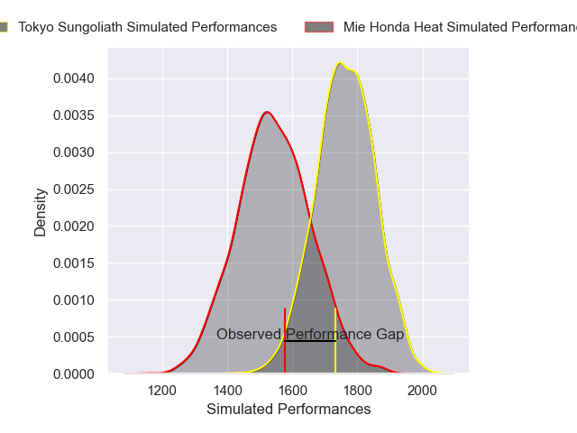
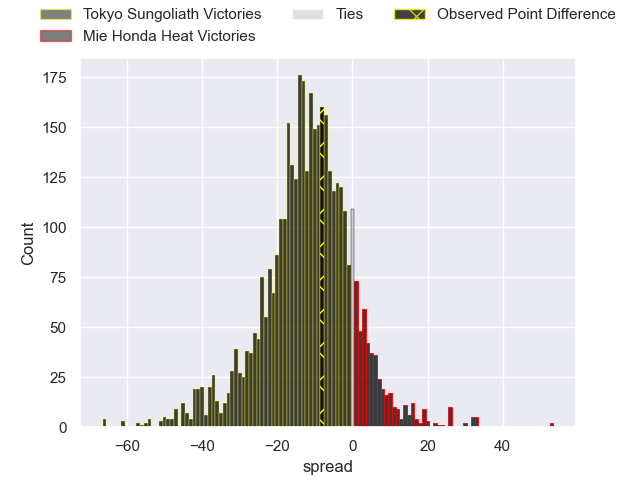
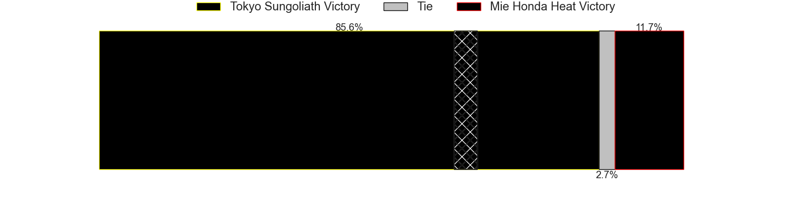
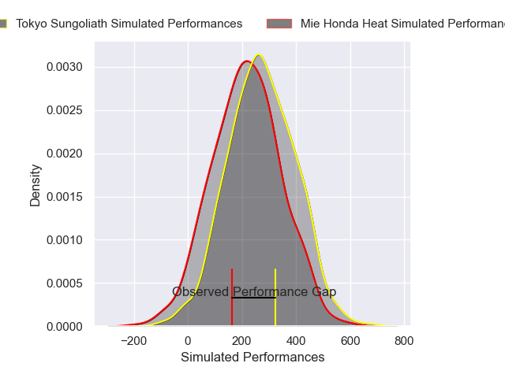
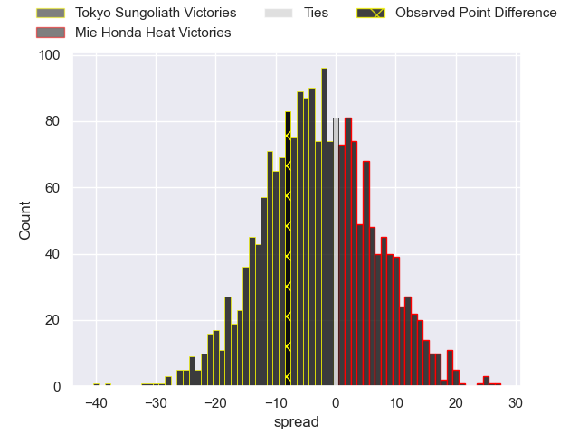

---  
layout: page  
title: Tokyo Sungoliath at Mie Honda Heat; 27-19  
date: 2025-01-19 18:00:00 -0500  
categories: "Japan Rugby League One 2024" match review  
---
# Tokyo Sungoliath at Mie Honda Heat; 27-19

# Club Level Predictions

The first set of predictions treats a club as the smallest object, as the club develops its members, organizes a gameplan, and deploys its players as needed for each match. This club model has a prediction of 0.226, which translates to predicting Tokyo Sungoliath to win by 11.1.

Our Over/Under is 46.5 - and combined with the spread above, we have a predicted scoreline of 29 to 18

Each club has a rating and a rating deviation (similar to a Glicko rating), and expected performances can be generated. This allows for simulated matches and spreads like the ones below.
## Projected Performances - Club Model

## Projected Spreads - Club Model

## Projected Results - Club Model

# Player Level Predictions

Treating teams instead as an entity made up of the currently active players, I have ratings for each player in an altogether different system. These can be combined to form team ratings once teamsheets are announced, weighting starters a bit higher than the reserves. After the match is played, players can be weighted by their minutes on the field, allowing for an accurate measure of the team's composition. With these compiled team ratings, we can make predictions, measure inaccuracy, and update the individual player ratings.
## Prediction without Player Minutes: Tokyo Sungoliath by 7.1

Tokyo Sungoliath by 10.6 on a neutral pitch

## Projected Performances - Player Model

## Projected Spreads - Player Model

## Projected Results - Player Model

|   Away Minutes | Away Player         |   Away Percentile |   Number |   Home Percentile | Home Player            |   Home Minutes |
|---------------:|:--------------------|------------------:|---------:|------------------:|:-----------------------|---------------:|
|             80 | Kenta Kobayashi     |             63.25 |        1 |              2.91 | Tatsuhiko Tsurukawa    |             80 |
|             80 | Kienori Go          |             48.05 |        2 |             35.46 | Koki Hida              |             14 |
|             66 | Shinnosuke Kakinaga |             88.03 |        3 |             18.21 | Katsuyuki Hoshino      |             23 |
|             80 | Saimoni Vunilagi    |             63.56 |        4 |             81.78 | Ryoma Nishimura        |             40 |
|             61 | Harry Hockings      |             98.38 |        5 |             84.62 | Janko Swanepoel        |             64 |
|             19 | Sam Jeffries        |             95.14 |        6 |             99.7  | Pablo Matera           |             80 |
|             27 | Kanji Shimokawa     |             59.11 |        7 |              9.82 | Tony Ray Hunt          |             57 |
|             80 | Sean McMahon        |             97.4  |        8 |             32.68 | Talifolofola Tangipa   |             80 |
|             23 | Yutaka Nagare       |             80.98 |        9 |             53.26 | Azuma Doei             |             80 |
|             52 | Mikiya Takamoto     |             50.33 |       10 |             38.98 | Manu Vunipola          |             71 |
|             13 | Cheslin Kolbe       |             99.8  |       11 |             49.51 | Larry Steven Sulunga   |             80 |
|             20 | Isaiah Punivai      |             55.07 |       12 |             80.48 | Jonathan Faauli        |             11 |
|             80 | Taiga Ozaki         |             75.35 |       13 |             39.8  | Kyogo Okano            |             16 |
|             80 | Seiya Ozaki         |             91.73 |       14 |              9.94 | Haruhiko Uemura        |             44 |
|             80 | Ryosuke Kawase      |             44.84 |       15 |             80.66 | Tom Banks              |             50 |
|             57 | Ryuga Hashimoto     |             69.23 |       16 |             48.23 | Ikuma Yamada           |             61 |
|             28 | Kan Nakano          |             17.86 |       17 |             72.38 | Hayata Nakao           |             80 |
|              9 | Kosuke Horikoshi    |             69.68 |       18 |            nan    | Feinga Kihe Lotu Fakai |             36 |
|              2 | Ryoto Nakamura      |             88.55 |       19 |             53.8  | Takuro Hojo            |             15 |
|             80 | Atsuki Yamamoto     |            nan    |       20 |             14.19 | Takumi Fuji            |             80 |
|             40 | Shota Emi           |             76.38 |       21 |             55.77 | Connor Wihongi         |             80 |
|             80 | Trevor Hosea        |             21.86 |       22 |              3.6  | Fraser Quirk           |             80 |
|             23 | Kenta Fukuda        |             70.47 |       23 |             67.41 | Tevita Tupou           |             80 |

