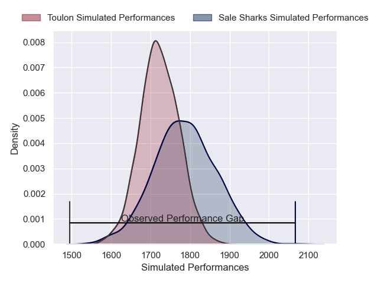
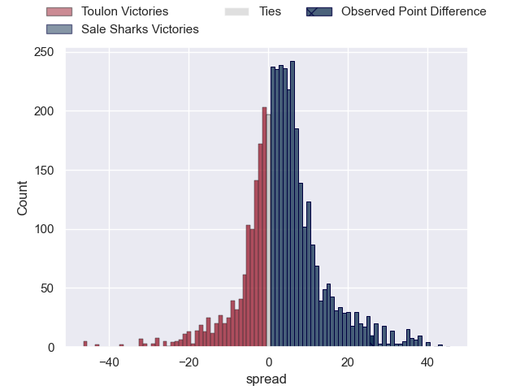
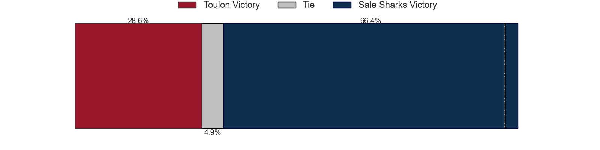
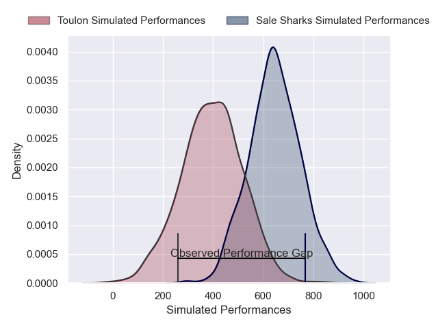
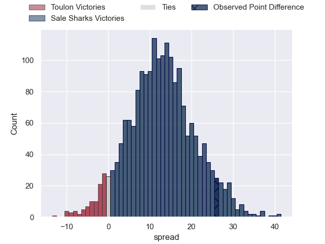
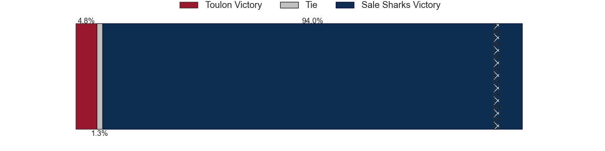

---  
layout: page  
title: Toulon at Sale Sharks; 7-33  
date: 2025-01-19 18:00:00 -0500  
categories: "European Rugby Champions Cup 2024" match review  
---
# Toulon at Sale Sharks; 7-33

# Club Level Predictions

The first set of predictions treats a club as the smallest object, as the club develops its members, organizes a gameplan, and deploys its players as needed for each match. This club model has a prediction of 0.6, which translates to predicting Sale Sharks to win by 3.5.

Our Over/Under is 42.5 - and combined with the spread above, we have a predicted scoreline of 20 to 23

Each club has a rating and a rating deviation (similar to a Glicko rating), and expected performances can be generated. This allows for simulated matches and spreads like the ones below.
## Projected Performances - Club Model

## Projected Spreads - Club Model

## Projected Results - Club Model

# Player Level Predictions

Treating teams instead as an entity made up of the currently active players, I have ratings for each player in an altogether different system. These can be combined to form team ratings once teamsheets are announced, weighting starters a bit higher than the reserves. After the match is played, players can be weighted by their minutes on the field, allowing for an accurate measure of the team's composition. With these compiled team ratings, we can make predictions, measure inaccuracy, and update the individual player ratings.
## Prediction without Player Minutes: Sale Sharks by 17.0

Sale Sharks by 3.6 on a neutral pitch

## Projected Performances - Player Model

## Projected Spreads - Player Model

## Projected Results - Player Model

|   Away Minutes | Away Player        |   Away Percentile |   Number |   Home Percentile | Home Player          |   Home Minutes |
|---------------:|:-------------------|------------------:|---------:|------------------:|:---------------------|---------------:|
|             80 | Jean-Baptiste Gros |             97.69 |        1 |             93.76 | Bevan Rodd           |             18 |
|             80 | Gianmarco Lucchesi |             85.28 |        2 |             91.13 | Luke Cowan-Dickie    |             27 |
|             80 | Emerick Setiano    |             96.67 |        3 |             92.74 | Asher Opoku-Fordjour |             52 |
|             80 | Matthias Halagahu  |             58.81 |        4 |             99.9  | Jean-Luc du Preez    |             15 |
|             75 | Swan Rebbadj       |             70.95 |        5 |             36.64 | Hyron Andrews        |             16 |
|             80 | Lewis Ludlam       |             54.55 |        6 |             86.23 | Tom Curry            |             80 |
|             20 | Jules Coulon       |             61.94 |        7 |             75.71 | Ben Curry            |             12 |
|             28 | Selevasio Tolofua  |             83.98 |        8 |             91.13 | Daniel du Preez      |             13 |
|             80 | Ben White          |             89.49 |        9 |             85.33 | Raffi Quirke         |              9 |
|             28 | Dan Biggar         |             98.22 |       10 |             95.77 | George Ford          |             80 |
|             20 | Gabin Villiere     |             82.97 |       11 |             98.82 | Tom O'Flaherty       |             80 |
|             52 | Jérémy Sinzelle    |              9.6  |       12 |              7.2  | Rekeiti Ma'asi-White |             13 |
|             47 | Antoine Frisch     |             97.82 |       13 |             42.97 | Robert du Preez      |             16 |
|             47 | Antoine Frisch     |             97.82 |       13 |             42.97 | Robert du Preez      |              5 |
|             47 | Jiuta Wainiqolo    |             93.01 |       14 |             70.37 | Tom Roebuck          |             50 |
|             68 | Rayan Rebbadj      |             32.31 |       15 |             22.64 | Joe Carpenter        |             60 |
|             12 | Dany Priso         |             91.03 |       16 |             92.22 | Simon McIntyre       |             64 |
|             30 | Mickael Ivaldi     |             87.94 |       17 |             86.84 | WillGriff John       |             12 |
|             35 | Davit Mchelidze    |            nan    |       18 |            nan    | Ethan Caine          |             18 |
|             28 | David Ribbans      |             85.83 |       19 |             94.74 | Ernst van Rhyn       |             68 |
|             56 | Yannick Youyoutte  |             82.19 |       20 |             18.93 | Ben Bamber           |             80 |
|             80 | Esteban Abadie     |             81.68 |       21 |            nan    | Anerin (Nye) Thomas  |             60 |
|              0 | Baptiste Serin     |             98.01 |       22 |             87.57 | Sam Bedlow           |             80 |
|             67 | Paolo Garbisi      |             83.52 |       23 |             95.77 | Arron Reed           |             68 |

