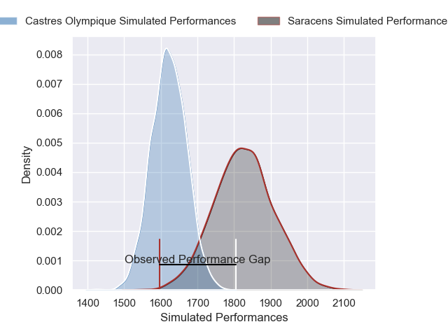
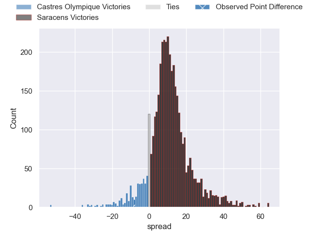
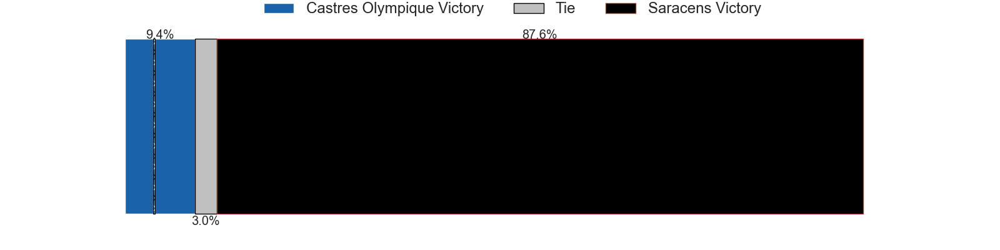
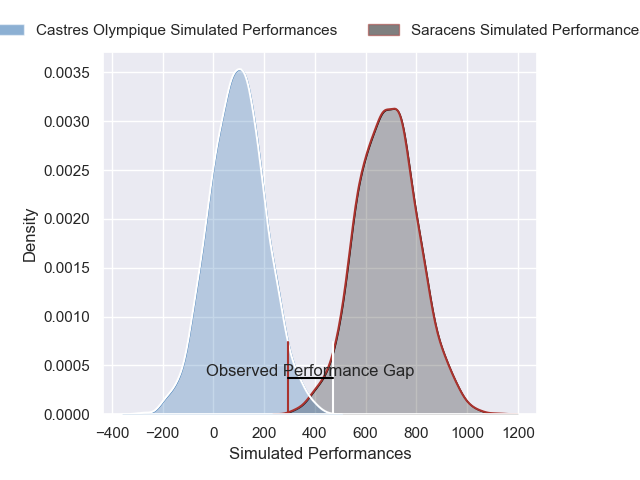
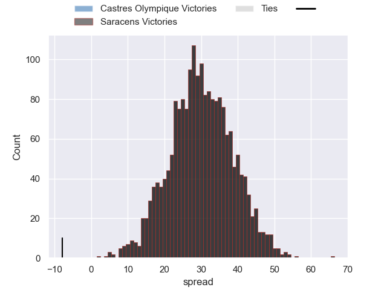

---  
layout: page  
title: Castres Olympique at Saracens; 32-24  
date: 2025-01-19 18:00:00 -0500  
categories: "European Rugby Champions Cup 2024" match review  
---
# Castres Olympique at Saracens; 32-24

# Club Level Predictions

The first set of predictions treats a club as the smallest object, as the club develops its members, organizes a gameplan, and deploys its players as needed for each match. This club model has a prediction of 0.76, which translates to predicting Saracens to win by 10.1.

Our Over/Under is 61.5 - and combined with the spread above, we have a predicted scoreline of 26 to 36

Each club has a rating and a rating deviation (similar to a Glicko rating), and expected performances can be generated. This allows for simulated matches and spreads like the ones below.
## Projected Performances - Club Model

## Projected Spreads - Club Model

## Projected Results - Club Model

# Player Level Predictions

Treating teams instead as an entity made up of the currently active players, I have ratings for each player in an altogether different system. These can be combined to form team ratings once teamsheets are announced, weighting starters a bit higher than the reserves. After the match is played, players can be weighted by their minutes on the field, allowing for an accurate measure of the team's composition. With these compiled team ratings, we can make predictions, measure inaccuracy, and update the individual player ratings.
## Prediction without Player Minutes: Saracens by 31.3

Saracens by 20.3 on a neutral pitch

## Projected Performances - Player Model

## Projected Spreads - Player Model

## Projected Results - Player Model

|   Away Minutes | Away Player           |   Away Percentile |   Number |   Home Percentile | Home Player          |   Home Minutes |
|---------------:|:----------------------|------------------:|---------:|------------------:|:---------------------|---------------:|
|             19 | Lois Guerois-Galisson |              8.64 |        1 |             94.39 | Eroni Mawi           |             18 |
|             59 | Pierre Colonna        |             67.09 |        2 |             34.35 | Theo Dan             |             62 |
|              8 | Nicolas Corato        |             16.23 |        3 |              5.01 | Fraser Balmain       |             30 |
|             20 | Gauthier Maravat      |              2.12 |        4 |             97.98 | Maro Itoje           |             76 |
|             45 | Paul Jedrasiak        |             59.07 |        5 |             47.18 | Hugh Tizard          |             80 |
|             80 | Izaiha Moore-Aiono    |             82.89 |        6 |             97.53 | Juan Martin Gonzalez |             80 |
|             40 | Simon Meka            |             73.61 |        7 |             98.25 | Ben Earl             |             80 |
|             61 | Feibyan Tukino        |             60.34 |        8 |             69.4  | Tom Willis           |             12 |
|             61 | Gauthier Doubrere     |             50    |        9 |             84.12 | Ivan van Zyl         |             33 |
|              4 | Louis Le Brun         |             66.52 |       10 |             63.88 | Fergus Burke         |             33 |
|             29 | Josaia Raisuqe        |             91.59 |       11 |             67.64 | Rotimi Segun         |             33 |
|             29 | Adrea Cocagi          |             76.77 |       12 |             99.23 | Nick Tompkins        |             80 |
|             36 | Adrien Seguret        |              6.97 |       13 |             73.23 | Alex Lozowski        |             80 |
|             80 | Nathanael Hulleu      |             84.56 |       14 |             31.77 | Tobias Elliott       |             80 |
|             21 | Theo Chabouni         |             53.47 |       15 |             71.81 | Elliot Daly          |             80 |
|             16 | Wayan de Benedittis   |            nan    |       16 |             31.35 | Phil Brantingham     |             28 |
|             80 | Loris Zarantonello    |             17.27 |       17 |             99.64 | Jamie George         |             52 |
|             31 | Aurelien Azar         |             60.1  |       18 |             81.78 | Marco Riccioni       |             55 |
|             49 | Yann Peysson          |             73.49 |       19 |             68.35 | Toby Knight          |             47 |
|             80 | Romain Macurdy        |            nan    |       20 |             33.94 | Gareth Simpson       |             35 |
|             80 | Santiago Arata        |             55.29 |       21 |             45.8  | Olly Hartley         |             67 |
|             80 | Joris Dupont          |             66.26 |       22 |             63.05 | Angus Hall           |             80 |
|             24 | Antoine Zeghdar       |            nan    |       23 |             82.33 | Nathan Michelow      |             26 |

