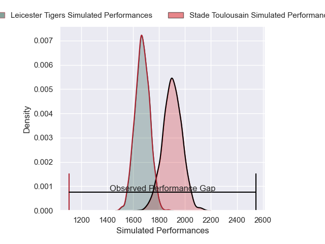
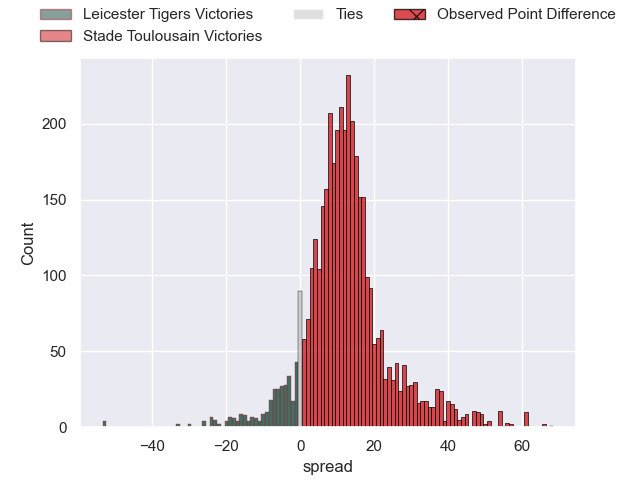
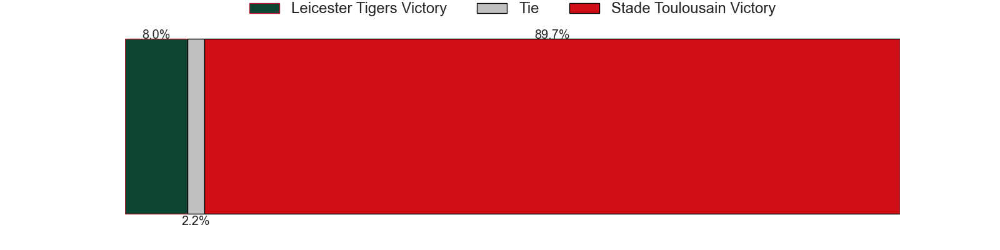
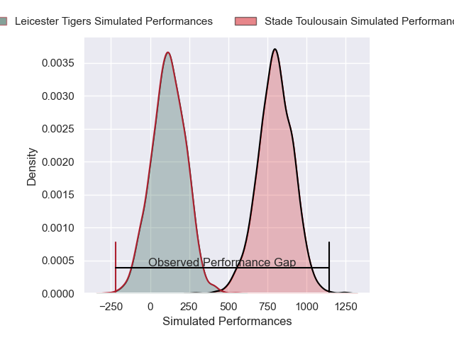
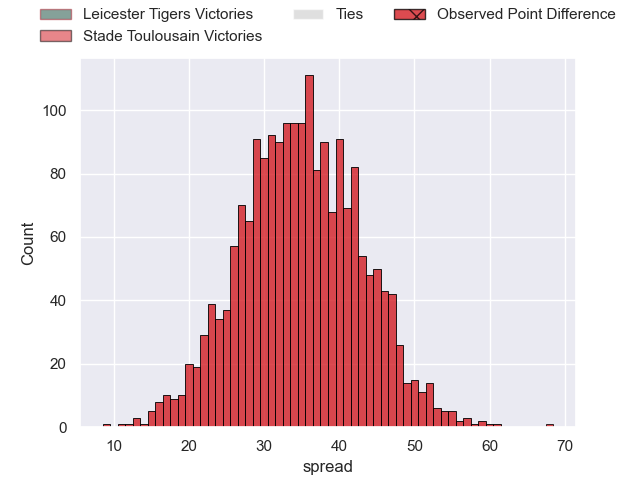

---  
layout: page  
title: Leicester Tigers at Stade Toulousain; 12-80  
date: 2025-01-19 18:00:00 -0500  
categories: "European Rugby Champions Cup 2024" match review  
---
# Leicester Tigers at Stade Toulousain; 12-80

# Club Level Predictions

The first set of predictions treats a club as the smallest object, as the club develops its members, organizes a gameplan, and deploys its players as needed for each match. This club model has a prediction of 0.79, which translates to predicting Stade Toulousain to win by 11.7.

Our Over/Under is 59.5 - and combined with the spread above, we have a predicted scoreline of 24 to 36

Each club has a rating and a rating deviation (similar to a Glicko rating), and expected performances can be generated. This allows for simulated matches and spreads like the ones below.
## Projected Performances - Club Model

## Projected Spreads - Club Model

## Projected Results - Club Model

# Player Level Predictions

Treating teams instead as an entity made up of the currently active players, I have ratings for each player in an altogether different system. These can be combined to form team ratings once teamsheets are announced, weighting starters a bit higher than the reserves. After the match is played, players can be weighted by their minutes on the field, allowing for an accurate measure of the team's composition. With these compiled team ratings, we can make predictions, measure inaccuracy, and update the individual player ratings.
## Prediction without Player Minutes: Stade Toulousain by 38.9

Stade Toulousain by 26.1 on a neutral pitch

## Projected Performances - Player Model

## Projected Spreads - Player Model

## Projected Results - Player Model

|   Away Minutes | Away Player           |   Away Percentile |   Number |   Home Percentile | Home Player          |   Home Minutes |
|---------------:|:----------------------|------------------:|---------:|------------------:|:---------------------|---------------:|
|             24 | Nicky Smith           |             60.09 |        1 |             29.06 | Rodrigue Neti        |             63 |
|             54 | Julian Montoya        |             91.31 |        2 |             98.23 | Julien Marchand      |             45 |
|             80 | Joe Heyes             |             83.42 |        3 |             93.5  | Dorian Aldegheri     |             80 |
|             19 | Cameron Henderson     |             76.01 |        4 |             86.54 | Thibaud Flament      |             29 |
|             13 | George Martin         |             93.12 |        5 |             70.55 | Emmanuel Meafou      |             26 |
|             22 | Ollie Chessum         |             72.57 |        6 |             95.55 | Francois Cros        |             18 |
|             19 | Tommy Reffell         |             59.72 |        7 |             97.27 | Jack Willis          |             54 |
|             80 | Olly Cracknell        |             22.51 |        8 |            100    | Anthony Jelonch      |             18 |
|             22 | Jack van Poortvliet   |             56.88 |        9 |             99.64 | Antoine Dupont       |             80 |
|             40 | Handre Pollard        |             81.96 |       10 |             96.21 | Romain Ntamack       |             72 |
|             19 | Ollie Hassell-Collins |             44    |       11 |             99.9  | Blair Kinghorn       |              8 |
|             40 | Dan Kelly             |             74.37 |       12 |             95.42 | Pierre-Louis Barassi |             60 |
|             80 | Izaia Perese          |             19.3  |       13 |             89.31 | Dimitri Delibes      |             36 |
|             20 | Josh Bassett          |             77.46 |       14 |             97.64 | Ange Capuozzo        |             51 |
|             26 | Freddie Steward       |              2.42 |       15 |             94.07 | Thomas Ramos         |             16 |
|             80 | James Whitcombe       |             54.62 |       16 |             96.5  | Cyril Baille         |             80 |
|             67 | Charlie Clare         |             22.7  |       17 |             91.49 | Peato Mauvaka        |             80 |
|             80 | Will Hurd             |             65.81 |       18 |             81.54 | Joel Merkler         |             80 |
|             67 | Harry Wells           |             84.92 |       19 |             88.77 | Joshua Brennan       |             64 |
|             58 | Emeka Ilione          |             74.29 |       20 |             85.43 | Leo Banos            |             40 |
|             13 | Tom Whiteley          |             47.83 |       21 |            100    | Juan Cruz Mallia     |             40 |
|             18 | James Shillcock       |              8.46 |       22 |             99.02 | Matthis Lebel        |             56 |
|             40 | Solomone Kata         |              6.32 |       23 |             19.57 | Paul Graou           |             80 |

