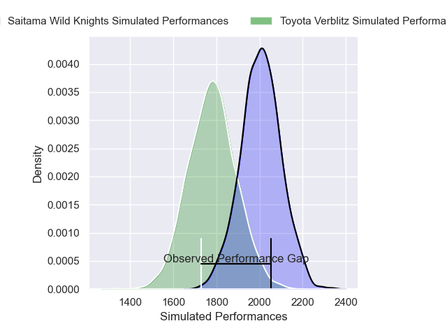
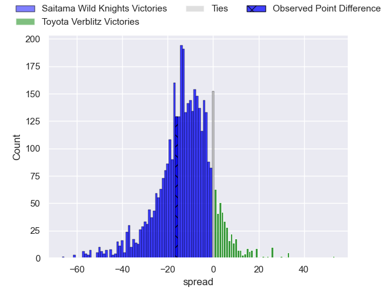
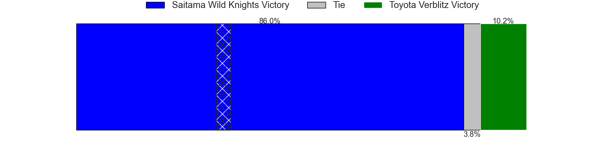
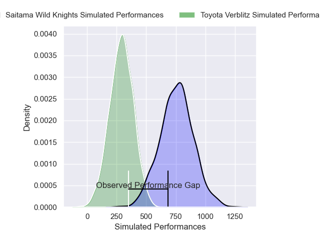
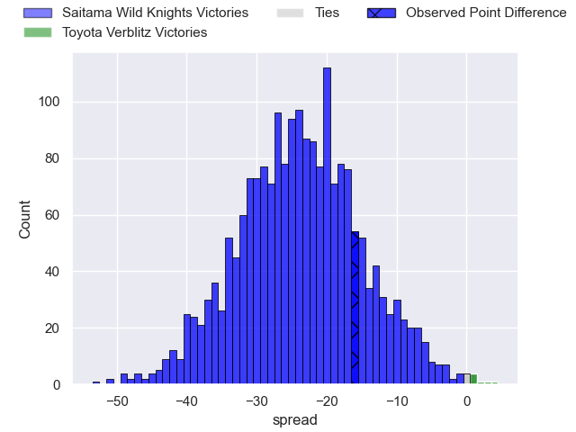
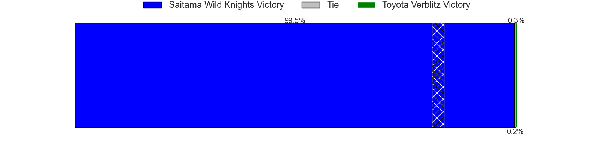

---  
layout: page  
title: Saitama Wild Knights at Toyota Verblitz; 38-22  
date: 2025-01-19 18:00:00 -0500  
categories: "Japan Rugby League One 2024" match review  
---
# Saitama Wild Knights at Toyota Verblitz; 38-22

# Club Level Predictions

The first set of predictions treats a club as the smallest object, as the club develops its members, organizes a gameplan, and deploys its players as needed for each match. This club model has a prediction of 0.232, which translates to predicting Saitama Wild Knights to win by 10.8.

Our Over/Under is 52.5 - and combined with the spread above, we have a predicted scoreline of 32 to 21

Each club has a rating and a rating deviation (similar to a Glicko rating), and expected performances can be generated. This allows for simulated matches and spreads like the ones below.
## Projected Performances - Club Model

## Projected Spreads - Club Model

## Projected Results - Club Model

# Player Level Predictions

Treating teams instead as an entity made up of the currently active players, I have ratings for each player in an altogether different system. These can be combined to form team ratings once teamsheets are announced, weighting starters a bit higher than the reserves. After the match is played, players can be weighted by their minutes on the field, allowing for an accurate measure of the team's composition. With these compiled team ratings, we can make predictions, measure inaccuracy, and update the individual player ratings.
## Prediction without Player Minutes: Saitama Wild Knights by 12.0

Saitama Wild Knights by 16.4 on a neutral pitch

## Projected Performances - Player Model

## Projected Spreads - Player Model

## Projected Results - Player Model

|   Away Minutes | Away Player       |   Away Percentile |   Number |   Home Percentile | Home Player         |   Home Minutes |
|---------------:|:------------------|------------------:|---------:|------------------:|:--------------------|---------------:|
|             80 | Keita Inagaki     |             92.14 |        1 |             91.62 | Shogo Miura         |             19 |
|             19 | Atsushi Sakate    |             86.87 |        2 |             93.71 | Yoshikatsu Hikosaka |             15 |
|             69 | Taiki Fujii       |             91.45 |        3 |             82.99 | Genki Sudo          |             61 |
|             57 | Liam Mitchell     |             87.1  |        4 |             88.41 | Richie Gray         |             61 |
|             80 | Esei Ha'angana    |             87    |        5 |             75.91 | Daichi Akiyama      |             14 |
|             50 | Ben Gunter        |             96.08 |        6 |             89.38 | Isaiah Mapusua      |             15 |
|             80 | Lachlan Boshier   |             99.28 |        7 |             32.27 | Will Tupou          |             19 |
|             80 | Jack Cornelsen    |             97.41 |        8 |             41.81 | Akito Okui          |             80 |
|             80 | Taiki Koyama      |             95.62 |        9 |             96.72 | Aaron Smith         |             27 |
|             80 | Kyohei Yamasawa   |             84.58 |       10 |             97.8  | Rikiya Matsuda      |             19 |
|             45 | Tomoki Osada      |             21.7  |       11 |             75.95 | Yuichiro Wada       |             11 |
|             45 | Damian de Allende |             99.78 |       12 |             83.08 | Nicholas McCurran   |             14 |
|             80 | Dylan Riley       |             98.23 |       13 |              0.44 | Siosaia Fifita      |             15 |
|             51 | Koki Takeyama     |             98.44 |       14 |             88.95 | Taichi Takahashi    |             80 |
|             54 | Ryuji Noguchi     |             99.11 |       15 |             85.46 | Tiaan Falcon        |             80 |
|             61 | Craig Millar      |             63.3  |       16 |             64.52 | Josh Dickson        |             68 |
|             40 | Lood de Jager     |             98.19 |       17 |             81.19 | Matt McGahan        |             61 |
|             80 | Itsuki Onishi     |             93.75 |       18 |             33.52 | Joseph Manu         |             11 |
|             65 | Vince Aso         |             68.92 |       19 |             32.85 | Kaito Shigeno       |             12 |
|             80 | Taniela Vea       |            nan    |       20 |             79.14 | Ryusei Kato         |             80 |
|             80 | Yuta Takagi       |            nan    |       21 |             26.7  | Kosei Miki          |             80 |
|             72 | Ryota Hasegawa    |             99.18 |       22 |            nan    | Shunsuke Asaoka     |             30 |

