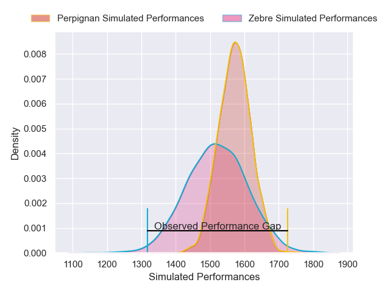
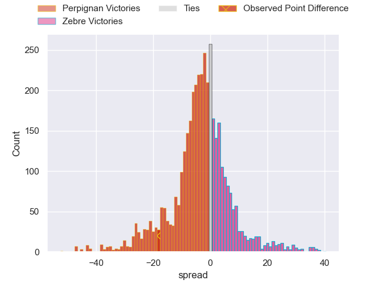
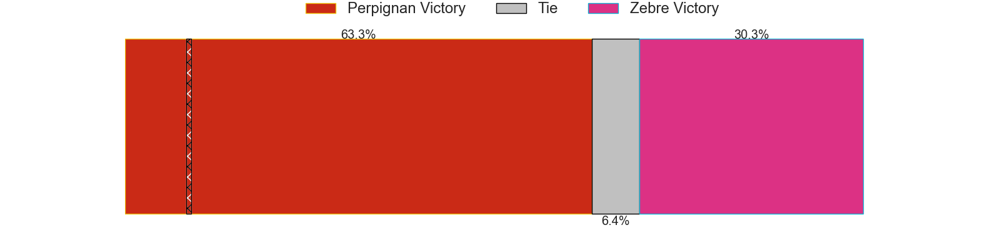
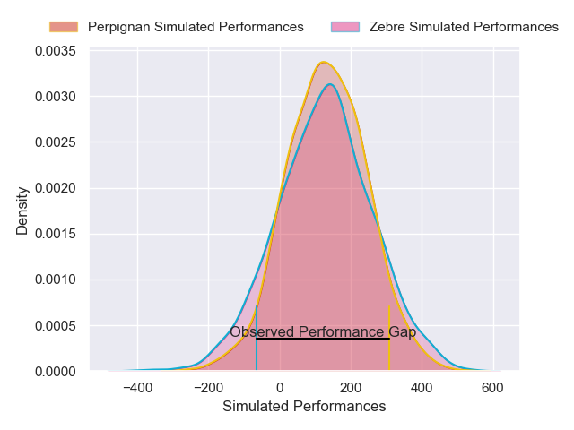
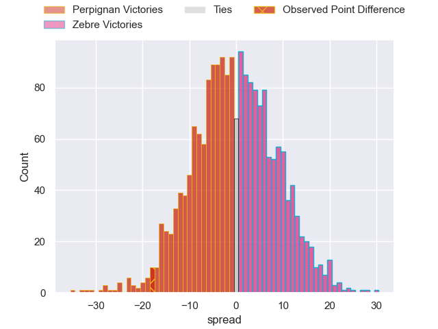

---  
layout: page  
title: Perpignan at Zebre; 39-21  
date: 2025-01-19 18:00:00 -0500  
categories: "European Rugby Challenge Cup 2024" match review  
---
# Perpignan at Zebre; 39-21

# Club Level Predictions

The first set of predictions treats a club as the smallest object, as the club develops its members, organizes a gameplan, and deploys its players as needed for each match. This club model has a prediction of 0.429, which translates to predicting Perpignan to win by 2.5.

Our Over/Under is 37.5 - and combined with the spread above, we have a predicted scoreline of 20 to 18

Each club has a rating and a rating deviation (similar to a Glicko rating), and expected performances can be generated. This allows for simulated matches and spreads like the ones below.
## Projected Performances - Club Model

## Projected Spreads - Club Model

## Projected Results - Club Model

# Player Level Predictions

Treating teams instead as an entity made up of the currently active players, I have ratings for each player in an altogether different system. These can be combined to form team ratings once teamsheets are announced, weighting starters a bit higher than the reserves. After the match is played, players can be weighted by their minutes on the field, allowing for an accurate measure of the team's composition. With these compiled team ratings, we can make predictions, measure inaccuracy, and update the individual player ratings.
## Prediction without Player Minutes: Perpignan by 0.1

Perpignan by 6.4 on a neutral pitch

## Projected Performances - Player Model

## Projected Spreads - Player Model

## Projected Results - Player Model

|   Away Minutes | Away Player            |   Away Percentile |   Number |   Home Percentile | Home Player           |   Home Minutes |
|---------------:|:-----------------------|------------------:|---------:|------------------:|:----------------------|---------------:|
|             76 | Bruce Devaux           |             27.15 |        1 |             72.16 | Luca Rizzoli          |             80 |
|             28 | Victor Montgaillard    |              7.1  |        2 |             69.8  | Luca Bigi             |             36 |
|             28 | Nemo Roelofse          |             79.73 |        3 |             45.45 | Juan Pitinari         |             35 |
|             33 | Marvin Orie            |             90.72 |        4 |             40.62 | Rusiate Nasove        |             45 |
|             12 | Mathieu Tanguy         |             72.36 |        5 |             90.82 | Matteo Canali         |             44 |
|             33 | Noe Della Schiava      |             26.39 |        6 |              5.06 | Luca Andreani         |             59 |
|             27 | Patrick Sobela         |             94.54 |        7 |              2.63 | Iacopo Bianchi        |             80 |
|             80 | Alessandro Ortombina   |             59.66 |        8 |             21.89 | Giacomo Ferrari       |             80 |
|             80 | Gela Aprasidze         |             50.81 |        9 |             13.51 | Thomas Dominguez      |             80 |
|             80 | Jake McIntyre          |             91.39 |       10 |              3.53 | Giovanni Montemauri   |             80 |
|             55 | Setareki Toganiyadrava |             57.44 |       11 |             80.21 | Scott Gregory         |             45 |
|              7 | Apisai Naqalevu        |             64.76 |       12 |             56.14 | Damiano Mazza         |             80 |
|             44 | Eneriko Buliruarua     |              7.65 |       13 |             12.39 | Fetuli Paea           |             59 |
|             36 | Jefferson Joseph       |             60.33 |       14 |             15.18 | Jacopo Trulla         |              8 |
|             62 | Antoine Aucagne        |             21.03 |       15 |             15.21 | Giacomo Da Re         |             80 |
|             80 | Giorgi Beria           |             82.22 |       16 |            nan    | Paolo Buonfiglio      |             80 |
|             80 | Akato Fakatika         |            nan    |       17 |             56.48 | Tommaso Di Bartolomeo |             21 |
|             12 | Bastien Chinarro       |             37.03 |       18 |             20.96 | Muhamed Hasa          |             80 |
|             21 | Lucas Bachelier        |             85.54 |       19 |              7.58 | Leonard Krumov        |             40 |
|             18 | James Hall             |            nan    |       20 |             12.44 | Bautista Stavile      |             80 |
|             80 | Job Poulet             |             52.16 |       21 |             27.9  | Giovanni Licata       |             51 |
|             50 | Jean Pascal Barraque   |             20.91 |       22 |             22.52 | Gonzalo Garcia        |             29 |
|             50 | Jean Pascal Barraque   |             20.91 |       22 |             22.52 | Gonzalo Garcia        |             80 |
|            nan | nan                    |            nan    |       23 |            nan    | Alessandro Gesi       |             35 |

