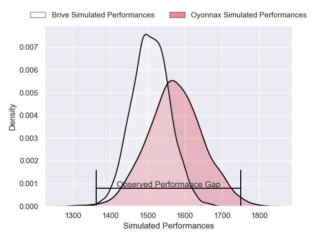
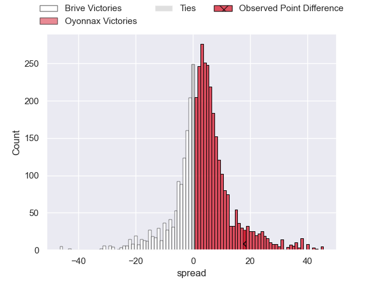
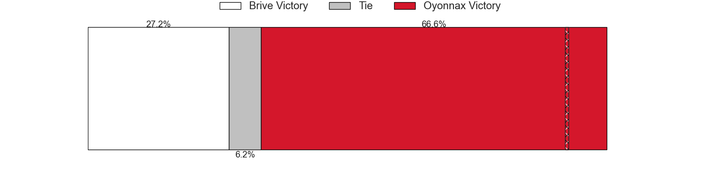
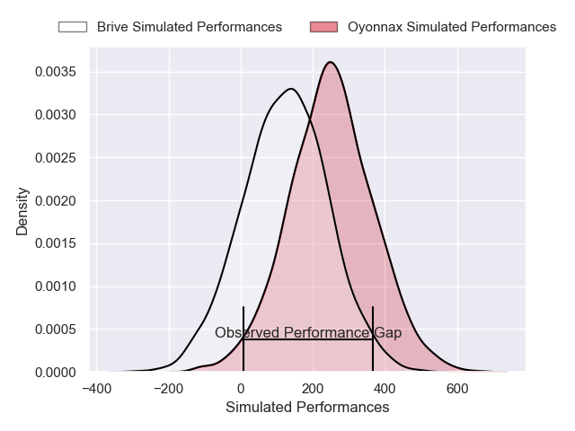
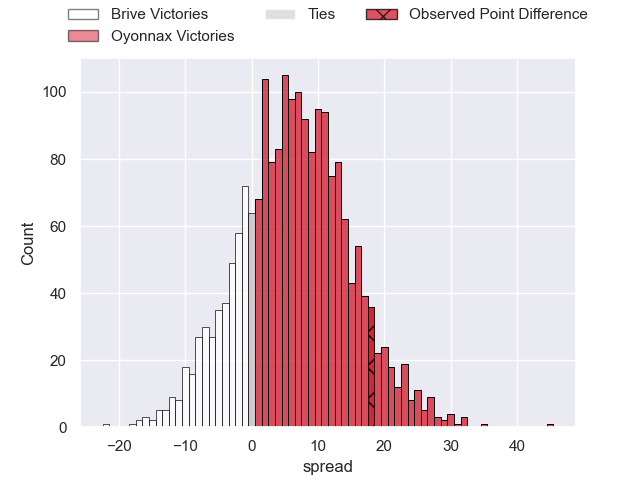
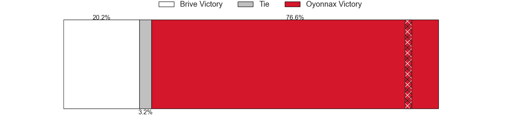

---  
layout: page  
title: Brive at Oyonnax; 16-34  
date: 2025-01-23 18:00:00 -0500  
categories: "Pro D2 2024" match review  
---
# Brive at Oyonnax; 16-34

# Club Level Predictions

The first set of predictions treats a club as the smallest object, as the club develops its members, organizes a gameplan, and deploys its players as needed for each match. This club model has a prediction of 0.595, which translates to predicting Oyonnax to win by 3.4.

Our Over/Under is 46.5 - and combined with the spread above, we have a predicted scoreline of 21 to 25

Each club has a rating and a rating deviation (similar to a Glicko rating), and expected performances can be generated. This allows for simulated matches and spreads like the ones below.
## Projected Performances - Club Model

## Projected Spreads - Club Model

## Projected Results - Club Model

# Player Level Predictions

Treating teams instead as an entity made up of the currently active players, I have ratings for each player in an altogether different system. These can be combined to form team ratings once teamsheets are announced, weighting starters a bit higher than the reserves. After the match is played, players can be weighted by their minutes on the field, allowing for an accurate measure of the team's composition. With these compiled team ratings, we can make predictions, measure inaccuracy, and update the individual player ratings.
## Prediction without Player Minutes: Oyonnax by 9.2

Brive by 4.0 on a neutral pitch

## Projected Performances - Player Model

## Projected Spreads - Player Model

## Projected Results - Player Model

|   Away Minutes | Away Player               |   Away Percentile |   Number |   Home Percentile | Home Player        |   Home Minutes |
|---------------:|:--------------------------|------------------:|---------:|------------------:|:-------------------|---------------:|
|             20 | Simon-Pierre Chauvac      |             11.23 |        1 |             12.78 | Adrien Bordenave   |             80 |
|             56 | Benjamin Boudou           |             22.12 |        2 |              2.7  | Teddy Durand       |             80 |
|             39 | Marcel van der Merwe      |              3.2  |        3 |             74.44 | Paulo Tafili       |             76 |
|             12 | Tevita Ratuva             |             51.51 |        4 |             92.64 | Phoenix Battye     |             43 |
|             80 | Konstantin Mikautadze     |              5.34 |        5 |             35.79 | Ewan Johnson       |             80 |
|             80 | Sasha Gue                 |             13.3  |        6 |             16.29 | Kevin Lebreton     |             43 |
|             80 | Hendre Stassen            |              9.07 |        7 |             13.61 | Hugo Hermet        |              4 |
|              2 | Rahboni Warren-Vosayaco   |             35.34 |        8 |              3.23 | Loic Godener       |             43 |
|             15 | Leo Carbonneau            |             80.47 |        9 |             93.43 | Jonathan Ruru      |             15 |
|             16 | Curwin Bosch              |             83.04 |       10 |             65.64 | Zack Holmes        |             16 |
|             12 | Benjamin Lefranc          |             39    |       11 |             71.75 | Daniel Ikpefan     |             41 |
|             27 | Georges Shvelidze         |             57.08 |       12 |             10.73 | Lucas Mensa        |             51 |
|             18 | Paul Pimienta             |             21.24 |       13 |             60.29 | Afusipa Taumoepeau |             56 |
|              9 | Mathis Ferté              |             66.18 |       14 |             12.32 | Maxime Salles      |              4 |
|             18 | Thomas Zenon              |              5.82 |       15 |             10.96 | Martin Bogado      |             80 |
|             68 | Maxime Sidobre            |             66.79 |       16 |             93.96 | Oli Kebble         |             35 |
|             80 | Vakh Abdaladze            |             77.46 |       17 |             27.01 | Antoine Miquel     |             80 |
|             80 | Retief Marais             |             81.34 |       18 |              6.39 | Christopher Vaotoa |              0 |
|             24 | Tom Raffy                 |             35.02 |       19 |              1.41 | Manuel Leindekar   |             80 |
|             80 | Asier Usarraga            |             87.5  |       20 |              3.83 | Vasil Lobzhanidze  |             13 |
|             61 | Issam Hamel               |             72.12 |       21 |             73.79 | Chris Smith        |             80 |
|             59 | Francisco Coria Marchetti |             60.62 |       22 |             17.99 | Benjamin Geledan   |             80 |
|             80 | Samuel Maximin            |             68.97 |       23 |            nan    | Victor Lebas       |             78 |

