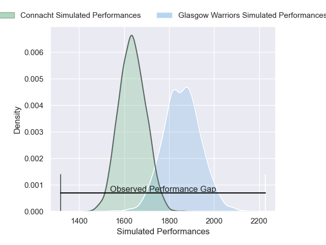
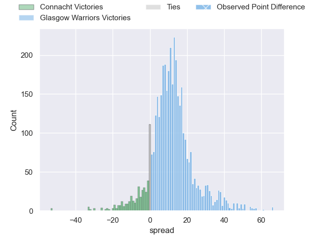
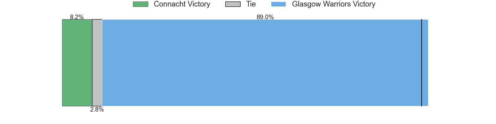
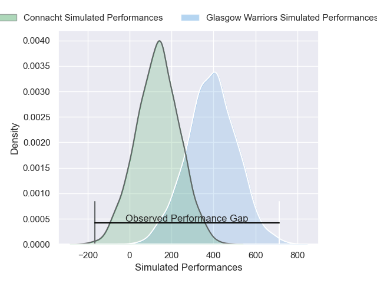
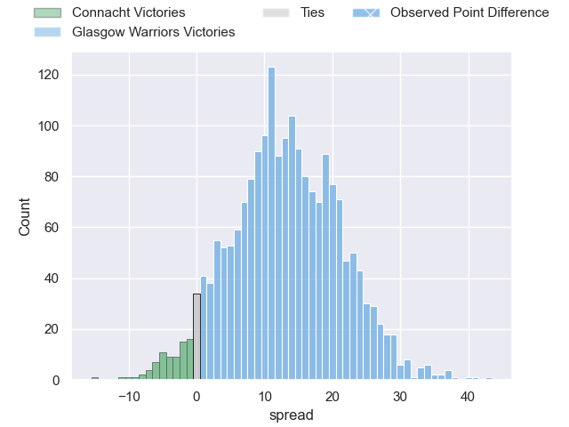
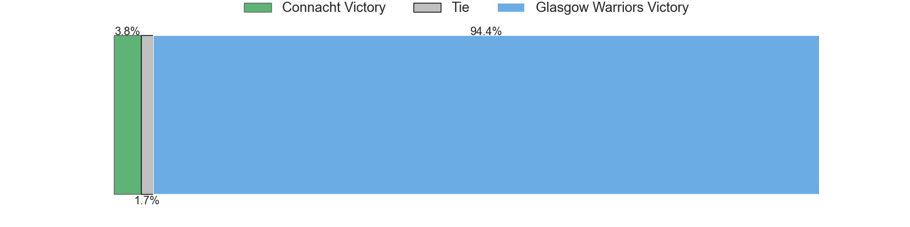

---  
layout: page  
title: Connacht at Glasgow Warriors; 0-43  
date: 2025-01-24 18:00:00 -0500  
categories: "United Rugby Championship 2024" match review  
---
# Connacht at Glasgow Warriors; 0-43

# Club Level Predictions

The first set of predictions treats a club as the smallest object, as the club develops its members, organizes a gameplan, and deploys its players as needed for each match. This club model has a prediction of 0.782, which translates to predicting Glasgow Warriors to win by 11.3.

Our Over/Under is 39.5 - and combined with the spread above, we have a predicted scoreline of 14 to 25

Each club has a rating and a rating deviation (similar to a Glicko rating), and expected performances can be generated. This allows for simulated matches and spreads like the ones below.
## Projected Performances - Club Model

## Projected Spreads - Club Model

## Projected Results - Club Model

# Player Level Predictions

Treating teams instead as an entity made up of the currently active players, I have ratings for each player in an altogether different system. These can be combined to form team ratings once teamsheets are announced, weighting starters a bit higher than the reserves. After the match is played, players can be weighted by their minutes on the field, allowing for an accurate measure of the team's composition. With these compiled team ratings, we can make predictions, measure inaccuracy, and update the individual player ratings.
## Prediction without Player Minutes: Glasgow Warriors by 8.2

Connacht by 1.4 on a neutral pitch

## Projected Performances - Player Model

## Projected Spreads - Player Model

## Projected Results - Player Model

|   Away Minutes | Away Player           |   Away Percentile |   Number |   Home Percentile | Home Player           |   Home Minutes |
|---------------:|:----------------------|------------------:|---------:|------------------:|:----------------------|---------------:|
|              0 | Peter Dooley          |             97.02 |        1 |             70.15 | Patrick Schickerling  |             82 |
|             82 | Dave Heffernan        |             63.17 |        2 |             31.5  | Johnny Matthews       |             63 |
|             82 | Jack Aungier          |             53.49 |        3 |             57.99 | Finlay Richardson     |             82 |
|             82 | David O'Connor        |             23.91 |        4 |             38.1  | Euan Ferrie           |             18 |
|             27 | Joe Joyce             |             95.04 |        5 |             33.53 | Alex Samuel           |             60 |
|             82 | Josh Murphy           |             95.59 |        6 |             25.65 | Ally Miller           |             56 |
|             82 | Shamus Hurley-Langton |             43.19 |        7 |             97.29 | Henco Venter          |             64 |
|             42 | Sean Jansen           |             20.22 |        8 |             30.65 | Jack Mann             |             82 |
|              0 | Caolin Blade          |             77.51 |        9 |             13.53 | Ben Afshar            |             23 |
|             30 | JJ Hanrahan           |             89.25 |       10 |             68.64 | Duncan Weir           |             72 |
|             64 | Byron Ralston         |              6.87 |       11 |             93.23 | Facundo Cordero       |              0 |
|             30 | David Hawkshaw        |             64.95 |       12 |             55.59 | Duncan Munn           |             82 |
|             36 | Piers O'Conor         |             59.89 |       13 |             19.89 | Ollie Smith           |             22 |
|             16 | Chay Mullins          |             71.34 |       14 |             98.72 | Sebastian Cancelliere |             82 |
|             22 | Santiago Cordero      |             98.5  |       15 |             68.24 | Josh McKay            |             55 |
|             16 | Dylan Tierney-Martin  |            nan    |       16 |              7.06 | Grant Stewart         |             82 |
|             22 | Jordan Duggan         |             40.73 |       17 |             64.54 | Nathan McBeth         |             82 |
|              0 | Sam Illo              |            nan    |       18 |             42.43 | Sam Talakai           |             56 |
|             16 | Oisin Dowling         |             69.84 |       19 |            nan    | Macenzzie Duncan      |             18 |
|             22 | Paul Boyle            |             62.17 |       20 |             42.04 | Joe Roberts           |             19 |
|             82 | Matthew Devine        |             49.73 |       21 |             41.14 | Angus Fraser          |             18 |
|             18 | Jack Carty            |             93.86 |       22 |            nan    | Sean Kennedy          |             64 |
|             26 | Finn Treacy           |            nan    |       23 |            nan    | Kerr Johnston         |             10 |

