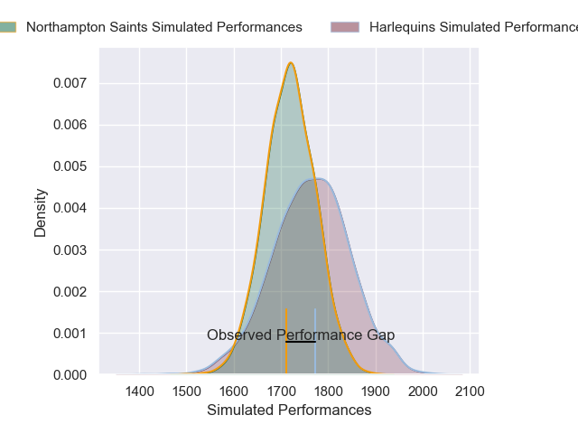
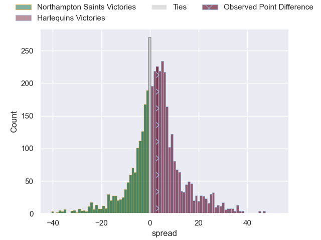
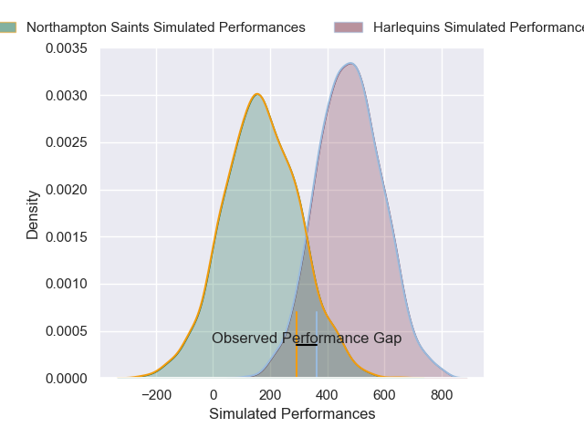
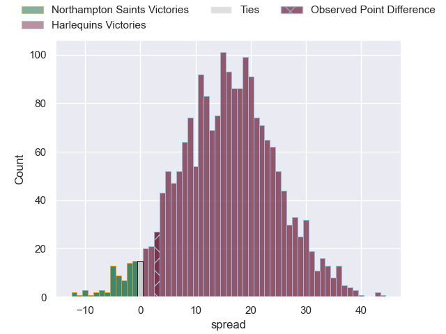
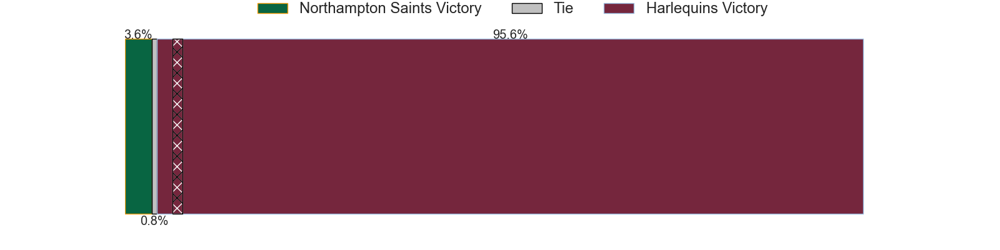

---  
layout: page  
title: Northampton Saints at Harlequins; 19-22  
date: 2025-01-24 18:00:00 -0500  
categories: "Gallagher Premiership 2024" match review  
---
# Northampton Saints at Harlequins; 19-22

# Club Level Predictions

The first set of predictions treats a club as the smallest object, as the club develops its members, organizes a gameplan, and deploys its players as needed for each match. This club model has a prediction of 0.565, which translates to predicting Harlequins to win by 2.3.

Our Over/Under is 52.5 - and combined with the spread above, we have a predicted scoreline of 25 to 27

Each club has a rating and a rating deviation (similar to a Glicko rating), and expected performances can be generated. This allows for simulated matches and spreads like the ones below.
## Projected Performances - Club Model

## Projected Spreads - Club Model

## Projected Results - Club Model

# Player Level Predictions

Treating teams instead as an entity made up of the currently active players, I have ratings for each player in an altogether different system. These can be combined to form team ratings once teamsheets are announced, weighting starters a bit higher than the reserves. After the match is played, players can be weighted by their minutes on the field, allowing for an accurate measure of the team's composition. With these compiled team ratings, we can make predictions, measure inaccuracy, and update the individual player ratings.
## Prediction without Player Minutes: Harlequins by 14.3

Harlequins by 0.6 on a neutral pitch

## Projected Performances - Player Model

## Projected Spreads - Player Model

## Projected Results - Player Model

|   Away Minutes | Away Player             |   Away Percentile |   Number |   Home Percentile | Home Player     |   Home Minutes |
|---------------:|:------------------------|------------------:|---------:|------------------:|:----------------|---------------:|
|             80 | Tarek Haffar            |             83.84 |        1 |             75.26 | Wyn Jones       |           80   |
|              3 | Henry Walker            |             42.86 |        2 |              9.81 | Jack Walker     |            7   |
|             25 | Trevor Davison          |              0.09 |        3 |             20.58 | Simon Kerrod    |           25   |
|             29 | Temo Mayanavanua        |             95.93 |        4 |             93.65 | Joe Launchbury  |           35   |
|             80 | Tom Lockett             |             23.61 |        5 |             59.82 | Stephan Lewies  |           80   |
|              3 | Josh Kemeny             |              4.61 |        6 |             76.85 | Jack Kenningham |           29   |
|             16 | Tom Pearson             |             98.6  |        7 |             39.28 | Will Evans      |           11   |
|             35 | Juarno Augustus         |             70.87 |        8 |             88.04 | James Chisholm  |           20   |
|             73 | Archie McParland        |             80.99 |        9 |             97.44 | Danny Care      |           80   |
|             77 | George Makepeace-Cubitt |             72.81 |       10 |             39.47 | Jarrod Evans    |           80   |
|             45 | Tom Seabrook            |              3.53 |       11 |             63.3  | Cassius Cleaves |            5   |
|             45 | Rory Hutchinson         |             91.29 |       12 |             48.17 | Ben Waghorn     |           80   |
|             80 | Charlie Savala          |             53.66 |       13 |             76.67 | Will Joseph     |           20.5 |
|             80 | Tom Litchfield          |             71.25 |       14 |             65.36 | Nick David      |           25   |
|             80 | James Ramm              |             71.03 |       15 |             25.97 | Tyrone Green    |           68   |
|             19 | Craig Wright            |            nan    |       16 |             90.02 | Sam Riley       |           76   |
|             35 | Tom West                |             51.87 |       17 |            nan    | Jordan Els      |           50   |
|             45 | Luke Green              |            nan    |       18 |             97.19 | Dillon Lewis    |           71   |
|             80 | Ed Prowse               |             47.32 |       19 |             24.31 | Irne Herbst     |           80   |
|             50 | Callum Hunter-Hill      |            nan    |       20 |            nan    | Tom Lawday      |           80   |
|             80 | Angus Scott-Young       |             42.38 |       21 |             27.06 | Will Porter     |           25   |
|             80 | Tom James               |             16.09 |       22 |             36.4  | Jamie Benson    |           64   |
|             80 | Will Glister            |             22.77 |       23 |             62.02 | Leigh Halfpenny |           55   |

