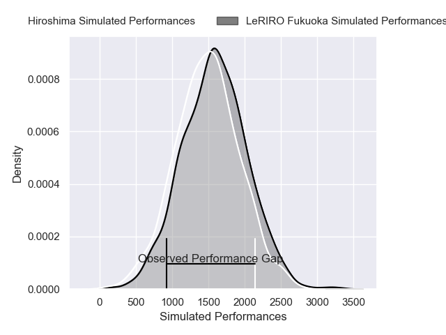
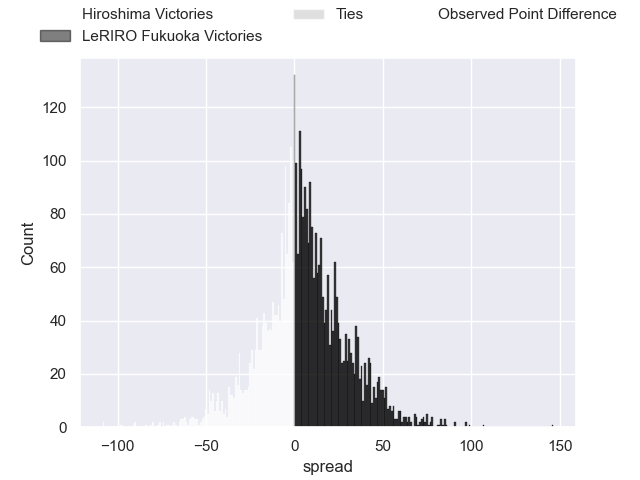
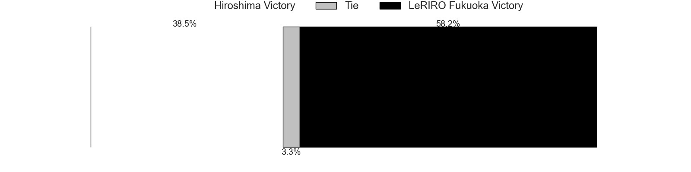
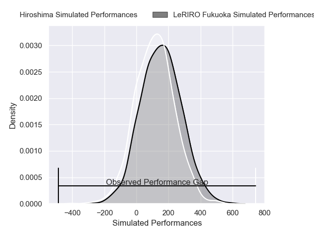
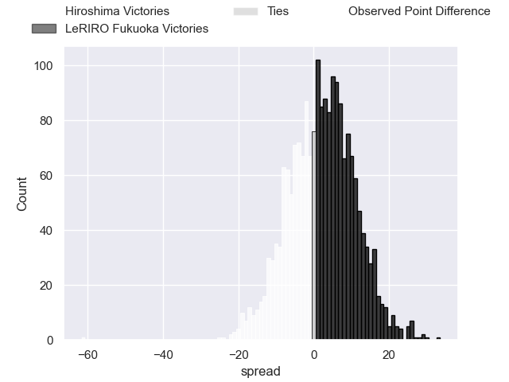

---  
layout: page  
title: Hiroshima at LeRIRO Fukuoka; 66-5  
date: 2025-01-24 18:00:00 -0500  
categories: "Japan Rugby League One - Division 3 2025" match review  
---
# Hiroshima at LeRIRO Fukuoka; 66-5

# Club Level Predictions

The first set of predictions treats a club as the smallest object, as the club develops its members, organizes a gameplan, and deploys its players as needed for each match. This club model has a prediction of 0.575, which translates to predicting LeRIRO Fukuoka to win by 4.5.

Our Over/Under is 24.5 - and combined with the spread above, we have a predicted scoreline of 10 to 15

Each club has a rating and a rating deviation (similar to a Glicko rating), and expected performances can be generated. This allows for simulated matches and spreads like the ones below.
## Projected Performances - Club Model

## Projected Spreads - Club Model

## Projected Results - Club Model

# Player Level Predictions

Treating teams instead as an entity made up of the currently active players, I have ratings for each player in an altogether different system. These can be combined to form team ratings once teamsheets are announced, weighting starters a bit higher than the reserves. After the match is played, players can be weighted by their minutes on the field, allowing for an accurate measure of the team's composition. With these compiled team ratings, we can make predictions, measure inaccuracy, and update the individual player ratings.
## Prediction without Player Minutes: LeRIRO Fukuoka by 2.0

Hiroshima by 0.1 on a neutral pitch

## Projected Performances - Player Model

## Projected Spreads - Player Model

## Projected Results - Player Model

|   Away Minutes | Away Player        |   Away Percentile |   Number |   Home Percentile | Home Player         |   Home Minutes |
|---------------:|:-------------------|------------------:|---------:|------------------:|:--------------------|---------------:|
|             51 | Haruki Umemoto     |             66.58 |        1 |             24.91 | Tomoki Nobeta       |             51 |
|             23 | Yusuke Kitabayashi |             55.59 |        2 |             23.41 | Yoshiaki Takeuchi   |             59 |
|             32 | Tadatsugu Kanayama |             59.86 |        3 |             18.71 | Rintarou Noda       |             80 |
|             10 | Tye Nash           |             50.3  |        4 |             26.59 | Taiji Machino       |             64 |
|             62 | Yutaro Tanaka      |             65.48 |        5 |             25.79 | Keita Terada        |             68 |
|             42 | Iori Suzuki        |             61.12 |        6 |             19.19 | Karne Hesketh       |             80 |
|             38 | Tomoki Ashida      |             59.92 |        7 |             19.19 | Naoki Yasuda        |             80 |
|              0 | Jackson Pugh       |             39.35 |        8 |             32.83 | Kouta Nishimura     |             17 |
|             80 | Kotaro Tatsuno     |             68.74 |        9 |             37.48 | Hisanori Mimata     |             22 |
|             30 | Hitaka Inoue       |             54.39 |       10 |             26.97 | Rinto Kagawa        |             37 |
|             60 | Hayato Kanamaru    |             65.65 |       11 |             33.27 | Masakazu Yatsumonji |             37 |
|             57 | Jacob Abel         |             61.83 |       12 |             38.92 | Kentaro Kamata      |             13 |
|             66 | Syunya Motoyama    |             63.98 |       13 |             33.12 | Haruto Sugisaki     |             28 |
|             43 | Tsubasa Kono       |             61.14 |       14 |             26.99 | Amanaki Lisala      |             57 |
|             73 | Keisuke Nakamoto   |             62.66 |       15 |             20.39 | Benjamin Ray Yagi   |             80 |
|             65 | Taichi Yokoo       |            nan    |       16 |            nan    | Taiyou Minami       |             36 |
|             75 | Tomonori Koyanagi  |            nan    |       17 |            nan    | Keita Kimura        |             32 |
|             73 | Ryoto Tomita       |            nan    |       18 |            nan    | Iosefatu Mareko     |             80 |
|             40 | Andrew Davidson    |            nan    |       19 |            nan    | Finau Makavaha      |             48 |
|             76 | Ramo Sato          |            nan    |       20 |            nan    | Tarou Ide           |             80 |
|             16 | Syoya Maeda        |            nan    |       21 |            nan    | Syuuhei Harada      |             35 |
|             80 | Ryotaro Saito      |            nan    |       22 |            nan    | Tsuyoshi Hasegawa   |             80 |
|             59 | Haruki Kitajima    |            nan    |       23 |            nan    | Yuudai Kawahara     |             80 |
|            nan | nan                |            nan    |       24 |            nan    |                     |             80 |

