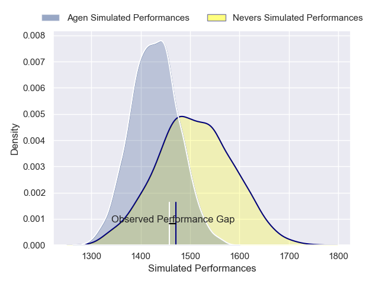
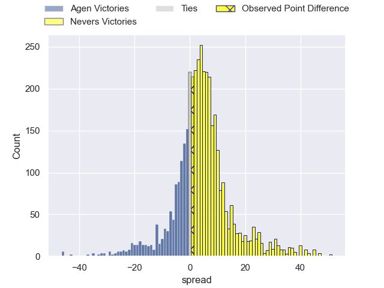
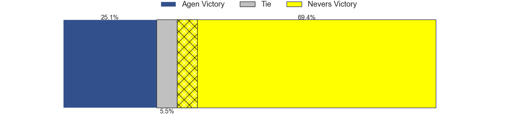
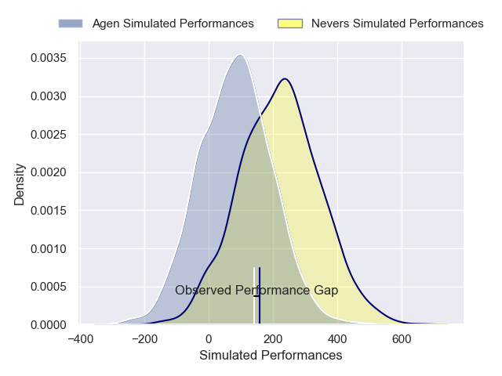
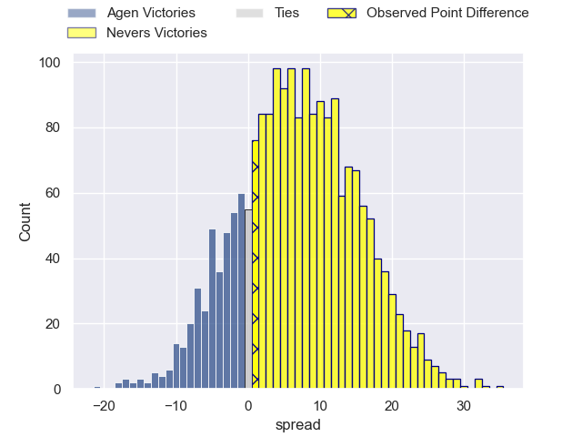
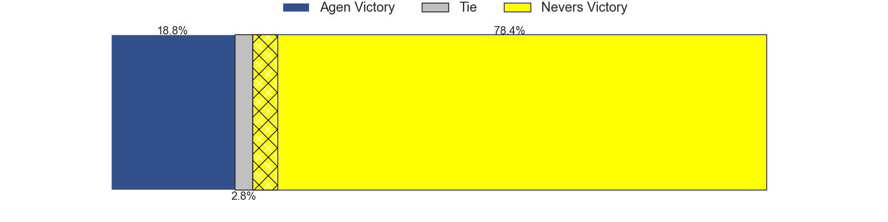

---  
layout: page  
title: Agen at Nevers; 28-29  
date: 2025-01-24 18:00:00 -0500  
categories: "Pro D2 24/25" match review  
---
# Agen at Nevers; 28-29

# Club Level Predictions

The first set of predictions treats a club as the smallest object, as the club develops its members, organizes a gameplan, and deploys its players as needed for each match. This club model has a prediction of 0.615, which translates to predicting Nevers to win by 4.1.

Our Over/Under is 49.5 - and combined with the spread above, we have a predicted scoreline of 23 to 27

Each club has a rating and a rating deviation (similar to a Glicko rating), and expected performances can be generated. This allows for simulated matches and spreads like the ones below.
## Projected Performances - Club Model

## Projected Spreads - Club Model

## Projected Results - Club Model

# Player Level Predictions

Treating teams instead as an entity made up of the currently active players, I have ratings for each player in an altogether different system. These can be combined to form team ratings once teamsheets are announced, weighting starters a bit higher than the reserves. After the match is played, players can be weighted by their minutes on the field, allowing for an accurate measure of the team's composition. With these compiled team ratings, we can make predictions, measure inaccuracy, and update the individual player ratings.
## Prediction without Player Minutes: Nevers by 4.7

Agen by 0.3 on a neutral pitch

## Projected Performances - Player Model

## Projected Spreads - Player Model

## Projected Results - Player Model

|   Away Minutes | Away Player             |   Away Percentile |   Number |   Home Percentile | Home Player      |   Home Minutes |
|---------------:|:------------------------|------------------:|---------:|------------------:|:-----------------|---------------:|
|             80 | Florent Guion           |             56.98 |        1 |             48.81 | Aitor Kitutu     |             28 |
|             18 | Santiago Socino         |             82.99 |        2 |             37.11 | Efi Ma'Afu       |             61 |
|             30 | Alex Burin              |             50.6  |        3 |             62.86 | Farai Mudariki   |             37 |
|             32 | Vincent Farré           |             50.25 |        4 |             40.6  | Ugo Vignolles    |             32 |
|             80 | John Madigan            |             56.52 |        5 |             48.46 | Chris Gabriel    |             47 |
|             18 | Evan Olmstead           |             47.25 |        6 |             59.44 | Luka Plataret    |             51 |
|             80 | Tomasi Fineanganofo (2) |             55.24 |        7 |             38.96 | Hugues Bastide   |             56 |
|             80 | Valentin Gayraud        |             51.63 |        8 |             52.49 | Jason Fraser     |             45 |
|             64 | Théo Idjellidaine       |             52.83 |        9 |             45.16 | Hugo Bouyssou    |             80 |
|             40 | Billy Searle            |             47.15 |       10 |             55.7  | Shaun Reynolds   |             49 |
|             36 | Lucas Martins           |             51.23 |       11 |             37.27 | Arthur Mathiron  |             80 |
|             20 | Kolinio Ramoka          |             46.24 |       12 |             56.99 | Noa Pommelet     |             49 |
|             30 | Clément Garrigues       |             47.53 |       13 |             38.28 | Rudy Derrieux    |             54 |
|             23 | Thibaud Mazzoléni       |             48.77 |       14 |             50.93 | Johan Wasserman  |             30 |
|             23 | Loris Tolot             |             44.73 |       15 |             56.77 | Perry Mayo       |             48 |
|              0 | Hayam El Bibouji        |            nan    |       16 |             64.78 | Stefan Buruiana  |             80 |
|             70 | Mamuka Mstoiani         |            nan    |       17 |            nan    | Kamaliele Tufele |             80 |
|             57 | Javier Eissmann         |              2.39 |       18 |            nan    | Kévin Noah       |             80 |
|             48 | Mathieu De Giovanni     |            nan    |       19 |            nan    | Steven David     |             80 |
|             50 | Andrea Lucchini         |            nan    |       20 |            nan    | Simon Tarel      |             80 |
|             62 | Émile Dayral            |            nan    |       21 |             58.11 | Yohan Le Bourhis |             80 |
|             50 | Iban Etcheverry         |            nan    |       22 |            nan    | Nicolas Ragoevi  |             80 |
|             54 | Lasha Macharashvili     |             31.6  |       23 |            nan    | Cleopas Kundiona |             54 |

