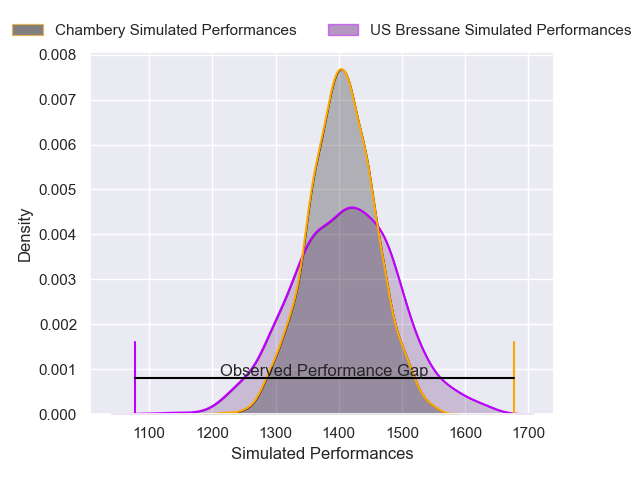
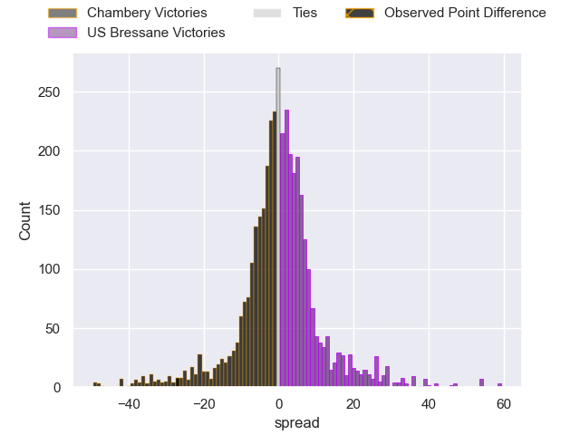
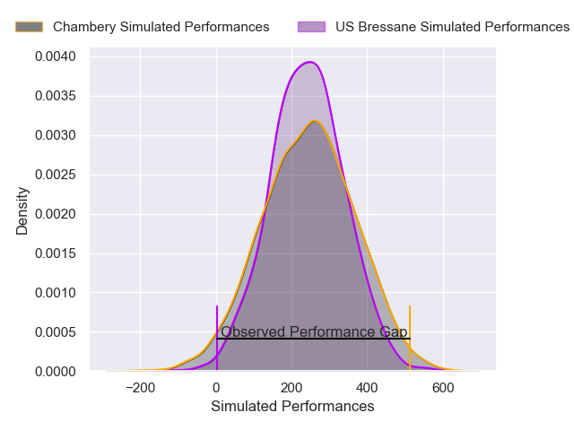
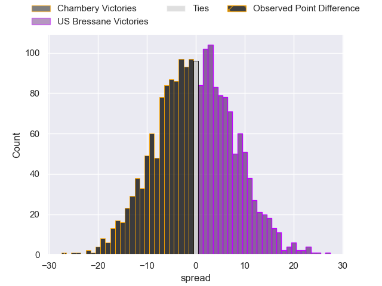

---  
layout: page  
title: Chambery at US Bressane; 32-5  
date: 2025-01-24 18:00:00 -0500  
categories: "Nationale 24/25" match review  
---
# Chambery at US Bressane; 32-5

# Club Level Predictions

The first set of predictions treats a club as the smallest object, as the club develops its members, organizes a gameplan, and deploys its players as needed for each match. This club model has a prediction of 0.509, which translates to predicting US Bressane to win by 0.3.

Our Over/Under is 37.5 - and combined with the spread above, we have a predicted scoreline of 19 to 19

Each club has a rating and a rating deviation (similar to a Glicko rating), and expected performances can be generated. This allows for simulated matches and spreads like the ones below.
## Projected Performances - Club Model

## Projected Spreads - Club Model

## Projected Results - Club Model

# Player Level Predictions

Treating teams instead as an entity made up of the currently active players, I have ratings for each player in an altogether different system. These can be combined to form team ratings once teamsheets are announced, weighting starters a bit higher than the reserves. After the match is played, players can be weighted by their minutes on the field, allowing for an accurate measure of the team's composition. With these compiled team ratings, we can make predictions, measure inaccuracy, and update the individual player ratings.
## Prediction without Player Minutes: US Bressane by 0.5

Chambery by 4.9 on a neutral pitch

## Projected Performances - Player Model

## Projected Spreads - Player Model

## Projected Results - Player Model

|   Away Minutes | Away Player              |   Away Percentile |   Number |   Home Percentile | Home Player          |   Home Minutes |
|---------------:|:-------------------------|------------------:|---------:|------------------:|:---------------------|---------------:|
|             53 | Nugzar Somkhishvili      |             87.99 |        1 |             25.13 | Vazha Kapanadze      |             80 |
|             35 | Yan Tabarot              |             66.49 |        2 |             34.88 | Louis Dasalmartini   |             39 |
|             80 | Osman Dimen              |             61.84 |        3 |             16.7  | Atonio Ulutuipalelei |             34 |
|             48 | Fabien Witz              |             68.76 |        4 |             12.24 | Quentin Witt         |             27 |
|             52 | Corentin Astier          |             77.71 |        5 |              4.88 | Victor Fromenteze    |             30 |
|             67 | Jean-Baptiste Grenod     |             95.5  |        6 |             74.13 | Pierre Reynaud       |             26 |
|             41 | Matheo Triki             |             85.01 |        7 |             69.63 | Nail Ait Naceur      |             23 |
|             20 | Taniela Matakaiongo      |             55.75 |        8 |             88.94 | Loic Baradel         |             24 |
|             22 | Aubin Eymeri             |             51.74 |        9 |             74.77 | Jeremy Valencot      |             23 |
|             32 | Arwel Robson             |             41.89 |       10 |             29.17 | Nathan Azais         |             50 |
|             25 | Arthur Nennig            |             89.28 |       11 |             22.03 | Élie De Fleurian     |             62 |
|             20 | Bastien Reymond          |             73.55 |       12 |             88.6  | Fred Zeilinga        |             50 |
|             52 | Joseph Exshaw            |             68.06 |       13 |             44.09 | Joe Margetts         |             59 |
|             80 | Va'aufauese Apelu Maliko |             79.94 |       14 |             25.76 | Thibaut Perrette     |             80 |
|             22 | Thomas Hecquet           |             67.53 |       15 |             79.78 | Florent Massip       |             80 |
|             80 | Gela Murusidze           |             40.29 |       16 |             55.11 | Teo Bordenave        |             38 |
|             66 | Baptiste Collet          |            nan    |       17 |             89.35 | Clement Jullien      |             31 |
|             59 | Colin Lebian             |             71.13 |       18 |             63.2  | Erich de Jager       |             39 |
|             80 | Pierre-Nicolas Dance     |             53.15 |       19 |             49.65 | Thomas Déliance      |             41 |
|             80 | Mateo Guerret            |             51.37 |       20 |             48.85 | Nicolas Tachat       |             35 |
|             80 | Thibault Moreno          |             62.94 |       21 |              3.84 | Nicolas Faure        |             24 |
|             80 | Emmanuel Vaitulukina     |             75.59 |       22 |             55.91 | Jules Margarit       |             80 |
|            nan | nan                      |            nan    |       23 |             57.85 | Benjamin Doy         |             36 |

