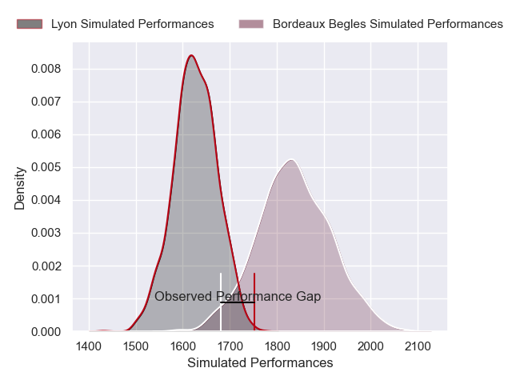
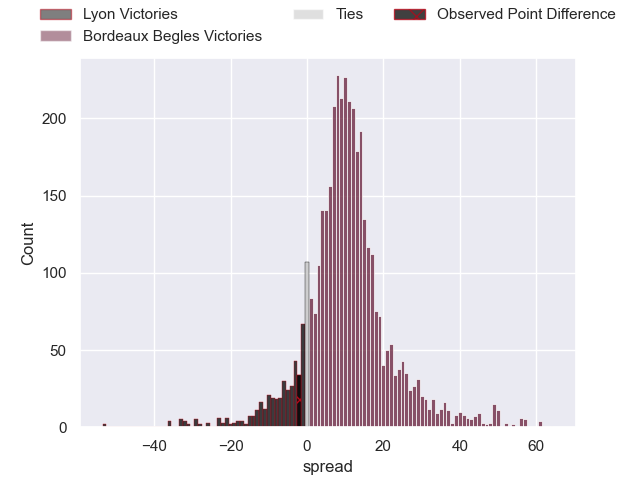
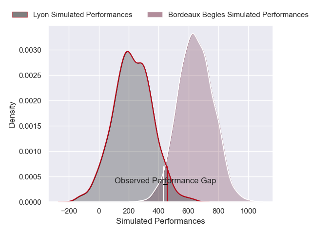
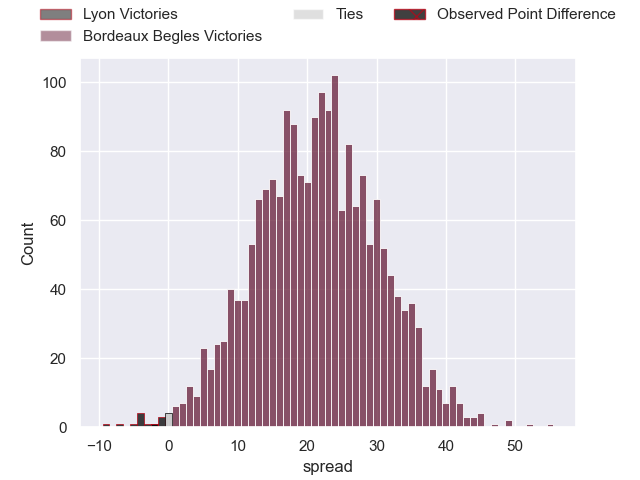

---  
layout: page  
title: Lyon at Bordeaux Begles; 22-20  
date: 2025-01-25 18:00:00 -0500  
categories: "Top 14 Orange 24/25" match review  
---
# Lyon at Bordeaux Begles; 22-20

# Club Level Predictions

The first set of predictions treats a club as the smallest object, as the club develops its members, organizes a gameplan, and deploys its players as needed for each match. This club model has a prediction of 0.769, which translates to predicting Bordeaux Begles to win by 10.6.

Our Over/Under is 54.5 - and combined with the spread above, we have a predicted scoreline of 22 to 32

Each club has a rating and a rating deviation (similar to a Glicko rating), and expected performances can be generated. This allows for simulated matches and spreads like the ones below.
## Projected Performances - Club Model

## Projected Spreads - Club Model

## Projected Results - Club Model

# Player Level Predictions

Treating teams instead as an entity made up of the currently active players, I have ratings for each player in an altogether different system. These can be combined to form team ratings once teamsheets are announced, weighting starters a bit higher than the reserves. After the match is played, players can be weighted by their minutes on the field, allowing for an accurate measure of the team's composition. With these compiled team ratings, we can make predictions, measure inaccuracy, and update the individual player ratings.
## Prediction without Player Minutes: Bordeaux Begles by 17.2

Bordeaux Begles by 5.3 on a neutral pitch

## Projected Performances - Player Model

## Projected Spreads - Player Model

## Projected Results - Player Model

|   Away Minutes | Away Player        |   Away Percentile |   Number |   Home Percentile | Home Player               |   Home Minutes |
|---------------:|:-------------------|------------------:|---------:|------------------:|:--------------------------|---------------:|
|             52 | Hamza Kaabeche     |             14.22 |        1 |             82.45 | Jefferson Poirot          |             45 |
|             62 | Guillaume Marchand |             33.16 |        2 |             91.24 | Romain Latterrade         |             51 |
|             52 | Jermaine Ainsley   |             33.56 |        3 |             69.76 | Carlu Sadie               |             59 |
|             31 | Theo William       |             19.3  |        4 |             81    | Guido Petti               |             27 |
|             80 | Alban Roussel      |             79.9  |        5 |             88.36 | Alexandre Ricard          |             29 |
|             80 | Dylan Cretin       |             83.02 |        6 |             76.72 | Mahamadou Diaby           |             80 |
|             49 | Beka Saghinadze    |             85.51 |        7 |             11.09 | Temo Matiu                |             35 |
|             32 | Arno Botha         |             87.85 |        8 |             91.76 | Tevita Tatafu             |             72 |
|             21 | Baptiste Couilloud |             93.05 |        9 |              9.51 | Yann Lesgourgues          |             16 |
|              6 | Leo Berdeu         |             82.24 |       10 |             73.9  | Joey Carbery              |             31 |
|             18 | Davit Niniashvili  |             87.22 |       11 |             96.17 | Arthur Retiere            |             27 |
|             29 | Theo Millet        |             65.7  |       12 |             84.41 | Rohan Janse van Rensburg  |             45 |
|             80 | Semi Radradra      |             99.25 |       13 |             19.68 | Ben Tapuai                |             80 |
|             62 | Vincent Rattez     |             91.25 |       14 |              2.56 | Pablo Uberti              |              0 |
|             63 | Martin Meliande    |              4.73 |       15 |             86.24 | Nans Ducuing              |             64 |
|             80 | Camille Chat       |             93.64 |       16 |             59.45 | Connor Sa                 |             69 |
|             63 | Irakli Aptsiauri   |             62.69 |       17 |             87.9  | Ugo Boniface              |             64 |
|             50 | Killian Geraci     |             30.35 |       18 |            nan    | Jacques Nguimbous         |             65 |
|             38 | Felix Lambey       |             65.07 |       19 |             91.21 | Bastien Vergnes Taillefer |             80 |
|             80 | Charlie Cassang    |             81.72 |       20 |             99.45 | Maxime Lucu               |             64 |
|             80 | Josiah Maraku      |              3.44 |       21 |             97.59 | Matthieu Jalibert         |             53 |
|             80 | Maxime Gouzou      |             22.34 |       22 |             85.05 | Nicolas Depoortere        |             80 |
|             80 | Cedate Gomes Sa    |             60.73 |       23 |             85.43 | Sipili Falatea            |             64 |

