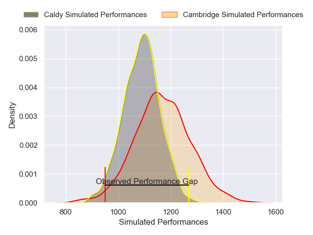
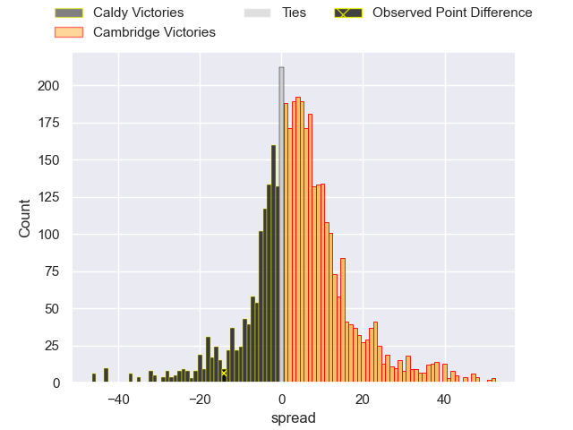
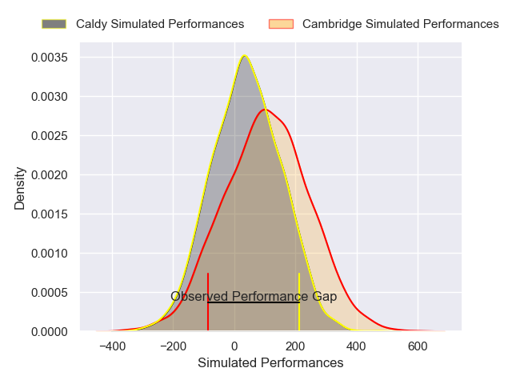
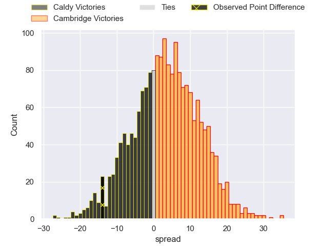

---  
layout: page  
title: Caldy at Cambridge; 41-27  
date: 2025-01-25 18:00:00 -0500  
categories: "RFU Championship 2024" match review  
---
# Caldy at Cambridge; 41-27

# Club Level Predictions

The first set of predictions treats a club as the smallest object, as the club develops its members, organizes a gameplan, and deploys its players as needed for each match. This club model has a prediction of 0.612, which translates to predicting Cambridge to win by 4.0.

Our Over/Under is 47.5 - and combined with the spread above, we have a predicted scoreline of 22 to 26

Each club has a rating and a rating deviation (similar to a Glicko rating), and expected performances can be generated. This allows for simulated matches and spreads like the ones below.
## Projected Performances - Club Model

## Projected Spreads - Club Model

## Projected Results - Club Model

# Player Level Predictions

Treating teams instead as an entity made up of the currently active players, I have ratings for each player in an altogether different system. These can be combined to form team ratings once teamsheets are announced, weighting starters a bit higher than the reserves. After the match is played, players can be weighted by their minutes on the field, allowing for an accurate measure of the team's composition. With these compiled team ratings, we can make predictions, measure inaccuracy, and update the individual player ratings.
## Prediction without Player Minutes: Cambridge by 1.2

Caldy by 1.3 on a neutral pitch

## Projected Performances - Player Model

## Projected Spreads - Player Model

## Projected Results - Player Model

|   Away Minutes | Away Player       |   Away Percentile |   Number |   Home Percentile | Home Player          |   Home Minutes |
|---------------:|:------------------|------------------:|---------:|------------------:|:---------------------|---------------:|
|             80 | Monty Weatherby   |             69.13 |        1 |             13.18 | Zac Nearchou         |            0   |
|             36 | Ollie Hearn       |             50.26 |        2 |             16.18 | Ben Brownlie         |           30   |
|             20 | Nathan Rushton    |             34.44 |        3 |              5.27 | Billy Walker         |           42   |
|             20 | Freddie Stevenson |             52.98 |        4 |             12.9  | George Bretag-Norris |           80   |
|             36 | Tom Sanders       |             48.12 |        5 |             13.89 | Gareth Baxter        |           11   |
|             77 | Callum Ridgway    |             57.62 |        6 |             23.55 | Archie Benson        |           77   |
|              3 | Tom Parry         |             46.19 |        7 |             38.08 | Ben Adams            |            2   |
|              3 | Jj Dickinson      |             24.78 |        8 |             46.96 | Jack Bartlett        |           18   |
|              3 | Ollie Wynn        |             46.98 |        9 |             17.55 | Pete White           |            4.5 |
|             80 | Lewis Barker      |             49.78 |       10 |             30.7  | Louis Grimoldby      |           12   |
|             80 | Will Robinson     |             49.56 |       11 |              7.65 | Eli Caven            |           80   |
|             58 | Mike Barlow       |             42.58 |       12 |             10.75 | Matt Hema            |           80   |
|             80 | Connor Wilkinson  |             39.35 |       13 |             17.2  | Sam Hanks            |           76   |
|             22 | Nick Royle        |             51.42 |       14 |              8.93 | Joe Green            |           80   |
|             27 | Matt Kilcourse    |             45.92 |       15 |             10.3  | Joe Tarrant          |           71   |
|             22 | Matt Gallagher    |            nan    |       16 |            nan    | Morgan Veness        |           80   |
|              5 | Matthew Rabbette  |            nan    |       17 |            nan    | Jake Ellwood         |           80   |
|             74 | Ryan Higginson    |            nan    |       18 |            nan    | Jake Bridges         |           56   |
|             80 | Sam Olyott        |            nan    |       19 |            nan    | Kayde Sylvester      |           80   |
|             80 |                   |            nan    |       20 |            nan    | Matt Dawson          |           50   |
|             80 |                   |            nan    |       20 |            nan    | Matt Dawson          |           80   |
|             52 | Joe Murray        |            nan    |       21 |             60.33 | Ruaridh Dawson       |           76   |
|             52 | Joe Murray        |            nan    |       21 |             60.33 | Ruaridh Dawson       |           50   |
|              8 | Jacob Mitchell    |            nan    |       22 |            nan    | Matt Williams        |            6   |
|             19 | Charlie Hyde      |            nan    |       23 |            nan    | Josh Skelcey         |           80   |

