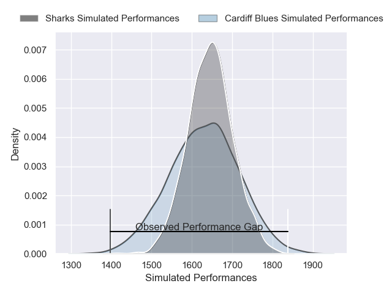
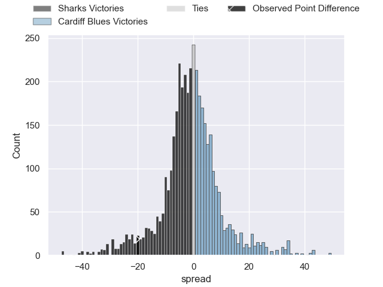
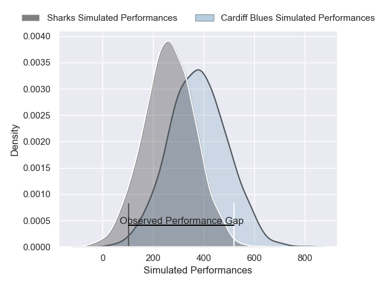
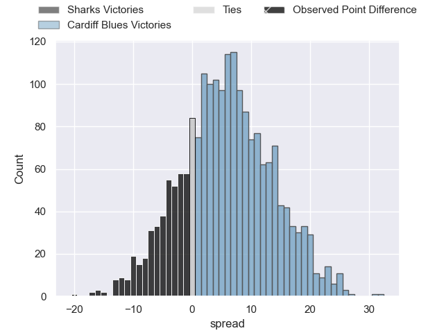
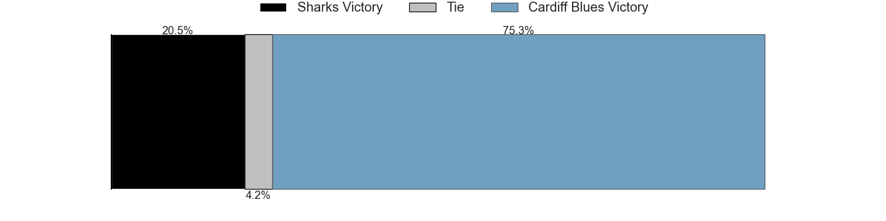

---  
layout: page  
title: Sharks at Cardiff Blues; 42-22  
date: 2025-01-25 18:00:00 -0500  
categories: "United Rugby Championship 2024" match review  
---
# Sharks at Cardiff Blues; 42-22

# Club Level Predictions

The first set of predictions treats a club as the smallest object, as the club develops its members, organizes a gameplan, and deploys its players as needed for each match. This club model has a prediction of 0.478, which translates to predicting Sharks to win by 0.8.

Our Over/Under is 38.5 - and combined with the spread above, we have a predicted scoreline of 20 to 19

Each club has a rating and a rating deviation (similar to a Glicko rating), and expected performances can be generated. This allows for simulated matches and spreads like the ones below.
## Projected Performances - Club Model

## Projected Spreads - Club Model

## Projected Results - Club Model

# Player Level Predictions

Treating teams instead as an entity made up of the currently active players, I have ratings for each player in an altogether different system. These can be combined to form team ratings once teamsheets are announced, weighting starters a bit higher than the reserves. After the match is played, players can be weighted by their minutes on the field, allowing for an accurate measure of the team's composition. With these compiled team ratings, we can make predictions, measure inaccuracy, and update the individual player ratings.
## Prediction without Player Minutes: Cardiff Blues by 7.7

Sharks by 4.4 on a neutral pitch

## Projected Performances - Player Model

## Projected Spreads - Player Model

## Projected Results - Player Model

|   Away Minutes | Away Player         |   Away Percentile |   Number |   Home Percentile | Home Player        |   Home Minutes |
|---------------:|:--------------------|------------------:|---------:|------------------:|:-------------------|---------------:|
|            4.5 | Ntuthuko Mchunu     |              8.59 |        1 |             25.94 | Rhys Barratt       |              0 |
|           80   | Bongi Mbonambi      |             98.62 |        2 |              6.02 | Dafydd Hughes      |              5 |
|           18   | Trevor Nyakane      |             83.25 |        3 |             39.54 | Rhys Litterick     |             25 |
|           80   | Vincent Tshituka    |             91.57 |        4 |             76.29 | Josh McNally       |             40 |
|           80   | Jason Jenkins       |             68.25 |        5 |              4.27 | Seb Davies         |             25 |
|            9   | Phepsi Buthelezi    |             48.5  |        6 |              2.4  | Alex Mann          |             80 |
|           80   | Emmanuel Tshituka   |             61.92 |        7 |             66.33 | Thomas Young       |             80 |
|           29   | Nick Hatton         |             59.13 |        8 |             61.09 | Alun Lawrence      |             44 |
|            6   | Grant Williams      |             84.64 |        9 |              7.31 | Johan Mulder       |             80 |
|            0   | Siya Masuku         |             58.11 |       10 |             88.38 | Callum Sheedy      |             60 |
|           30   | Makazole Mapimpi    |             99.41 |       11 |             19.53 | Tom Bowen          |             44 |
|           24   | Ethan Hooker        |             58.39 |       12 |             11.18 | Rory Jennings      |             60 |
|           56   | Jurenzo Julius      |             78.06 |       13 |             85.05 | Rey Lee-Lo         |             17 |
|           30   | Yaw Penxe           |              3.14 |       14 |             82.04 | Gabriel Hamer-Webb |             53 |
|           20   | Jordan Hendrikse    |             82.19 |       15 |             11.16 | Cameron Winnett    |             18 |
|           16   | Ethan Bester        |             48.71 |       16 |            nan    | Efan Daniel        |             17 |
|           80   | Ruan Dreyer         |             98.81 |       17 |             59.35 | Danny Southworth   |             51 |
|           50   | Vincent Koch        |             82.14 |       18 |             14.71 | Will Davies-King   |             53 |
|           22   | Deon Slabbert       |            nan    |       19 |              7.34 | Rory Thornton      |             71 |
|           22   | Jeandre Labuschagne |             12.02 |       20 |             32.17 | Mackenzie Martin   |             74 |
|           22   | Jaden Hendrikse     |             86.11 |       21 |            nan    | Ethan Lloyd        |             80 |
|           11   | Francois Venter     |             31.18 |       22 |             10.94 | Jacob Beetham      |             77 |
|           80   | Lukhanyo Am         |             80.11 |       23 |             61.63 | Regan Grace        |             78 |

