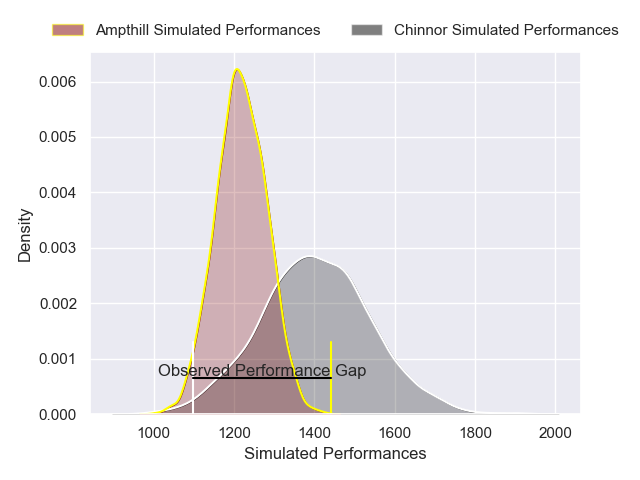
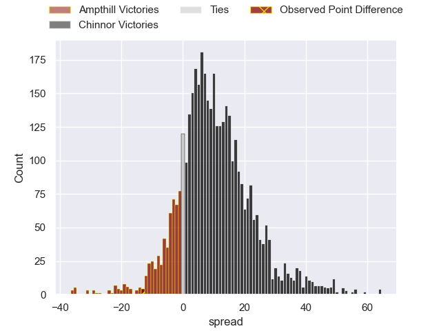
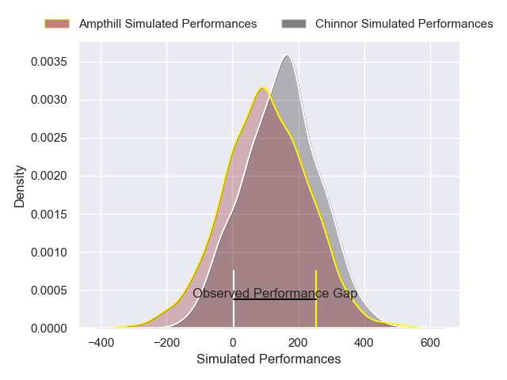
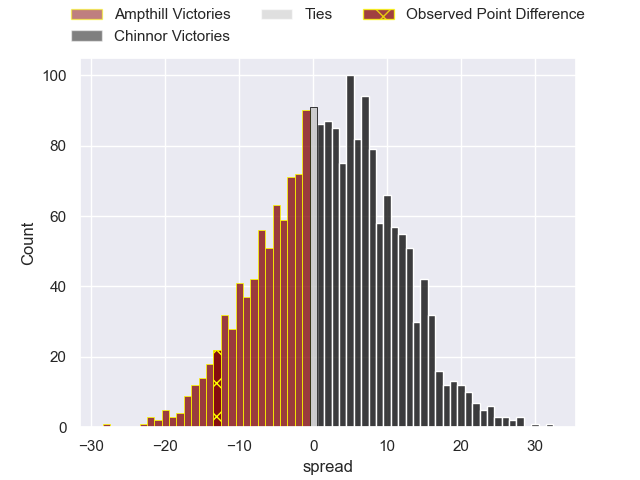

---  
layout: page  
title: Ampthill at Chinnor; 32-19  
date: 2025-01-25 18:00:00 -0500  
categories: "RFU Championship 24/25" match review  
---
# Ampthill at Chinnor; 32-19

# Club Level Predictions

The first set of predictions treats a club as the smallest object, as the club develops its members, organizes a gameplan, and deploys its players as needed for each match. This club model has a prediction of 0.741, which translates to predicting Chinnor to win by 9.3.

Our Over/Under is 52.5 - and combined with the spread above, we have a predicted scoreline of 22 to 31

Each club has a rating and a rating deviation (similar to a Glicko rating), and expected performances can be generated. This allows for simulated matches and spreads like the ones below.
## Projected Performances - Club Model

## Projected Spreads - Club Model

## Projected Results - Club Model

# Player Level Predictions

Treating teams instead as an entity made up of the currently active players, I have ratings for each player in an altogether different system. These can be combined to form team ratings once teamsheets are announced, weighting starters a bit higher than the reserves. After the match is played, players can be weighted by their minutes on the field, allowing for an accurate measure of the team's composition. With these compiled team ratings, we can make predictions, measure inaccuracy, and update the individual player ratings.
## Prediction without Player Minutes: Chinnor by 2.0

Ampthill by 0.2 on a neutral pitch

## Projected Performances - Player Model

## Projected Spreads - Player Model

## Projected Results - Player Model

|   Away Minutes | Away Player        |   Away Percentile |   Number |   Home Percentile | Home Player      |   Home Minutes |
|---------------:|:-------------------|------------------:|---------:|------------------:|:-----------------|---------------:|
|              0 | Richard Barrington |             46.47 |        1 |             27.43 | Keston Lines     |             66 |
|              0 | Luke Thompson      |             44.23 |        2 |             30.12 | Alun Walker      |             57 |
|             31 | James Johnston     |             55.28 |        3 |             31.01 | Rob Hardwick     |             52 |
|             80 | Arthur Thomas      |             64.25 |        4 |             20.66 | Scott Hall       |             56 |
|             18 | Kennedy Sylvester  |             51.54 |        5 |             39.32 | Jonny Green      |              4 |
|             31 | Barnaby Merrett    |             54.41 |        6 |             64.43 | Harry Dugmore    |              9 |
|             26 | Charles Rylands    |             53.51 |        7 |             28.96 | George Stokes    |             61 |
|             80 | Lekima Ravuvu      |             59.44 |        8 |             37.74 | Izzy Wharton     |              9 |
|             77 | Rory Morgan        |             63.14 |        9 |             38.87 | Luke Carter      |             24 |
|             80 | Josh Barton        |             62.36 |       10 |             18.6  | George Worboys   |             30 |
|             80 | Oran Mcnulty       |             64.57 |       11 |             35.24 | Kieran Goss      |             44 |
|             61 | Fraser Strachan    |             29.68 |       12 |             25.43 | Grant Hughes     |             80 |
|             80 | Sione Va'Enuku     |             61.83 |       13 |             25.43 | Tom Watson       |             80 |
|             46 | Mason Cullen       |             57.97 |       14 |             33.66 | Ryan Crowley     |             54 |
|             80 | Evan Mitchell      |             68.45 |       15 |             30.26 | Connor Slevin    |             52 |
|             80 | James Isaacs       |            nan    |       16 |            nan    | Will Cave        |             49 |
|              4 | Harrison Courtney  |            nan    |       17 |            nan    | Elliot Chilvers  |             62 |
|             51 | James Flynn        |            nan    |       18 |            nan    | Lawson Porter    |             24 |
|             40 | Jake Parkinson     |            nan    |       19 |            nan    | Alfie North      |             80 |
|             80 | Syd Blackmore      |            nan    |       20 |            nan    | Willie Ryan      |             80 |
|             36 | Roan Frostwick     |            nan    |       21 |            nan    | Callum Pascoe    |             80 |
|             71 | Byron Sharwood     |            nan    |       22 |            nan    | Cameron Rafferty |             44 |
|             30 | Wilson Ijeh        |            nan    |       23 |            nan    | Epi Rokodrava    |             44 |
|            nan | nan                |            nan    |       24 |            nan    |                  |              3 |

