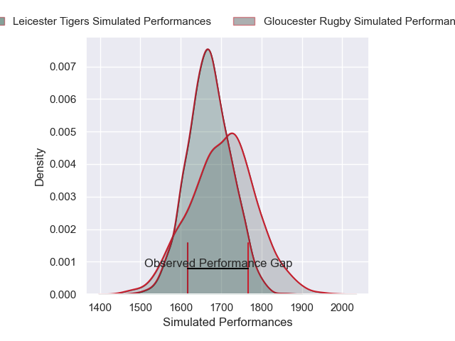
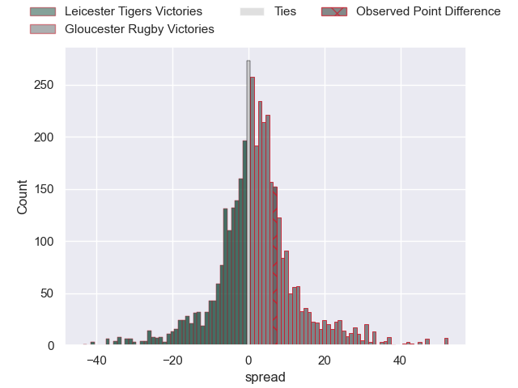
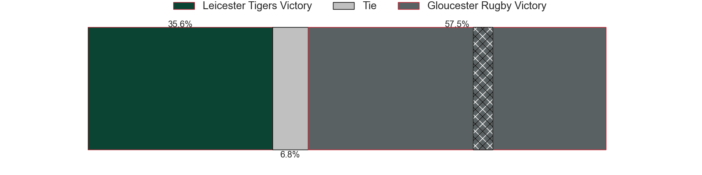
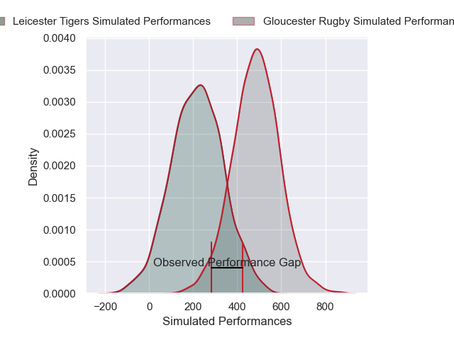
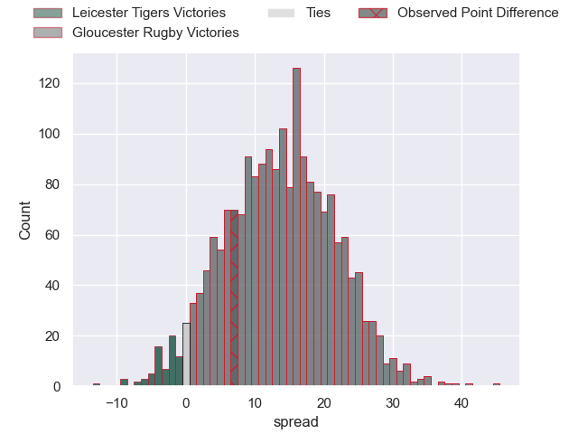
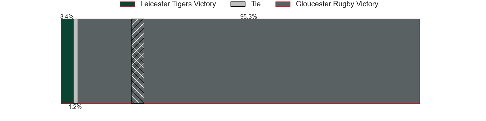

---  
layout: page  
title: Leicester Tigers at Gloucester Rugby; 31-38  
date: 2025-01-25 18:00:00 -0500  
categories: "Gallagher Premiership 24/25" match review  
---
# Leicester Tigers at Gloucester Rugby; 31-38

# Club Level Predictions

The first set of predictions treats a club as the smallest object, as the club develops its members, organizes a gameplan, and deploys its players as needed for each match. This club model has a prediction of 0.548, which translates to predicting Gloucester Rugby to win by 1.7.

Our Over/Under is 51.5 - and combined with the spread above, we have a predicted scoreline of 25 to 27

Each club has a rating and a rating deviation (similar to a Glicko rating), and expected performances can be generated. This allows for simulated matches and spreads like the ones below.
## Projected Performances - Club Model

## Projected Spreads - Club Model

## Projected Results - Club Model

# Player Level Predictions

Treating teams instead as an entity made up of the currently active players, I have ratings for each player in an altogether different system. These can be combined to form team ratings once teamsheets are announced, weighting starters a bit higher than the reserves. After the match is played, players can be weighted by their minutes on the field, allowing for an accurate measure of the team's composition. With these compiled team ratings, we can make predictions, measure inaccuracy, and update the individual player ratings.
## Prediction without Player Minutes: Gloucester Rugby by 13.8

Leicester Tigers by 2.0 on a neutral pitch

## Projected Performances - Player Model

## Projected Spreads - Player Model

## Projected Results - Player Model

|   Away Minutes | Away Player           |   Away Percentile |   Number |   Home Percentile | Home Player       |   Home Minutes |
|---------------:|:----------------------|------------------:|---------:|------------------:|:------------------|---------------:|
|             80 | Nicky Smith           |             76.41 |        1 |              4.68 | Mayco Vivas       |             80 |
|             28 | Julian Montoya        |             91.75 |        2 |             78.52 | Seb Blake         |             32 |
|             18 | Dan Cole              |             11.5  |        3 |             80.58 | Kirill Gotovtsev  |             40 |
|             30 | Cameron Henderson     |             71.04 |        4 |             77.51 | Freddie Thomas    |             40 |
|             48 | Harry Wells           |             90.05 |        5 |             85.57 | Cameron Jordan    |             49 |
|             69 | Hanro Liebenberg      |             91.81 |        6 |             12.39 | Jack Clement      |             15 |
|             80 | Tommy Reffell         |             83.82 |        7 |              5.59 | Lewis Ludlow      |             22 |
|             63 | Olly Cracknell        |             71.8  |        8 |             63.12 | Ruan Ackermann    |             31 |
|             72 | Ben Youngs            |             53.75 |        9 |             80.62 | Tomos Williams    |             80 |
|             30 | Handre Pollard        |             83.99 |       10 |             56.8  | Gareth Anscombe   |             80 |
|             22 | Ollie Hassell-Collins |             68.14 |       11 |             85.35 | Max Llewellyn     |             23 |
|              0 | Solomone Kata         |              8.71 |       12 |             11.94 | Seb Atkinson      |             80 |
|             80 | Izaia Perese          |             50.43 |       13 |              6.56 | Chris Harris      |             37 |
|              3 | Adam Radwan           |             25.86 |       14 |             92.63 | Christian Wade    |             69 |
|             14 | Mike Brown            |             91.61 |       15 |             79.35 | Santiago Carreras |              0 |
|             14 | Charlie Clare         |             21.48 |       16 |             92.44 | Jack Singleton    |             80 |
|             40 | James Cronin          |             91.48 |       17 |             81.94 | Val Rapava-Ruskin |             32 |
|             14 | Will Hurd             |             48.47 |       18 |              8.77 | Ciaran Knight     |             59 |
|             80 | Côme Joussain         |            nan    |       19 |             32.34 | Freddie Clarke    |             80 |
|             80 | Emeka Ilione          |             78.62 |       20 |             96.1  | Albert Tuisue     |             30 |
|             80 | Tom Whiteley          |             70.18 |       21 |             65.45 | Caolan Englefield |             18 |
|             57 | Joseph Woodward       |             35.05 |       22 |             82.02 | Charlie Atkinson  |             48 |
|             62 | Ben Volavola          |             31.36 |       23 |             69.91 | Josh Hathaway     |             28 |

