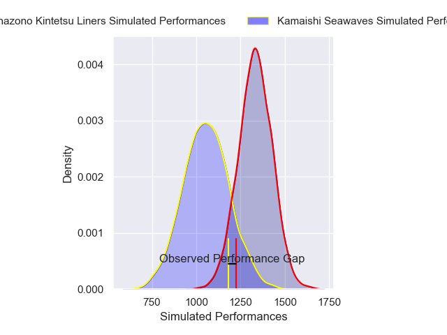
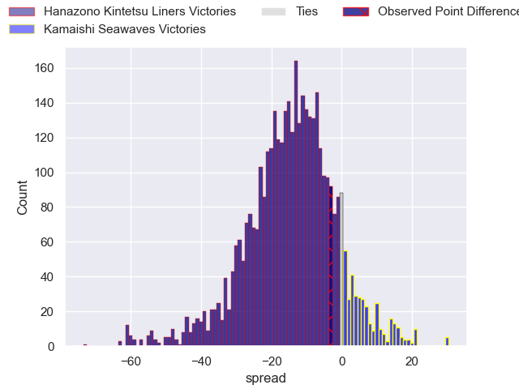
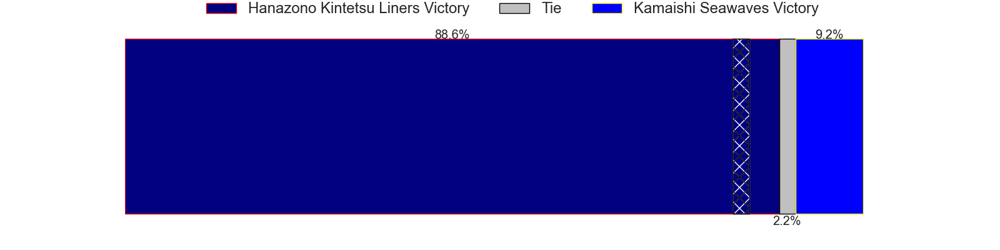
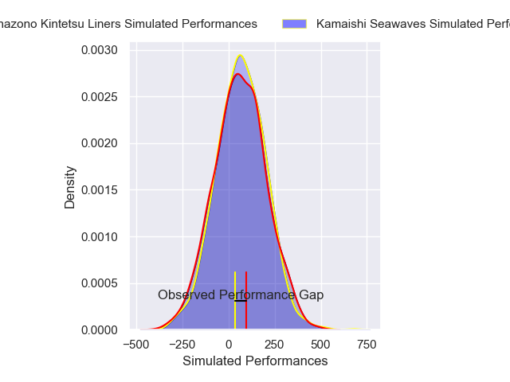
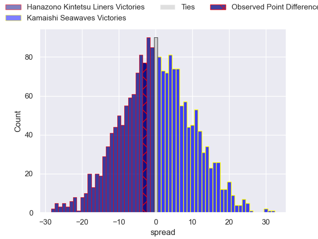
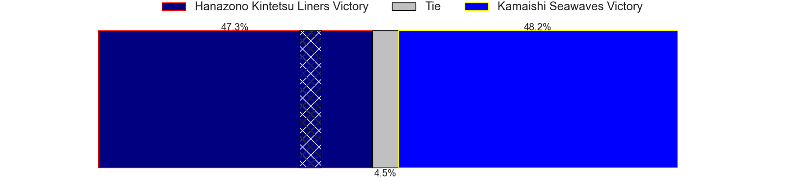

---  
layout: page  
title: Hanazono Kintetsu Liners at Kamaishi Seawaves; 33-30  
date: 2025-01-25 18:00:00 -0500  
categories: "Japan Rugby League One D2 2024" match review  
---
# Hanazono Kintetsu Liners at Kamaishi Seawaves; 33-30

# Club Level Predictions

The first set of predictions treats a club as the smallest object, as the club develops its members, organizes a gameplan, and deploys its players as needed for each match. This club model has a prediction of 0.177, which translates to predicting Hanazono Kintetsu Liners to win by 14.0.

Our Over/Under is 58.5 - and combined with the spread above, we have a predicted scoreline of 36 to 22

Each club has a rating and a rating deviation (similar to a Glicko rating), and expected performances can be generated. This allows for simulated matches and spreads like the ones below.
## Projected Performances - Club Model

## Projected Spreads - Club Model

## Projected Results - Club Model

# Player Level Predictions

Treating teams instead as an entity made up of the currently active players, I have ratings for each player in an altogether different system. These can be combined to form team ratings once teamsheets are announced, weighting starters a bit higher than the reserves. After the match is played, players can be weighted by their minutes on the field, allowing for an accurate measure of the team's composition. With these compiled team ratings, we can make predictions, measure inaccuracy, and update the individual player ratings.
## Prediction without Player Minutes: Kamaishi Seawaves by 0.3

Hanazono Kintetsu Liners by 2.5 on a neutral pitch

## Projected Performances - Player Model

## Projected Spreads - Player Model

## Projected Results - Player Model

|   Away Minutes | Away Player      |   Away Percentile |   Number |   Home Percentile | Home Player         |   Home Minutes |
|---------------:|:-----------------|------------------:|---------:|------------------:|:--------------------|---------------:|
|             80 | Shintaro Okamoto |             75.85 |        1 |             23.04 | Yusuke Yamada       |             80 |
|             80 | Keiichi Kaneko   |              6.37 |        2 |              2.75 | Daiki Ito           |             80 |
|             80 | Kota Mitake      |             18.62 |        3 |             73.21 | Satoshi Ueda        |             80 |
|             80 | James Blackwell  |             18.15 |        4 |             43.35 | Satoshi Hatazawa    |             80 |
|             80 | Simeone Schmidt  |             60.81 |        5 |              8.53 | Hamish Dalzell      |             80 |
|             80 | Mitch Brown      |             75.45 |        6 |              9.32 | Ben Nee Nee         |             80 |
|             80 | Daiki Miyashita  |              3.41 |        7 |             27.56 | Ryota Kono          |             80 |
|             80 | Shohei Nonaka    |             12.83 |        8 |              4.13 | Sam Henwood         |             80 |
|             80 | Kensyo Kawamura  |             55.58 |        9 |              4.02 | Youhei Murakami     |             80 |
|             80 | Quade Cooper     |             97.37 |       10 |             57.89 | Mitch Hunt          |             80 |
|             80 | Ryosuke Kataoka  |             62.61 |       11 |             82.92 | Jamie Henry         |             80 |
|             80 | Patrick Stehlin  |             77.74 |       12 |             14.95 | Gerdus van der Walt |             80 |
|             80 | Tom Hendrickson  |             37.31 |       13 |             41.4  | Katsuto Hatanaka    |             80 |
|             80 | Tomoya Kimura    |              9.72 |       14 |             15.01 | Gousuke Kawakami    |             80 |
|             56 | Semisi Masirewa  |              3    |       15 |             29.18 | Kazuki Ochi         |             80 |

