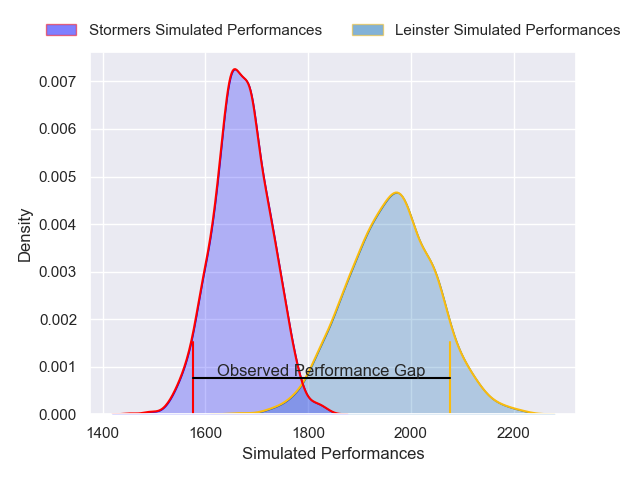
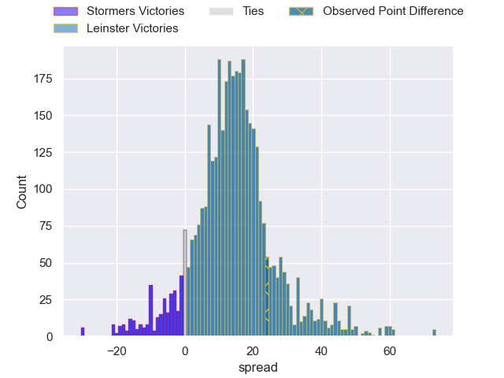
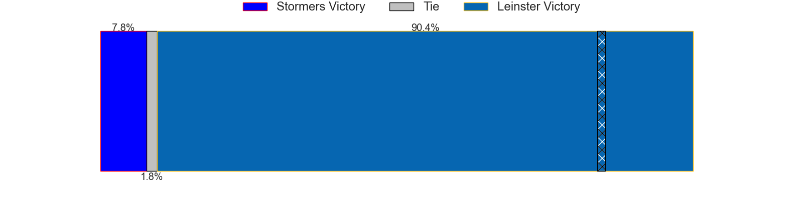
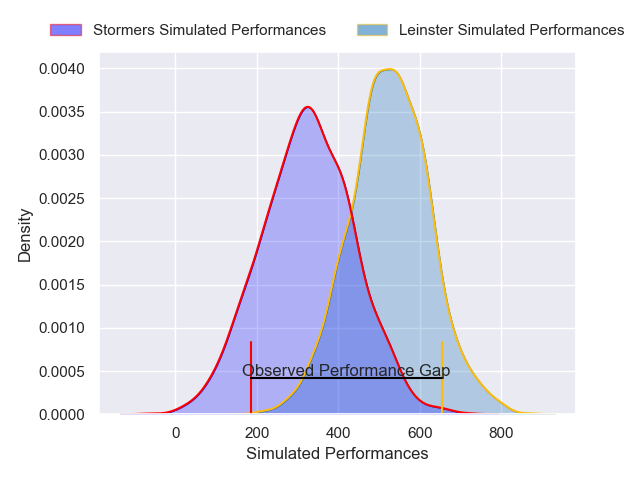
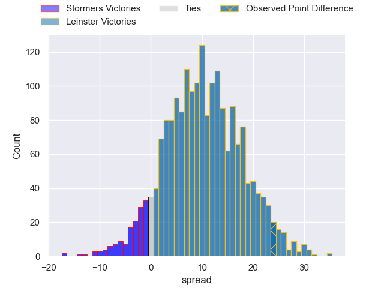

---  
layout: page  
title: Stormers at Leinster; 12-36  
date: 2025-01-25 18:00:00 -0500  
categories: "United Rugby Championship 2024" match review  
---
# Stormers at Leinster; 12-36

# Club Level Predictions

The first set of predictions treats a club as the smallest object, as the club develops its members, organizes a gameplan, and deploys its players as needed for each match. This club model has a prediction of 0.841, which translates to predicting Leinster to win by 14.7.

Our Over/Under is 51.5 - and combined with the spread above, we have a predicted scoreline of 18 to 33

Each club has a rating and a rating deviation (similar to a Glicko rating), and expected performances can be generated. This allows for simulated matches and spreads like the ones below.
## Projected Performances - Club Model

## Projected Spreads - Club Model

## Projected Results - Club Model

# Player Level Predictions

Treating teams instead as an entity made up of the currently active players, I have ratings for each player in an altogether different system. These can be combined to form team ratings once teamsheets are announced, weighting starters a bit higher than the reserves. After the match is played, players can be weighted by their minutes on the field, allowing for an accurate measure of the team's composition. With these compiled team ratings, we can make predictions, measure inaccuracy, and update the individual player ratings.
## Prediction without Player Minutes: Leinster by 14.2

Leinster by 4.1 on a neutral pitch

## Projected Performances - Player Model

## Projected Spreads - Player Model

## Projected Results - Player Model

|   Away Minutes | Away Player        |   Away Percentile |   Number |   Home Percentile | Home Player     |   Home Minutes |
|---------------:|:-------------------|------------------:|---------:|------------------:|:----------------|---------------:|
|           37   | Alistair Vermaak   |             84.27 |        1 |             52.72 | Jack Boyle      |           55   |
|            0   | Joseph Dweba       |             71.43 |        2 |             55.94 | Dan Sheehan     |           27   |
|            8   | Neethling Fouche   |             84.95 |        3 |             81.12 | Rabah Slimani   |           60   |
|           80   | JD Schickerling    |              3.77 |        4 |             99.9  | RG Snyman       |           60   |
|           62   | Ruben van Heerden  |             89.09 |        5 |             64.38 | Brian Deeny     |           80   |
|           80   | Deon Fourie        |             93.99 |        6 |             46.79 | Alex Soroka     |           27   |
|           50   | Ben-Jason Dixon    |             67.03 |        7 |             88.88 | Scott Penny     |           68   |
|           38   | Evan Roos          |             86.09 |        8 |             93.91 | Max Deegan      |           19   |
|            5   | Paul de Wet        |             81.9  |        9 |             98.72 | Luke McGrath    |           18   |
|           27   | Manie Libbok       |             85.75 |       10 |             94.3  | Ross Byrne      |           30   |
|           80   | Leolin Zas         |             84.3  |       11 |            100    | James Lowe      |           80   |
|           49   | Jonathan Roche     |             53.01 |       12 |             93.55 | Jordie Barrett  |           59   |
|           53   | Ruhan Nel          |             56.13 |       13 |             48.71 | Liam Turner     |           40   |
|           53   | Ben Loader         |             90.28 |       14 |             52.99 | Andrew Osborne  |           80   |
|           80   | Warrick Gelant     |             99.14 |       15 |             43.99 | Henry McErlean  |           16   |
|           64   | Andre-Hugo Venter  |             75.39 |       16 |             73.32 | John McKee      |           60   |
|           80   | Sti Sithole        |             92.35 |       17 |            nan    | Paddy Mccarthy  |           16   |
|           18   | Brok Harris        |             99.91 |       18 |            nan    | Rory Mcguire    |           15   |
|            4   | Salmaan Moerat     |             77.78 |       19 |             34.57 | Diarmuid Mangan |           59   |
|           29.5 | Marcel Theunissen  |             43.39 |       20 |            nan    | James Culhane   |            9.5 |
|           25   | Paul De Villiers   |            nan    |       21 |             84.97 | Will Connors    |           27   |
|            0   | Herschel Jantjies  |             93.24 |       22 |             60.15 | Cormac Foley    |           40   |
|           80   | Wandisile Simelane |             70.75 |       23 |             36.56 | Charlie Tector  |           11   |

