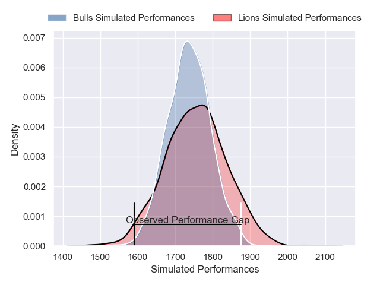
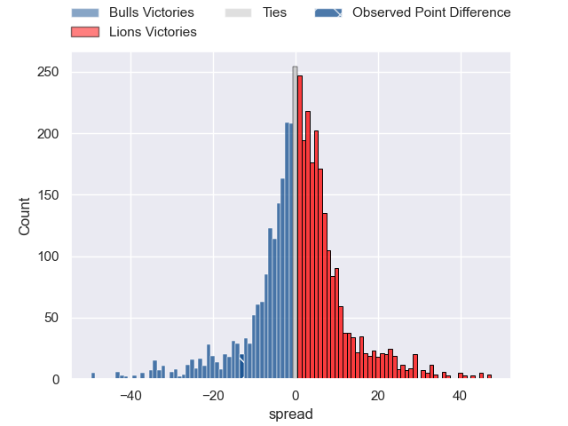
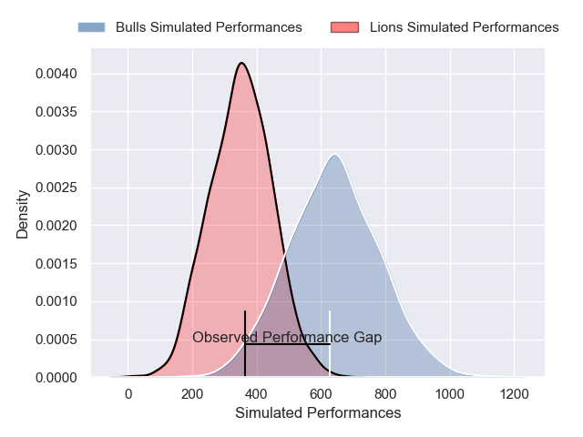
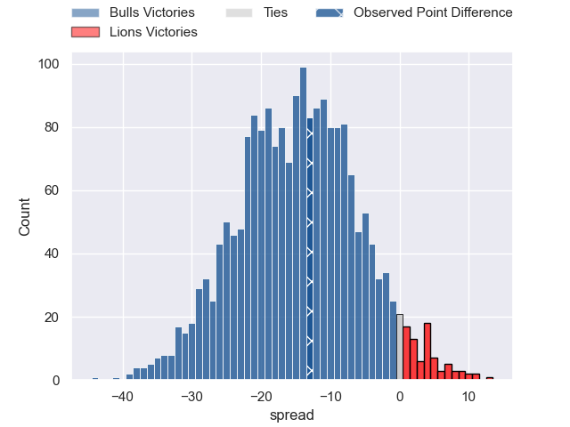

---  
layout: page  
title: Bulls at Lions; 35-22  
date: 2025-01-25 18:00:00 -0500  
categories: "United Rugby Championship 24/25" match review  
---
# Bulls at Lions; 35-22

# Club Level Predictions

The first set of predictions treats a club as the smallest object, as the club develops its members, organizes a gameplan, and deploys its players as needed for each match. This club model has a prediction of 0.523, which translates to predicting Lions to win by 0.8.

Our Over/Under is 47.5 - and combined with the spread above, we have a predicted scoreline of 24 to 24

Each club has a rating and a rating deviation (similar to a Glicko rating), and expected performances can be generated. This allows for simulated matches and spreads like the ones below.
## Projected Performances - Club Model

## Projected Spreads - Club Model

## Projected Results - Club Model

# Player Level Predictions

Treating teams instead as an entity made up of the currently active players, I have ratings for each player in an altogether different system. These can be combined to form team ratings once teamsheets are announced, weighting starters a bit higher than the reserves. After the match is played, players can be weighted by their minutes on the field, allowing for an accurate measure of the team's composition. With these compiled team ratings, we can make predictions, measure inaccuracy, and update the individual player ratings.
## Prediction without Player Minutes: Bulls by 6.2

Bulls by 12.5 on a neutral pitch

## Projected Performances - Player Model

## Projected Spreads - Player Model

## Projected Results - Player Model

|   Away Minutes | Away Player         |   Away Percentile |   Number |   Home Percentile | Home Player          |   Home Minutes |
|---------------:|:--------------------|------------------:|---------:|------------------:|:---------------------|---------------:|
|           40   | Gerhard Steenekamp  |             90.03 |        1 |             55.03 | Juan Schoeman        |             46 |
|           16   | Johan Grobbelaar    |             93.98 |        2 |             81.24 | PJ Botha             |             38 |
|           30   | Wilco Louw          |             99.32 |        3 |             67.12 | Asenathi Ntlabakanye |             80 |
|           25   | Wilco Louw          |             99.32 |        3 |             67.12 | Asenathi Ntlabakanye |             80 |
|           14   | Cobus Wiese         |             94.24 |        4 |             88.58 | Etienne Oosthuizen   |             80 |
|           30   | Ruan Nortje         |             82.52 |        5 |             57.6  | Ruan Delport         |              9 |
|           75   | Marcell Coetzee     |             94.59 |        6 |             86.17 | JC Pretorius         |             14 |
|           51   | Elrigh Louw         |             95.09 |        7 |             90.98 | Ruan Venter          |              9 |
|           55   | Elrigh Louw         |             95.09 |        7 |             90.98 | Ruan Venter          |              9 |
|           70   | Cameron Hanekom     |             52.71 |        8 |             98.26 | Francke Horn         |              9 |
|           20.5 | Embrose Papier      |             91.42 |        9 |             88.69 | Morne van den Berg   |             23 |
|           66   | Boeta Chamberlain   |             64.33 |       10 |             36.32 | Sam Francis          |             50 |
|           25   | Sergeal Petersen    |             97.15 |       11 |             94.39 | Edwill van der Merwe |             55 |
|           80   | Harold Vorster      |             96.77 |       12 |             85.16 | Rynhardt Jonker      |             80 |
|           66   | David Kriel         |             80    |       13 |             71.94 | Henco van Wyk        |             58 |
|           80   | Sebastian de Klerk  |             92.03 |       14 |             49.7  | Richard Kriel        |             80 |
|           71   | Devon Williams      |             91.42 |       15 |             97    | Quan Horn            |             42 |
|           71   | Akker van der Merwe |             96.73 |       16 |             90.88 | Jaco Visagie         |             34 |
|           80   | Alulutho Tshakweni  |             44.29 |       17 |            nan    | Sj Kotze             |             46 |
|           80   | Francois Klopper    |             14.91 |       18 |            nan    | Rf Schoeman          |              3 |
|           57   | Reinhardt Ludwig    |             68.04 |       19 |            nan    | Raynard Roets        |             31 |
|           80   | Nizaam Carr         |             97.4  |       20 |             61.61 | WJ Steenkamp         |              5 |
|           80   | Keagan Johannes     |             11.82 |       21 |             70.62 | Nico Steyn           |             31 |
|           21   | Canan Moodie        |             99.51 |       22 |             85.41 | Gianni Lombard       |             22 |
|           62   | Willie le Roux      |             95.49 |       23 |            nan    | Manuel Rass          |             16 |

